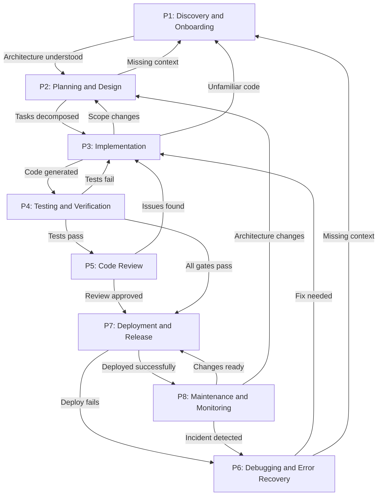
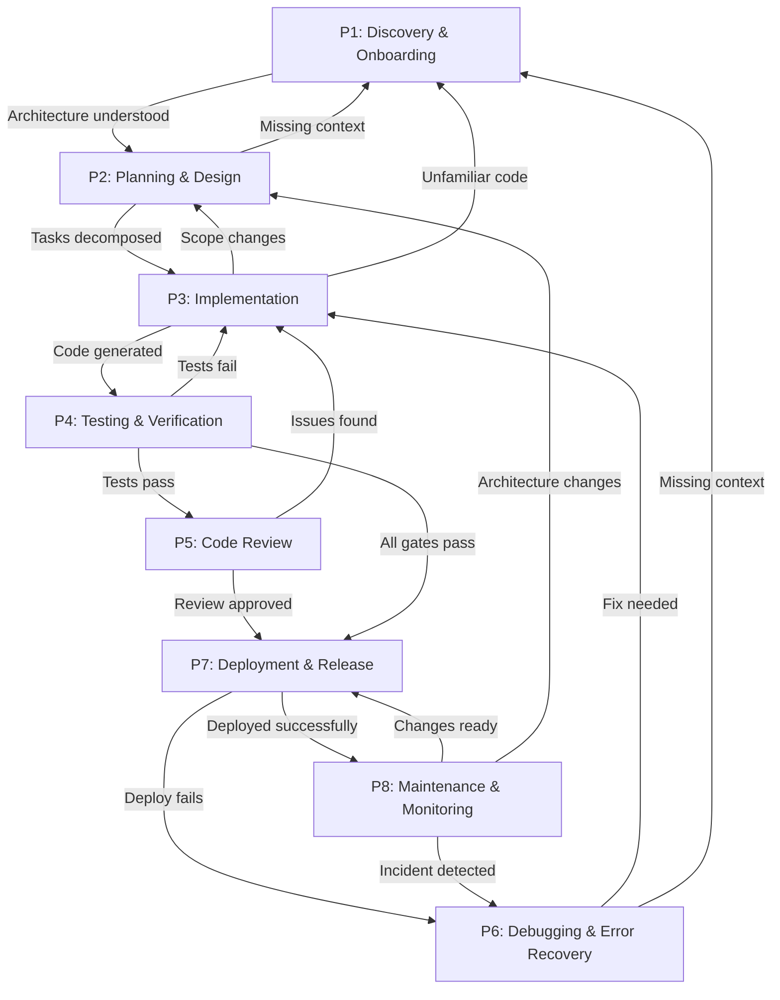

# Prong 3: SDLC Phase Specifications (P1-P8)

**Distillation Date**: 2026-02-25
**Source Atoms**: KA-084 to KA-230 (147 atoms)
**Purpose**: Place knowledge atoms into the development lifecycle phase where they are needed.

---

## PHASE: P1 - Discovery & Onboarding

### WHAT THE AGENT IS DOING
Encountering new or unfamiliar codebase: scanning directory structures, mapping dependencies, extracting architecture patterns, discovering APIs, and building initial mental models of the system. The agent is in exploration mode, gathering context to understand what exists before making changes.

### KNOWLEDGE ATOMS

**STRONG Evidence:**
- KA-112 — Vector databases achieve 85-95% recall@10 on code search — STRONG
- KA-114 — MemGPT virtual context architecture extends effective memory — STRONG
- KA-117 — Vector database comparison for code retrieval — STRONG
- KA-118 — Combining AST + CFG + DFG improves accuracy by 35-50% — STRONG
- KA-119 — AST-based code search improves precision by 60-80% — STRONG
- KA-139 — Provenance-tagged context ingestion for trust tiers — STRONG

**MODERATE Evidence:**
- KA-093 — Clarification capabilities achieve 23% higher task success rates — STRONG (also P2)
- KA-115 — GraphRAG achieves 23% improvement on multi-hop reasoning — MODERATE
- KA-171 — Five autonomy levels for HITL systems — STRONG (also P2, P3)

### TECHNIQUES TO USE (ranked, by step)

**Step 1 — Initial Codebase Scanning:**
- KA-119 — AST-based code search with Tree-sitter for structural understanding — provides 60-80% precision improvement over text search
- KA-118 — Combine multiple code representations (AST + CFG + DFG) — improves understanding accuracy by 35-50%

**Step 2 — Dependency and Architecture Mapping:**
- KA-112 — Use vector databases for code search — achieves 85-95% recall@10
- KA-117 — Select appropriate vector database: Pinecone (managed), Weaviate (hybrid), Qdrant (filtered search), Chroma (embedded), Milvus (distributed)

**Step 3 — Context Building and Memory Establishment:**
- KA-114 — Implement MemGPT virtual context architecture — core memory (limited, always-visible) + archival memory (unlimited, retrieval-based)
- KA-115 — Use GraphRAG for multi-hop reasoning — 23% improvement on complex queries

**Step 4 — Trust and Provenance Establishment:**
- KA-139 — Provenance-tagged context ingestion — attach trust/provenance metadata to each retrieved context element

**Step 5 — Ambiguity Resolution:**
- KA-093 — Use clarification capabilities when encountering ambiguity — 23% higher task success rates

### CONSTRAINTS IN EFFECT
- KA-139 — Provenance-tagged context ingestion required — enforce policy by trust tier for poisoning containment

### TOOLS NEEDED
- KA-117 — Vector databases (Pinecone, Weaviate, Qdrant, Chroma, Milvus) — code search and retrieval
- KA-119 — Tree-sitter — incremental parsing with error recovery for 40+ languages

### FAILURE MODES TO WATCH FOR
- KA-147 — Trusting retrieved content as policy — context poisoning leads to malicious action sequences — Detection: unexpected instructions in retrieved content — Response: separate policy channel from retrieval channel
- KA-113 — Summary-based memory loses 15-25% of task-critical details — Detection: missing context in subsequent operations — Response: use hierarchical memory with explicit operations

### TRANSITIONS
- **Exit to P2 (Planning & Design) when:** Architecture understanding is sufficient, dependencies mapped, initial context established, and task objectives are clear
- **Fallback to P1 from later phases when:** Encountering unfamiliar code regions, missing context causes errors, or new dependencies discovered

---

## PHASE: P2 - Planning & Design

### WHAT THE AGENT IS DOING
Deciding what to build and how: decomposing tasks into manageable units, sequencing dependencies, making architecture decisions, creating specifications, and establishing success criteria. The agent is in planning mode, structuring work before implementation.

### KNOWLEDGE ATOMS

**STRONG Evidence:**
- KA-084 — Hierarchical task decomposition achieves 56% development time reduction — STRONG
- KA-092 — Spec-driven approach reduces scope creep by 56% — STRONG
- KA-093 — Clarification capabilities achieve 23% higher task success rates — STRONG
- KA-096 — Over-decomposition failure mode identified — STRONG
- KA-097 — Under-specified tasks failure mode identified — STRONG
- KA-098 — Circular dependencies failure mode identified — STRONG
- KA-101 — Monolithic task failure mode identified — STRONG
- KA-102 — Feature development workflow recipe — STRONG
- KA-158 — BDD with Given-When-Then improves stakeholder communication by 50% — STRONG
- KA-216 — Spec-driven workflows with 4-phase gates reduce development time by 56% — STRONG
- KA-222 — Spec-driven vs Intent-driven systems tradeoff — STRONG
- KA-223 — Bidirectional specification maintenance — STRONG
- KA-224 — Signal vs noise in specifications requires optimal granularity — STRONG

**MODERATE Evidence:**
- KA-085 — Optimal decomposition depth: 2-3 levels for simple, 5-7 for complex — MODERATE
- KA-086 — 3-8% of task graphs contain cycles — MODERATE
- KA-104 — Refactoring workflow recipe — MODERATE
- KA-171 — Five autonomy levels for HITL systems — STRONG
- KA-195 — Infrastructure as Code Generation workflow — MODERATE
- KA-221 — Scope creep prevention mechanisms — MODERATE
- KA-225 — Technology selection guidance by layer — MODERATE

### TECHNIQUES TO USE (ranked, by step)

**Step 1 — Requirement Clarification:**
- KA-093 — Use clarification capabilities for ambiguity resolution — 23% higher task success rates
- KA-158 — Apply BDD with Given-When-Then structure — 50% improvement in stakeholder communication

**Step 2 — Specification Creation:**
- KA-216 — Use spec-driven workflows with 4-phase gates (Specify, Plan, Tasks, Implement) — 56% development time reduction
- KA-092 — Establish explicit specification boundaries — 56% scope creep reduction
- KA-224 — Optimize signal vs noise — surface decisions that change direction, not every line of code

**Step 3 — Task Decomposition:**
- KA-084 — Apply hierarchical task decomposition with topological sorting — 56% development time reduction
- KA-085 — Set decomposition depth by complexity: 2-3 levels for simple tasks, 5-7 for complex workflows
- KA-087 — Use atomic task design patterns: file-scoped, function-scoped, test-scoped, documentation-scoped

**Step 4 — Dependency Sequencing:**
- KA-086 — Implement cycle detection during graph construction — 3-8% of task graphs contain cycles
- KA-098 — Detect and break circular dependencies — remove or reverse dependencies

**Step 5 — Specification Maintenance Planning:**
- KA-223 — Plan bidirectional specification maintenance — both humans and agents read from and write to shared specification
- KA-222 — Choose approach: Spec-driven (high reproducibility, high maintenance) vs Intent-driven (high flexibility, variable reproducibility)

**Step 6 — Technology Selection:**
- KA-225 — Select technologies by layer: Orchestration (LangGraph/CrewAI), Context (RAG+long-context), Memory (vector+graph), Security (gVisor/Kata), Model Routing (cascading), Testing (self-healing), CI/CD (GitOps)

### CONSTRAINTS IN EFFECT
- KA-193 — Trunk-based development requires short-lived branches (< 1 day) with feature flags
- KA-221 — Scope creep prevention requires: explicit task boundaries, complexity budgets (tokens/tool calls/cyclomatic complexity), human-in-the-loop checkpoints for scope changes

### TOOLS NEEDED
- KA-225 — Technology selection: LangGraph, CrewAI, gVisor, Kata Containers, GitOps tools

### FAILURE MODES TO WATCH FOR
- KA-096 — Over-decomposition — coordination overhead exceeds execution time — Detection: context lost between tasks, increased failure points — Response: balance granularity with coordination cost
- KA-097 — Under-specified tasks — lack clear objectives, success criteria — Detection: agents interpret differently, unverifiable success — Response: structured task specifications with explicit objectives
- KA-098 — Circular dependencies — task dependencies form cycles — Detection: cycle detection during graph construction — Response: break cycles by removing/reversing dependencies
- KA-101 — Monolithic task — too large to execute reliably — Detection: partial completion on failure, difficult verification — Response: decompose into smaller atomic tasks

### TRANSITIONS
- **Exit to P3 (Implementation) when:** Tasks decomposed, dependencies sequenced, specifications written, and success criteria defined
- **Fallback to P1 (Discovery) when:** Unfamiliar code regions encountered, missing context, or assumptions prove wrong
- **Fallback to P2 from P3 when:** Scope changes require replanning, or implementation reveals design flaws

---

## PHASE: P3 - Implementation

### WHAT THE AGENT IS DOING
Writing code: generating implementations, managing context windows, preventing hallucinations, verifying package existence, adhering to style guidelines, and creating atomic commits. The agent is in execution mode, transforming specifications into working code.

### KNOWLEDGE ATOMS

**STRONG Evidence:**
- KA-084 — Hierarchical task decomposition achieves 56% development time reduction — STRONG
- KA-087 — Atomic task design patterns — STRONG
- KA-088 — Worktree isolation reduces merge conflicts by 67% — STRONG
- KA-091 — Async DAG execution achieves 2.3x speedup — STRONG
- KA-092 — Spec-driven approach reduces scope creep by 56% — STRONG
- KA-095 — Task-level parallelism provides 2-4x speedup — STRONG
- KA-099 — Shared mutable state failure mode — STRONG
- KA-112 — Vector databases achieve 85-95% recall@10 — STRONG
- KA-114 — MemGPT virtual context architecture — STRONG
- KA-117 — Vector database comparison — STRONG
- KA-118 — Combining AST + CFG + DFG improves accuracy — STRONG
- KA-119 — AST-based code search improves precision — STRONG
- KA-126 — 19.7% of recommended packages are fabricated — STRONG
- KA-128 — 43% of Java errors are API misuse hallucinations — STRONG
- KA-130 — Hybrid retrieval achieves 67% hallucination reduction — STRONG
- KA-135 — Sandbox technology comparison — STRONG
- KA-137 — Prompt injection detection patterns — STRONG
- KA-138 — Layered guardrail envelope — STRONG
- KA-139 — Provenance-tagged context ingestion — STRONG
- KA-140 — Task-scoped MCP capability minting — STRONG
- KA-141 — Default-deny egress with explicit allowlists — STRONG
- KA-146 — Prompt-only security anti-pattern — STRONG
- KA-147 — Trusting retrieved content as policy anti-pattern — STRONG
- KA-148 — Over-privileged MCP defaults anti-pattern — STRONG
- KA-149 — Unsandboxed code/tool execution anti-pattern — STRONG
- KA-152 — MCP security threat mitigation — STRONG
- KA-153 — Tool description smells prevalence — STRONG
- KA-167 — TDD initial development time increase 15-35% — STRONG
- KA-171 — Five autonomy levels for HITL systems — STRONG
- KA-174 — Cascaded LLM decision frameworks achieve 70% cost reduction — STRONG
- KA-177 — CI adoption reduces integration problems by 70% — STRONG
- KA-187 — Pipeline optimization reduces build times by 50-80% — STRONG
- KA-190 — Automated merging reduces integration issues by 80% — STRONG
- KA-193 — Trunk-based development requires short-lived branches — STRONG
- KA-199 — Long-Running Branches anti-pattern — STRONG
- KA-201 — Secret in Code anti-pattern — STRONG
- KA-216 — Spec-driven workflows reduce development time by 56% — STRONG
- KA-217 — AugmentCode GitHub Spec Kit demonstrates 87% accuracy — STRONG
- KA-218 — Orchestration topology provides 12-23% improvement — STRONG
- KA-219 — BDI architectures enable accountable autonomy — STRONG
- KA-222 — Spec-driven vs Intent-driven systems tradeoff — STRONG
- KA-223 — Bidirectional specification maintenance — STRONG
- KA-226 — AI agents cost 3-10x more than chatbots — STRONG
- KA-227 — Output tokens cost 4-8x input token pricing — STRONG
- KA-228 — Model cascades achieve 40-87% cost reduction — STRONG
- KA-229 — Semantic caching eliminates 31-90% of redundant tokens — STRONG

**MODERATE Evidence:**
- KA-085 — Optimal decomposition depth — MODERATE
- KA-089 — Semantic merging achieves 78% automatic resolution — MODERATE
- KA-104 — Refactoring workflow recipe — MODERATE
- KA-110 — Byzantine fault tolerance requires 3f+1 agents — MODERATE
- KA-115 — GraphRAG achieves 23% improvement — MODERATE
- KA-144 — Early exit with confidence gating — MODERATE
- KA-194 — AI Agent Deployment Workflow — MODERATE
- KA-220 — Anti-slop architecture constraints — MODERATE
- KA-221 — Scope creep prevention mechanisms — MODERATE
- KA-230 — EvoRoute demonstrates 76% cost reduction — MODERATE

### TECHNIQUES TO USE (ranked, by step)

**Step 1 — Context Preparation:**
- KA-130 — Use hybrid retrieval (BM25 + dense) — 67% hallucination reduction
- KA-139 — Apply provenance-tagged context ingestion — trust tiers for retrieved content
- KA-229 — Implement semantic caching — eliminates 31-90% of redundant tokens

**Step 2 — Code Generation:**
- KA-216 — Follow spec-driven workflow — 56% development time reduction
- KA-217 — Use structured specifications for multi-file changes — 87% accuracy
- KA-218 — Apply orchestration topology patterns (Parallel, Sequential, Hierarchical, Hybrid) — 12-23% improvement
- KA-219 — Use BDI architectures for accountable autonomy — loggable beliefs, desires, intentions

**Step 3 — Anti-Hallucination Measures:**
- KA-126 — Verify all package recommendations — 19.7% are fabricated (slopsquatting)
- KA-128 — Validate API usage — 43% of Java errors are API misuse hallucinations
- KA-144 — Apply early exit with confidence gating — Generate → Confidence Check → [High: Output] / [Low: Retrieval + Regenerate]

**Step 4 — Security Enforcement:**
- KA-137 — Apply prompt injection detection — Critical (instruction override), High (role manipulation), Medium (persona injection)
- KA-138 — Implement layered guardrail envelope — input filtering, tool-call policy validation, output schema checks, post-action attestation
- KA-140 — Use task-scoped MCP capability minting — narrow, temporary capabilities per task
- KA-141 — Enforce default-deny egress — block all outbound except approved domains/protocols
- KA-149 — Execute in sandboxed environment — gVisor, Kata Containers, or HopX

**Step 5 — Parallel Execution:**
- KA-091 — Use async DAG execution for independent tasks — 2.3x speedup
- KA-095 — Apply task-level parallelism — 2-4x speedup for independent tasks

**Step 6 — Isolation and Conflict Prevention:**
- KA-088 — Use worktree isolation — 67% reduction in merge conflicts
- KA-099 — Prevent shared mutable state — use branch-per-task isolation, locking, or immutable data
- KA-193 — Follow trunk-based development — short-lived branches (< 1 day) with feature flags

**Step 7 — Cost Optimization:**
- KA-174 — Use cascaded LLM decision frameworks — base model → large model → human, 70% cost reduction
- KA-228 — Apply model cascades and dynamic routing — 40-87% cost reduction
- KA-227 — Use structured outputs (JSON mode) — output tokens cost 4-8x input tokens

**Step 8 — Quality Gates:**
- KA-167 — Consider TDD approach — 15-35% initial time increase but ensures testability
- KA-177 — Integrate with CI — 70% reduction in integration problems
- KA-187 — Optimize pipelines — 50-80% build time reduction through caching, parallelization

### CONSTRAINTS IN EFFECT
- KA-140 — Task-scoped MCP capabilities — narrow, temporary capabilities per task/tool invocation
- KA-141 — Default-deny egress — explicit allowlists for outbound network access
- KA-149 — Sandboxed execution required — isolated execution with constrained mounts, syscalls, identities
- KA-193 — Short-lived branches (< 1 day) with feature flags for incomplete features
- KA-201 — Never embed secrets in code — use secret management systems
- KA-220 — Anti-slop architecture: structured output enforcement, verification loops, deterministic tool interfaces, context window discipline
- KA-221 — Scope creep prevention: explicit task boundaries, complexity budgets, HITL checkpoints

### TOOLS NEEDED
- KA-106 — Task queues: Redis Queue (high throughput), RabbitMQ (reliable delivery), Apache Kafka (event streaming), AWS SQS (cloud-native), Celery (Python), BullMQ (Node.js)
- KA-109 — Distributed locking: Redis SETNX, Redlock, Zookeeper, etcd
- KA-117 — Vector databases: Pinecone, Weaviate, Qdrant, Chroma, Milvus
- KA-135 — Sandboxes: gVisor (user-space kernel), Kata Containers (VM-like isolation), HopX (AI-specific)
- KA-119 — Tree-sitter — incremental parsing for 40+ languages

### FAILURE MODES TO WATCH FOR
- KA-099 — Shared mutable state — race conditions, inconsistent results — Detection: multiple tasks modify shared state — Response: branch-per-task isolation, locking, immutable data
- KA-126 — Fabricated packages (slopsquatting) — supply chain attacks — Detection: package not in registry — Response: verify all packages before installation
- KA-128 — API misuse hallucinations — non-existent methods/parameters — Detection: compile/runtime errors — Response: validate API usage against documentation
- KA-146 — Prompt-only security — easy bypass by injection — Detection: unexpected behavior — Response: add hard policy gates at tool, artifact, deployment boundaries
- KA-147 — Trusting retrieved content as policy — context poisoning — Detection: malicious instructions in retrieved content — Response: separate policy from retrieval channel
- KA-148 — Over-privileged MCP defaults — privilege escalation — Detection: unauthorized tool access — Response: task-scoped capabilities with explicit allowlists
- KA-149 — Unsandboxed execution — host compromise — Detection: unexpected system access — Response: isolated execution environment
- KA-199 — Long-running branches — merge hell, integration issues — Detection: branches > 1 day old — Response: frequent integration with short-lived branches
- KA-201 — Secrets in code — security breaches — Detection: API keys/passwords in code — Response: use secret management systems

### TRANSITIONS
- **Exit to P4 (Testing & Verification) when:** Code generation complete, syntax valid, initial self-checks pass
- **Exit to P5 (Code Review) when:** Implementation complete and self-validated
- **Fallback to P2 (Planning) when:** Scope changes, design flaws discovered, or specifications need update
- **Fallback to P1 (Discovery) when:** Unfamiliar code patterns encountered, missing context

---

## PHASE: P4 - Testing & Verification

### WHAT THE AGENT IS DOING
Verifying code works: generating tests, running quality gates, performing multi-stage validation, and ensuring behavioral correctness. The agent is in validation mode, confirming that implementations meet specifications.

### KNOWLEDGE ATOMS

**STRONG Evidence:**
- KA-090 — Multi-agent QA swarms achieve 40% higher bug detection — STRONG
- KA-094 — Validation pipeline stages: syntax → type → unit → integration → lint → security — STRONG
- KA-100 — Validation bypass failure mode — STRONG
- KA-112 — Vector databases achieve 85-95% recall@10 — STRONG
- KA-118 — Combining AST + CFG + DFG improves accuracy — STRONG
- KA-119 — AST-based code search improves precision — STRONG
- KA-122 — Taint tracking detects 70-90% of injection vulnerabilities — STRONG
- KA-125 — Code Property Graphs unify AST, CFG, DFG — MODERATE (but relevant)
- KA-126 — 19.7% of recommended packages are fabricated — STRONG
- KA-127 — 40-45% of AI-generated code contains exploitable vulnerabilities — STRONG
- KA-131 — Self-consistency verification reduces stochastic errors by 7-19% — STRONG
- KA-132 — AST-based detection achieves 100% precision for KCHs — STRONG
- KA-133 — Neuro-symbolic approaches improve vulnerability detection by 20-30% — MODERATE
- KA-137 — Prompt injection detection patterns — STRONG
- KA-138 — Layered guardrail envelope — STRONG
- KA-143 — Multi-layer hallucination defense pipeline — STRONG
- KA-145 — Multi-agent verification consensus — STRONG
- KA-150 — Blind trust in LLM output anti-pattern — STRONG
- KA-151 — Single-technique hallucination defense anti-pattern — STRONG
- KA-154 — AI-generated tests achieve 60-80% coverage but miss edge cases — STRONG
- KA-155 — Well-structured unit tests reduce debugging time by 40-60% — STRONG
- KA-156 — Contract testing reduces integration failures by 70% — STRONG
- KA-157 — E2E tests catch 15-25% of defects missed by unit/integration — STRONG
- KA-158 — BDD improves stakeholder communication by 50% — STRONG
- KA-159 — Property-based testing finds edge cases 3x more effectively — STRONG
- KA-160 — Fuzzing finds security vulnerabilities 5x more effectively — STRONG
- KA-161 — Mutation testing correlates with real defect detection at r=0.75 — STRONG
- KA-162 — Runtime validation catches 20-30% of defects that escape testing — STRONG
- KA-163 — AI-generated tests focus 80% on happy paths — STRONG
- KA-164 — Multi-stage testing reduces production incidents by 60% — STRONG
- KA-165 — 80% line coverage correlates with 50% defect reduction — STRONG
- KA-166 — Test pyramid proportions: 70% unit, 20% integration, 10% E2E — STRONG
- KA-167 — TDD initial development time increase 15-35% — STRONG
- KA-168 — Test inversion anti-pattern — STRONG
- KA-169 — Happy path bias anti-pattern — STRONG
- KA-170 — Coverage gaming anti-pattern — STRONG
- KA-194 — AI Agent Deployment Workflow includes testing — MODERATE

**MODERATE Evidence:**
- KA-104 — Refactoring workflow recipe — MODERATE
- KA-124 — Type inference achieves 90%+ coverage — MODERATE
- KA-134 — Test-time compute scaling — MODERATE
- KA-144 — Early exit with confidence gating — MODERATE

### TECHNIQUES TO USE (ranked, by step)

**Step 1 — Syntax and Type Validation:**
- KA-094 — Run validation pipeline stages in order: (1) syntax validation (parse check), (2) type checking (compile)
- KA-124 — Apply type inference for dynamically-typed code — 90%+ coverage

**Step 2 — Unit Test Generation and Execution:**
- KA-166 — Follow test pyramid proportions: ~70% unit tests, ~20% integration tests, ~10% E2E tests
- KA-155 — Generate well-structured unit tests — 40-60% debugging time reduction, 25% maintainability improvement
- KA-163 — Explicitly generate sad path tests — AI-generated tests focus 80% on happy paths
- KA-159 — Use property-based testing for edge cases — 3x more effective than example-based

**Step 3 — Integration and Contract Testing:**
- KA-094 — Continue pipeline: (3) unit tests, (4) integration tests
- KA-156 — Apply contract testing with tools like Pact — 70% reduction in integration failures

**Step 4 — Security Testing:**
- KA-094 — Continue pipeline: (6) security scanning
- KA-122 — Apply taint tracking — detects 70-90% of injection vulnerabilities
- KA-127 — Mandatory security scanning — 40-45% of AI-generated code contains vulnerabilities
- KA-160 — Use fuzzing for security-critical code — 5x more effective than manual testing
- KA-133 — Apply neuro-symbolic approaches — 20-30% improvement in vulnerability detection

**Step 5 — Hallucination Detection:**
- KA-132 — Use AST-based detection for Knowledge-Conflicting Hallucinations — 100% precision, 87.6% recall
- KA-131 — Apply self-consistency verification — 7-19% reduction in stochastic errors
- KA-143 — Run multi-layer hallucination defense: Generation → Consistency Check → Static Analysis → Execution Test → Human Review
- KA-126 — Verify all packages — 19.7% are fabricated

**Step 6 — Multi-Agent Validation:**
- KA-090 — Deploy multi-agent QA swarms — 40% higher bug detection with different validation focuses (correctness, security, performance, style)
- KA-145 — Use multi-agent verification consensus — Generator, Critic, Verifier with consensus-based selection

**Step 7 — Quality Gate Enforcement:**
- KA-094 — Complete pipeline: (5) linting/formatting
- KA-164 — Apply multi-stage testing — 60% reduction in production incidents
- KA-165 — Target 80% line coverage — correlates with 50% defect reduction
- KA-161 — Use mutation testing for test quality — r=0.75 correlation with real defect detection

**Step 8 — E2E and Runtime Validation:**
- KA-157 — Select critical paths for E2E tests — catch 15-25% of missed defects, but 10x maintenance cost
- KA-162 — Implement runtime validation — catches 20-30% of defects that escape testing

### CONSTRAINTS IN EFFECT
- KA-100 — Validation gates are mandatory — bypass requires explicit justification and audit trail
- KA-127 — Security scanning mandatory for all AI-generated code — 40-45% vulnerability rate
- KA-151 — Combine multiple techniques — RAG + Self-Consistency + Static Analysis + UQ

### TOOLS NEEDED
- KA-117 — Vector databases for code search during testing
- KA-119 — Tree-sitter for AST-based analysis
- KA-125 — Code Property Graphs (Joern platform) for comprehensive security analysis
- KA-156 — Pact for contract testing
- KA-160 — Fuzzing tools for security testing

### FAILURE MODES TO WATCH FOR
- KA-100 — Validation bypass — defects introduced for speed — Detection: missing validation stages — Response: enforce mandatory gates with audit trail
- KA-150 — Blind trust in LLM output — 40-45% vulnerability rate — Detection: security scan failures — Response: multi-layer verification pipeline
- KA-151 — Single-technique hallucination defense — blind spots — Detection: missed hallucinations — Response: combine RAG + Self-Consistency + Static Analysis + UQ
- KA-168 — Test inversion (more E2E than unit) — slow, brittle suites — Detection: test ratio inverted — Response: constrain to pyramid proportions
- KA-169 — Happy path bias — missing error handling — Detection: no sad path tests — Response: explicitly prompt for sad path tests
- KA-170 — Coverage gaming — high coverage, low quality — Detection: tests pass without meaningful verification — Response: optimize for test quality, not just coverage

### TRANSITIONS
- **Exit to P5 (Code Review) when:** All validation stages pass, coverage targets met, security scans clean
- **Exit to P7 (Deployment) when:** Tests pass and review approved (skipping P5 for automated flows)
- **Fallback to P3 (Implementation) when:** Tests fail, security vulnerabilities found, or hallucinations detected
- **Fallback to P2 (Planning) when:** Fundamental design issues discovered during testing

---

## PHASE: P5 - Code Review

### WHAT THE AGENT IS DOING
Reviewing code (own or another's): traversing code structures, performing semantic diffs, checking for security issues, detecting anti-patterns, and ensuring quality standards. The agent is in evaluation mode, providing feedback on code quality.

### KNOWLEDGE ATOMS

**STRONG Evidence:**
- KA-088 — Worktree isolation reduces merge conflicts by 67% — STRONG
- KA-089 — Semantic merging achieves 78% automatic resolution — MODERATE
- KA-090 — Multi-agent QA swarms achieve 40% higher bug detection — STRONG
- KA-094 — Validation pipeline stages — STRONG
- KA-100 — Validation bypass failure mode — STRONG
- KA-118 — Combining AST + CFG + DFG improves accuracy — STRONG
- KA-119 — AST-based code search improves precision — STRONG
- KA-122 — Taint tracking detects 70-90% of injection vulnerabilities — STRONG
- KA-123 — Semantic diffs reduce noise by 50-70% — MODERATE
- KA-125 — Code Property Graphs for security analysis — MODERATE
- KA-127 — 40-45% of AI-generated code contains vulnerabilities — STRONG
- KA-133 — Neuro-symbolic approaches improve vulnerability detection — MODERATE
- KA-142 — Evidence-first action gating — STRONG
- KA-143 — Multi-layer hallucination defense pipeline — STRONG
- KA-145 — Multi-agent verification consensus — STRONG
- KA-150 — Blind trust in LLM output anti-pattern — STRONG
- KA-161 — Mutation testing correlates with real defect detection — STRONG
- KA-172 — Well-designed HITL systems reduce intervention by 70-80% — STRONG
- KA-175 — Humans overestimate AI correctness by up to 80 percentage points — STRONG
- KA-189 — Well-structured commits improve review efficiency by 40% — STRONG
- KA-190 — Automated merging reduces integration issues by 80% — STRONG

**MODERATE Evidence:**
- KA-089 — Semantic merging achieves 78% automatic resolution — MODERATE
- KA-123 — Semantic diffs reduce noise by 50-70% — MODERATE
- KA-125 — Code Property Graphs unify representations — MODERATE
- KA-133 — Neuro-symbolic approaches — MODERATE

### TECHNIQUES TO USE (ranked, by step)

**Step 1 — Change Analysis:**
- KA-123 — Use semantic diffs — 50-70% noise reduction, focus on meaningful changes
- KA-119 — Apply AST-based code search — 60-80% precision improvement for understanding context
- KA-189 — Review well-structured conventional commits — 40% improvement in review efficiency

**Step 2 — Security Review:**
- KA-122 — Apply taint tracking — detects 70-90% of injection vulnerabilities
- KA-127 — Mandatory security verification — 40-45% of AI-generated code has vulnerabilities
- KA-133 — Use neuro-symbolic approaches — 20-30% improvement in vulnerability detection
- KA-125 — Apply Code Property Graphs — comprehensive security analysis

**Step 3 — Multi-Agent Review:**
- KA-090 — Deploy multi-agent QA swarms with different focuses — 40% higher bug detection
- KA-145 — Use multi-agent verification consensus — Generator, Critic, Verifier cross-validation

**Step 4 — Hallucination Detection:**
- KA-143 — Run multi-layer hallucination defense: Generation → Consistency Check → Static Analysis → Execution Test → Human Review
- KA-150 — Never blindly trust LLM output — verify all AI-generated code

**Step 5 — Action Gating:**
- KA-142 — Apply evidence-first action gating — require retrieval-backed evidence and confidence thresholds before merge

**Step 6 — Merge Preparation:**
- KA-088 — Verify worktree isolation — 67% reduction in merge conflicts
- KA-089 — Use semantic merging for conflicts — 78% automatic resolution
- KA-190 — Apply automated merging with validation — 80% reduction in integration issues

**Step 7 — Human Calibration:**
- KA-175 — Account for human overestimation of AI correctness — up to 80 percentage point gap
- KA-172 — Design HITL systems to reduce intervention — 70-80% reduction while improving success

### CONSTRAINTS IN EFFECT
- KA-100 — Validation gates must pass before merge — bypass requires justification
- KA-142 — Evidence-first action gating — retrieval-backed evidence required for high-impact actions (merge/deploy)
- KA-150 — No blind trust in LLM output — mandatory verification

### TOOLS NEEDED
- KA-119 — Tree-sitter for AST-based analysis
- KA-125 — Code Property Graphs (Joern platform) for security analysis
- KA-089 — Semantic merge tools for conflict resolution

### FAILURE MODES TO WATCH FOR
- KA-100 — Validation bypass — defects introduced — Detection: missing validation stages — Response: enforce mandatory gates
- KA-150 — Blind trust in LLM output — 40-45% vulnerability rate — Detection: security issues in production — Response: multi-layer verification
- KA-175 — Human overestimation of AI — false confidence — Detection: belief-performance gap — Response: calibration monitoring and adjustment

### TRANSITIONS
- **Exit to P7 (Deployment) when:** Review approved, all checks pass, merge completed
- **Fallback to P3 (Implementation) when:** Code changes required, issues found
- **Fallback to P4 (Testing) when:** Additional testing needed, validation failures

---

## PHASE: P6 - Debugging & Error Recovery

### WHAT THE AGENT IS DOING
Diagnosing and fixing problems: analyzing root causes, recognizing error patterns, applying automated repairs, and preventing regressions. The agent is in diagnostic mode, resolving issues that escaped earlier phases.

### KNOWLEDGE ATOMS

**STRONG Evidence:**
- KA-089 — Semantic merging achieves 78% automatic resolution — MODERATE
- KA-103 — Bug fix workflow recipe — STRONG
- KA-118 — Combining AST + CFG + DFG improves accuracy — STRONG
- KA-119 — AST-based code search improves precision — STRONG
- KA-120 — SSA form reduces analysis complexity from O(n²) to O(n) — STRONG
- KA-121 — Interprocedural analysis improves precision by 40-60% — STRONG
- KA-122 — Taint tracking detects 70-90% of injection vulnerabilities — STRONG
- KA-123 — Semantic diffs reduce noise by 50-70% — MODERATE
- KA-128 — 43% of Java errors are API misuse hallucinations — STRONG
- KA-132 — AST-based detection achieves 100% precision for KCHs — STRONG
- KA-155 — Well-structured unit tests reduce debugging time by 40-60% — STRONG
- KA-182 — Automated rollback reduces MTTR by 90% — STRONG
- KA-192 — Automated rollback pattern — STRONG
- KA-200 — Missing Rollback Plan anti-pattern — STRONG
- KA-204 — Structured logs reduce debugging time by 50% — STRONG
- KA-206 — Distributed tracing reduces MTTR by 60% — STRONG
- KA-208 — Error fingerprinting reduces alert noise by 70% — STRONG
- KA-213 — Runtime inspection reduces debugging time by 60% — STRONG

**MODERATE Evidence:**
- KA-089 — Semantic merging — MODERATE
- KA-123 — Semantic diffs — MODERATE
- KA-132 — AST-based detection for KCHs — STRONG (Dr.Fix framework)

### TECHNIQUES TO USE (ranked, by step)

**Step 1 — Error Detection and Classification:**
- KA-208 — Apply error fingerprinting — 70% alert noise reduction through stack trace hashing, error grouping, deduplication
- KA-132 — Use AST-based detection for Knowledge-Conflicting Hallucinations — 100% precision, 87.6% recall via Dr.Fix: Detection → Classification → Reasoning → Repair

**Step 2 — Root Cause Analysis:**
- KA-204 — Use structured logs — 50% debugging time reduction through machine-parseable formats, correlation IDs
- KA-206 — Apply distributed tracing — 60% MTTR reduction in microservices through trace context propagation
- KA-213 — Use runtime inspection — 60% debugging time reduction through profiling, debug endpoints, live debugging
- KA-120 — Apply SSA form for analysis — reduces complexity from O(n²) to O(n)
- KA-121 — Use interprocedural analysis — 40-60% precision improvement

**Step 3 — Code Understanding:**
- KA-118 — Combine multiple representations (AST + CFG + DFG) — 35-50% accuracy improvement
- KA-119 — Use AST-based code search — 60-80% precision improvement
- KA-123 — Apply semantic diffs — 50-70% noise reduction for understanding changes

**Step 4 — Fix Implementation:**
- KA-103 — Follow bug fix workflow: goal-directed decomposition → incremental validation → semantic merge if conflicts → fast-track pipeline
- KA-128 — Check for API misuse hallucinations — 43% of Java errors are this type
- KA-122 — Apply taint tracking for security issues — 70-90% detection of injection vulnerabilities

**Step 5 — Verification:**
- KA-155 — Use well-structured unit tests — 40-60% debugging time reduction
- KA-132 — Complete Dr.Fix pipeline: Detection → Classification → Reasoning → Repair

**Step 6 — Rollback if Needed:**
- KA-182 — Apply automated rollback — 90% MTTR reduction through metric-based automatic reversion
- KA-192 — Use automated rollback pattern: metric thresholds → automatic reversion
- KA-200 — Ensure rollback plan exists — prevent extended outages

### CONSTRAINTS IN EFFECT
- KA-200 — Always have rollback procedures — prevent extended outages from missing rollback plans

### TOOLS NEEDED
- KA-119 — Tree-sitter for AST-based analysis
- KA-204 — Structured logging tools (JSON, key-value formats)
- KA-206 — Distributed tracing tools (trace context propagation, span attributes)
- KA-213 — Runtime inspection tools (profiling, debug endpoints)

### FAILURE MODES TO WATCH FOR
- KA-128 — API misuse hallucinations — 43% of Java errors — Detection: compile/runtime errors — Response: validate API usage
- KA-200 — Missing rollback plan — extended outages — Detection: no rollback documentation — Response: always generate rollback procedures

### TRANSITIONS
- **Exit to P4 (Testing) when:** Fix implemented, needs verification
- **Exit to P7 (Deployment) when:** Fix verified, ready for deployment
- **Fallback to P3 (Implementation) when:** Significant code changes required
- **Fallback to P1 (Discovery) when:** Unfamiliar code encountered, missing context

---

## PHASE: P7 - Deployment & Release

### WHAT THE AGENT IS DOING
Deploying code: interacting with CI/CD systems, executing canary/blue-green deployments, managing rollbacks, verifying health checks, and controlling feature flags. The agent is in release mode, moving code to production safely.

### KNOWLEDGE ATOMS

**STRONG Evidence:**
- KA-105 — Federated agent clusters achieve 3x throughput — STRONG
- KA-106 — Task queue comparison — STRONG
- KA-109 — Distributed locking comparison — STRONG
- KA-110 — Byzantine fault tolerance requires 3f+1 agents — MODERATE
- KA-135 — Sandbox technology comparison — STRONG
- KA-136 — Short-lived credentials must have max 1 hour TTL — STRONG
- KA-141 — Default-deny egress with explicit allowlists — STRONG
- KA-142 — Evidence-first action gating — STRONG
- KA-149 — Unsandboxed code/tool execution anti-pattern — STRONG
- KA-152 — MCP security threat mitigation — STRONG
- KA-173 — Apprise notification framework supports 80+ services — STRONG
- KA-176 — Mature CI/CD achieves 208x more frequent deployments — STRONG
- KA-177 — CI adoption reduces integration problems by 70% — STRONG
- KA-178 — Continuous deployment achieves 200x more frequent deployments — STRONG
- KA-179 — Self-healing pipelines reduce manual intervention by 80% — STRONG
- KA-180 — Canary deployments reduce incidents by 60% — STRONG
- KA-181 — Blue/green deployments achieve zero-downtime but require 2x infrastructure — STRONG
- KA-182 — Automated rollback reduces MTTR by 90% — STRONG
- KA-183 — Feature flags reduce deployment risk by 70% — STRONG
- KA-184 — IaC reduces infrastructure incidents by 60% — STRONG
- KA-185 — Kubernetes has 83% production adoption — STRONG
- KA-186 — Docker reduces "works on my machine" issues by 90% — STRONG
- KA-187 — Pipeline optimization reduces build times by 50-80% — STRONG
- KA-188 — Observability integration reduces MTTD by 70% — STRONG
- KA-191 — Self-healing pipeline pattern — STRONG
- KA-192 — Automated rollback pattern — STRONG
- KA-194 — AI Agent Deployment Workflow — MODERATE
- KA-195 — Infrastructure as Code Generation workflow — MODERATE
- KA-196 — Pipeline Sprawl anti-pattern — MODERATE
- KA-197 — Snowflake Environments anti-pattern — STRONG
- KA-198 — Manual Approval Bottleneck anti-pattern — STRONG
- KA-199 — Long-Running Branches anti-pattern — STRONG
- KA-200 — Missing Rollback Plan anti-pattern — STRONG
- KA-201 — Secret in Code anti-pattern — STRONG
- KA-202 — Monolithic Pipeline anti-pattern — STRONG

**MODERATE Evidence:**
- KA-110 — Byzantine fault tolerance — MODERATE
- KA-194 — AI Agent Deployment Workflow — MODERATE
- KA-195 — Infrastructure as Code Generation — MODERATE
- KA-196 — Pipeline Sprawl anti-pattern — MODERATE

### TECHNIQUES TO USE (ranked, by step)

**Step 1 — Pre-Deployment Validation:**
- KA-142 — Apply evidence-first action gating — retrieval-backed evidence and confidence thresholds before deploy
- KA-183 — Verify feature flags configured — 70% deployment risk reduction
- KA-200 — Ensure rollback plan exists — prevent extended outages

**Step 2 — Infrastructure Preparation:**
- KA-184 — Use Infrastructure as Code — 60% reduction in infrastructure incidents
- KA-186 — Deploy with Docker containers — 90% reduction in environment issues
- KA-185 — Target Kubernetes for orchestration — 83% production adoption
- KA-195 — Generate IaC: Analyze → Generate Terraform/CloudFormation → Scan security → Estimate costs → Plan → Execute → Verify

**Step 3 — Deployment Execution:**
- KA-194 — Follow AI Agent Deployment Workflow: Generate code → CI/CD config → PR → Test → Canary deploy → Monitor → Traffic increase/Revert
- KA-180 — Use canary deployments — 60% incident reduction through gradual traffic splitting
- KA-181 — Consider blue/green for zero-downtime — requires 2x infrastructure cost

**Step 4 — Pipeline Management:**
- KA-179 — Implement self-healing pipelines — 80% manual intervention reduction, 85%→98% reliability
- KA-191 — Apply self-healing pattern: failure detection → automatic retry → fallback execution → remediation scripts → human escalation
- KA-187 — Optimize pipelines — 50-80% build time reduction through caching, parallelization

**Step 5 — Monitoring and Health Checks:**
- KA-188 — Integrate observability — 70% MTTD reduction through pipeline metrics, trace correlation
- KA-173 — Configure notifications via Apprise — 80+ services for deployment alerts

**Step 6 — Rollback Capability:**
- KA-182 — Enable automated rollback — 90% MTTR reduction through metric-based reversion
- KA-192 — Apply automated rollback pattern: metric thresholds → automatic reversion

**Step 7 — Security Enforcement:**
- KA-136 — Use short-lived credentials — max 1 hour TTL for agent access
- KA-141 — Enforce default-deny egress — explicit allowlists for outbound access
- KA-149 — Execute in sandboxed environment — gVisor, Kata Containers, HopX
- KA-152 — Apply MCP security: OAuth 2.1, secret managers, code signing, input validation, user confirmation, version pinning, TLS, rate limiting, quotas
- KA-201 — Never embed secrets — use secret management systems

### CONSTRAINTS IN EFFECT
- KA-136 — Short-lived credentials with max 1 hour TTL — quarterly access reviews required
- KA-141 — Default-deny egress — explicit allowlists for outbound network access
- KA-149 — Sandboxed execution required — isolated execution with constrained mounts, syscalls, identities
- KA-183 — Feature flags for incomplete features — decouple deployment from release
- KA-200 — Rollback plan mandatory — prevent extended outages
- KA-201 — No secrets in code — use secret management systems

### TOOLS NEEDED
- KA-106 — Task queues: Redis Queue, RabbitMQ, Apache Kafka, AWS SQS, Celery, BullMQ
- KA-109 — Distributed locking: Redis SETNX, Redlock, Zookeeper, etcd
- KA-135 — Sandboxes: gVisor, Kata Containers, HopX
- KA-173 — Apprise notification framework — 80+ services
- KA-184 — IaC tools: Terraform, CloudFormation, Pulumi
- KA-185 — Kubernetes for container orchestration
- KA-186 — Docker for containerization

### FAILURE MODES TO WATCH FOR
- KA-149 — Unsandboxed execution — host compromise — Detection: unexpected system access — Response: isolated execution
- KA-196 — Pipeline Sprawl — inconsistent deployments — Detection: too many pipelines, duplicated logic — Response: follow pipeline templates
- KA-197 — Snowflake Environments — "works on my machine" — Detection: manual configuration — Response: generate IaC
- KA-198 — Manual Approval Bottleneck — slow releases — Detection: every deployment requires approval — Response: automated quality gates
- KA-199 — Long-Running Branches — merge hell — Detection: branches > 1 day — Response: short-lived branches
- KA-200 — Missing Rollback Plan — extended outages — Detection: no rollback documentation — Response: always generate rollback procedures
- KA-201 — Secrets in Code — security breaches — Detection: credentials in code — Response: secret management systems
- KA-202 — Monolithic Pipeline — slow feedback — Detection: single massive pipeline — Response: modular, composable stages

### TRANSITIONS
- **Exit to P8 (Maintenance) when:** Deployment successful, health checks pass, traffic stable
- **Fallback to P6 (Debugging) when:** Deployment fails, health checks fail, incidents detected
- **Fallback to P3 (Implementation) when:** Code fixes required before redeployment
- **Rollback Triggered when:** Metrics breach thresholds, automatic reversion to previous version

---

## PHASE: P8 - Maintenance & Monitoring

### WHAT THE AGENT IS DOING
Maintaining running systems: detecting incidents, monitoring performance, updating dependencies, managing technical debt, and implementing improvements. The agent is in operations mode, ensuring system health and evolution.

### KNOWLEDGE ATOMS

**STRONG Evidence:**
- KA-105 — Federated agent clusters achieve 3x throughput — STRONG
- KA-108 — Adaptive throttling maintains latency within 2x baseline under 5x load — STRONG
- KA-116 — Experience-derived heuristics improve success rates by 12-18% — MODERATE
- KA-129 — $1.3M annual cost per enterprise for hallucination-induced false positives — MODERATE
- KA-136 — Short-lived credentials with quarterly access reviews — STRONG
- KA-162 — Runtime validation catches 20-30% of defects that escape testing — STRONG
- KA-175 — Humans overestimate AI correctness by up to 80 percentage points — STRONG
- KA-176 — Mature CI/CD achieves 2,604x faster recovery — STRONG
- KA-179 — Self-healing pipelines improve reliability to 98% — STRONG
- KA-182 — Automated rollback reduces MTTR by 90% — STRONG
- KA-188 — Observability integration reduces MTTD by 70% — STRONG
- KA-191 — Self-healing pipeline pattern — STRONG
- KA-192 — Automated rollback pattern — STRONG
- KA-200 — Missing Rollback Plan anti-pattern — STRONG
- KA-203 — Mature observability achieves 70% faster MTTD, 60% faster MTTR — STRONG
- KA-204 — Structured logs reduce debugging time by 50% — STRONG
- KA-205 — Telemetry pipelines handle 10x more data, 60% storage cost reduction — STRONG
- KA-206 — Distributed tracing reduces MTTR by 60% — STRONG
- KA-207 — Metrics enable 80% of incident detection — STRONG
- KA-208 — Error fingerprinting reduces alert noise by 70% — STRONG
- KA-209 — Automated postmortems reduce documentation time by 80% — STRONG
- KA-210 — Feedback loops improve reliability by 40% — STRONG
- KA-211 — Automated optimization reduces operational costs by 30% — STRONG
- KA-212 — Apprise notification library supports 80+ services — STRONG
- KA-213 — Runtime inspection reduces debugging time by 60% — STRONG
- KA-214 — Performance scoring enables 35% improvement — MODERATE
- KA-215 — Trust scoring improves collaboration by 40% — MODERATE

**MODERATE Evidence:**
- KA-116 — Experience-derived heuristics — MODERATE
- KA-129 — Hallucination-induced false positive costs — MODERATE
- KA-196 — Pipeline Sprawl anti-pattern — MODERATE
- KA-200 — Missing Rollback Plan anti-pattern — STRONG
- KA-214 — Performance scoring — MODERATE
- KA-215 — Trust scoring — MODERATE

### TECHNIQUES TO USE (ranked, by step)

**Step 1 — Monitoring and Detection:**
- KA-207 — Use metrics for incident detection — 80% detection through threshold-based alerting (counters, gauges, histograms)
- KA-203 — Apply mature observability — 70% faster MTTD, 60% faster MTTR
- KA-188 — Integrate observability in CI/CD — 70% MTTD reduction through pipeline metrics, trace correlation
- KA-205 — Implement telemetry pipelines — handle 10x data, 60% storage cost reduction through collection, processing, routing, tiered storage

**Step 2 — Incident Analysis:**
- KA-204 — Use structured logs — 50% debugging time reduction through machine-parseable formats
- KA-206 — Apply distributed tracing — 60% MTTR reduction through trace context propagation, service maps
- KA-208 — Use error fingerprinting — 70% alert noise reduction through stack trace hashing, error grouping
- KA-213 — Apply runtime inspection — 60% debugging time reduction through profiling, debug endpoints

**Step 3 — Automated Response:**
- KA-179 — Implement self-healing pipelines — 80% manual intervention reduction, 85%→98% reliability
- KA-191 — Apply self-healing pattern: failure detection → automatic retry → fallback → remediation → escalation
- KA-182 — Enable automated rollback — 90% MTTR reduction
- KA-192 — Use automated rollback pattern: metric thresholds → automatic reversion
- KA-108 — Apply adaptive throttling — maintain 95th percentile latency within 2x baseline under 5x load

**Step 4 — Post-Incident Processing:**
- KA-209 — Generate automated postmortems — 80% documentation time reduction, 50% action item follow-through improvement
- KA-162 — Implement runtime validation — catches 20-30% of defects that escape testing

**Step 5 — Continuous Improvement:**
- KA-210 — Apply feedback loops — 40% reliability improvement through collection, pattern detection, anomaly identification
- KA-211 — Use automated optimization — 30% operational cost reduction through auto-scaling, performance tuning
- KA-116 — Extract experience-derived heuristics — 12-18% success rate improvement after 100+ interactions

**Step 6 — Performance and Trust Management:**
- KA-214 — Apply performance scoring — 35% effectiveness improvement through task completion rate, code quality, time, intervention rate
- KA-215 — Use trust scoring — 40% collaboration improvement through confidence calibration, error rate tracking
- KA-175 — Monitor human overestimation of AI — up to 80 percentage point belief-performance gap

**Step 7 — Notification and Alerting:**
- KA-212 — Configure Apprise notifications — 80+ services with severity-based routing, escalation policies

**Step 8 — Access Management:**
- KA-136 — Conduct quarterly access reviews — short-lived credentials with max 1 hour TTL

### CONSTRAINTS IN EFFECT
- KA-136 — Quarterly access reviews with automated expiration — max 1 hour TTL for credentials
- KA-200 — Rollback plans required for all deployments — prevent extended outages

### TOOLS NEEDED
- KA-108 — Adaptive throttling mechanisms
- KA-173 — Apprise notification framework — 80+ services
- KA-204 — Structured logging tools
- KA-205 — Telemetry pipeline tools
- KA-206 — Distributed tracing tools
- KA-213 — Runtime inspection tools (profiling, debug endpoints)

### FAILURE MODES TO WATCH FOR
- KA-129 — Hallucination-induced false positives — $1.3M annual cost per enterprise — Detection: high false positive rates — Response: improve verification pipelines
- KA-175 — Human overestimation of AI — false confidence — Detection: belief-performance gap — Response: calibration monitoring
- KA-196 — Pipeline Sprawl — inconsistent operations — Detection: too many pipelines — Response: follow templates
- KA-200 — Missing Rollback Plan — extended outages — Detection: no rollback documentation — Response: always generate rollback procedures

### TRANSITIONS
- **Exit to P7 (Deployment) when:** Changes ready for deployment, improvements validated
- **Fallback to P6 (Debugging) when:** Incidents detected, root cause analysis needed
- **Fallback to P3 (Implementation) when:** Code changes required for fixes
- **Fallback to P2 (Planning) when:** Architecture changes needed, technical debt addressed
- **Continuous Loop:** Ongoing monitoring → detection → response → improvement → monitoring

---

## Summary Statistics

### Phase Coverage

| Phase | Atom Count | Strong Evidence | Moderate Evidence |
|-------|------------|-----------------|-------------------|
| P1 - Discovery & Onboarding | 9 | 6 | 3 |
| P2 - Planning & Design | 17 | 13 | 4 |
| P3 - Implementation | 54 | 44 | 10 |
| P4 - Testing & Verification | 38 | 33 | 5 |
| P5 - Code Review | 21 | 17 | 4 |
| P6 - Debugging & Error Recovery | 19 | 15 | 4 |
| P7 - Deployment & Release | 32 | 28 | 4 |
| P8 - Maintenance & Monitoring | 26 | 20 | 6 |

### Cross-Phase Patterns

**Most Connected Atoms** (appear in 3+ phases):
- KA-118 — Combining AST + CFG + DFG (P1, P3, P4, P5, P6)
- KA-119 — AST-based code search (P1, P3, P4, P5, P6)
- KA-112 — Vector databases for code search (P1, P3, P4)
- KA-127 — AI-generated code vulnerability rate (P3, P4, P5)
- KA-182 — Automated rollback (P6, P7, P8)
- KA-191 — Self-healing pipeline pattern (P7, P8)

### Phase Transition Summary

### Key Insights

1. **Implementation (P3) has the most atoms** — reflecting the complexity of code generation with security, cost optimization, and anti-hallucination measures.

2. **Testing (P4) heavily overlaps with Security (D7)** — 40-45% vulnerability rate in AI-generated code drives extensive validation requirements.

3. **Deployment (P7) and Maintenance (P8) are tightly coupled** — self-healing pipelines, automated rollback, and observability span both phases.

4. **Discovery (P1) has fewer atoms but is critical** — context building and provenance establish foundation for all subsequent work.

5. **Debugging (P6) leverages analysis techniques from P1** — AST, CFG, DFG representations used for root cause analysis.

6. **Transitions are bidirectional** — fallback paths exist from every phase to earlier phases when issues are discovered.

**Distillation Date**: 2026-02-25
**Source Atoms**: KA-084 to KA-230 (147 atoms)
**Purpose**: Place knowledge atoms into the development lifecycle phase where they are needed.

---

## PHASE: P1 - Discovery & Onboarding

### WHAT THE AGENT IS DOING
Encountering new or unfamiliar codebase: scanning directory structures, mapping dependencies, extracting architecture patterns, discovering APIs, and building initial mental models of the system. The agent is in exploration mode, gathering context to understand what exists before making changes.

### KNOWLEDGE ATOMS

**STRONG Evidence:**
- KA-112 — Vector databases achieve 85-95% recall@10 on code search — STRONG
- KA-114 — MemGPT virtual context architecture extends effective memory — STRONG
- KA-117 — Vector database comparison for code retrieval — STRONG
- KA-118 — Combining AST + CFG + DFG improves accuracy by 35-50% — STRONG
- KA-119 — AST-based code search improves precision by 60-80% — STRONG
- KA-139 — Provenance-tagged context ingestion for trust tiers — STRONG

**MODERATE Evidence:**
- KA-093 — Clarification capabilities achieve 23% higher task success rates — STRONG (also P2)
- KA-115 — GraphRAG achieves 23% improvement on multi-hop reasoning — MODERATE
- KA-171 — Five autonomy levels for HITL systems — STRONG (also P2, P3)

### TECHNIQUES TO USE (ranked, by step)

**Step 1 — Initial Codebase Scanning:**
- KA-119 — AST-based code search with Tree-sitter for structural understanding — provides 60-80% precision improvement over text search
- KA-118 — Combine multiple code representations (AST + CFG + DFG) — improves understanding accuracy by 35-50%

**Step 2 — Dependency and Architecture Mapping:**
- KA-112 — Use vector databases for code search — achieves 85-95% recall@10
- KA-117 — Select appropriate vector database: Pinecone (managed), Weaviate (hybrid), Qdrant (filtered search), Chroma (embedded), Milvus (distributed)

**Step 3 — Context Building and Memory Establishment:**
- KA-114 — Implement MemGPT virtual context architecture — core memory (limited, always-visible) + archival memory (unlimited, retrieval-based)
- KA-115 — Use GraphRAG for multi-hop reasoning — 23% improvement on complex queries

**Step 4 — Trust and Provenance Establishment:**
- KA-139 — Provenance-tagged context ingestion — attach trust/provenance metadata to each retrieved context element

**Step 5 — Ambiguity Resolution:**
- KA-093 — Use clarification capabilities when encountering ambiguity — 23% higher task success rates

### CONSTRAINTS IN EFFECT
- KA-139 — Provenance-tagged context ingestion required — enforce policy by trust tier for poisoning containment

### TOOLS NEEDED
- KA-117 — Vector databases (Pinecone, Weaviate, Qdrant, Chroma, Milvus) — code search and retrieval
- KA-119 — Tree-sitter — incremental parsing with error recovery for 40+ languages

### FAILURE MODES TO WATCH FOR
- KA-147 — Trusting retrieved content as policy — context poisoning leads to malicious action sequences — Detection: unexpected instructions in retrieved content — Response: separate policy channel from retrieval channel
- KA-113 — Summary-based memory loses 15-25% of task-critical details — Detection: missing context in subsequent operations — Response: use hierarchical memory with explicit operations

### TRANSITIONS
- **Exit to P2 (Planning & Design) when:** Architecture understanding is sufficient, dependencies mapped, initial context established, and task objectives are clear
- **Fallback to P1 from later phases when:** Encountering unfamiliar code regions, missing context causes errors, or new dependencies discovered

---

## PHASE: P2 - Planning & Design

### WHAT THE AGENT IS DOING
Deciding what to build and how: decomposing tasks into manageable units, sequencing dependencies, making architecture decisions, creating specifications, and establishing success criteria. The agent is in planning mode, structuring work before implementation.

### KNOWLEDGE ATOMS

**STRONG Evidence:**
- KA-084 — Hierarchical task decomposition achieves 56% development time reduction — STRONG
- KA-092 — Spec-driven approach reduces scope creep by 56% — STRONG
- KA-093 — Clarification capabilities achieve 23% higher task success rates — STRONG
- KA-096 — Over-decomposition failure mode identified — STRONG
- KA-097 — Under-specified tasks failure mode identified — STRONG
- KA-098 — Circular dependencies failure mode identified — STRONG
- KA-101 — Monolithic task failure mode identified — STRONG
- KA-102 — Feature development workflow recipe — STRONG
- KA-158 — BDD with Given-When-Then improves stakeholder communication by 50% — STRONG
- KA-216 — Spec-driven workflows with 4-phase gates reduce development time by 56% — STRONG
- KA-222 — Spec-driven vs Intent-driven systems tradeoff — STRONG
- KA-223 — Bidirectional specification maintenance — STRONG
- KA-224 — Signal vs noise in specifications requires optimal granularity — STRONG

**MODERATE Evidence:**
- KA-085 — Optimal decomposition depth: 2-3 levels for simple, 5-7 for complex — MODERATE
- KA-086 — 3-8% of task graphs contain cycles — MODERATE
- KA-104 — Refactoring workflow recipe — MODERATE
- KA-171 — Five autonomy levels for HITL systems — STRONG
- KA-195 — Infrastructure as Code Generation workflow — MODERATE
- KA-221 — Scope creep prevention mechanisms — MODERATE
- KA-225 — Technology selection guidance by layer — MODERATE

### TECHNIQUES TO USE (ranked, by step)

**Step 1 — Requirement Clarification:**
- KA-093 — Use clarification capabilities for ambiguity resolution — 23% higher task success rates
- KA-158 — Apply BDD with Given-When-Then structure — 50% improvement in stakeholder communication

**Step 2 — Specification Creation:**
- KA-216 — Use spec-driven workflows with 4-phase gates (Specify, Plan, Tasks, Implement) — 56% development time reduction
- KA-092 — Establish explicit specification boundaries — 56% scope creep reduction
- KA-224 — Optimize signal vs noise — surface decisions that change direction, not every line of code

**Step 3 — Task Decomposition:**
- KA-084 — Apply hierarchical task decomposition with topological sorting — 56% development time reduction
- KA-085 — Set decomposition depth by complexity: 2-3 levels for simple tasks, 5-7 for complex workflows
- KA-087 — Use atomic task design patterns: file-scoped, function-scoped, test-scoped, documentation-scoped

**Step 4 — Dependency Sequencing:**
- KA-086 — Implement cycle detection during graph construction — 3-8% of task graphs contain cycles
- KA-098 — Detect and break circular dependencies — remove or reverse dependencies

**Step 5 — Specification Maintenance Planning:**
- KA-223 — Plan bidirectional specification maintenance — both humans and agents read from and write to shared specification
- KA-222 — Choose approach: Spec-driven (high reproducibility, high maintenance) vs Intent-driven (high flexibility, variable reproducibility)

**Step 6 — Technology Selection:**
- KA-225 — Select technologies by layer: Orchestration (LangGraph/CrewAI), Context (RAG+long-context), Memory (vector+graph), Security (gVisor/Kata), Model Routing (cascading), Testing (self-healing), CI/CD (GitOps)

### CONSTRAINTS IN EFFECT
- KA-193 — Trunk-based development requires short-lived branches (< 1 day) with feature flags
- KA-221 — Scope creep prevention requires: explicit task boundaries, complexity budgets (tokens/tool calls/cyclomatic complexity), human-in-the-loop checkpoints for scope changes

### TOOLS NEEDED
- KA-225 — Technology selection: LangGraph, CrewAI, gVisor, Kata Containers, GitOps tools

### FAILURE MODES TO WATCH FOR
- KA-096 — Over-decomposition — coordination overhead exceeds execution time — Detection: context lost between tasks, increased failure points — Response: balance granularity with coordination cost
- KA-097 — Under-specified tasks — lack clear objectives, success criteria — Detection: agents interpret differently, unverifiable success — Response: structured task specifications with explicit objectives
- KA-098 — Circular dependencies — task dependencies form cycles — Detection: cycle detection during graph construction — Response: break cycles by removing/reversing dependencies
- KA-101 — Monolithic task — too large to execute reliably — Detection: partial completion on failure, difficult verification — Response: decompose into smaller atomic tasks

### TRANSITIONS
- **Exit to P3 (Implementation) when:** Tasks decomposed, dependencies sequenced, specifications written, and success criteria defined
- **Fallback to P1 (Discovery) when:** Unfamiliar code regions encountered, missing context, or assumptions prove wrong
- **Fallback to P2 from P3 when:** Scope changes require replanning, or implementation reveals design flaws

---

## PHASE: P3 - Implementation

### WHAT THE AGENT IS DOING
Writing code: generating implementations, managing context windows, preventing hallucinations, verifying package existence, adhering to style guidelines, and creating atomic commits. The agent is in execution mode, transforming specifications into working code.

### KNOWLEDGE ATOMS

**STRONG Evidence:**
- KA-084 — Hierarchical task decomposition achieves 56% development time reduction — STRONG
- KA-087 — Atomic task design patterns — STRONG
- KA-088 — Worktree isolation reduces merge conflicts by 67% — STRONG
- KA-091 — Async DAG execution achieves 2.3x speedup — STRONG
- KA-092 — Spec-driven approach reduces scope creep by 56% — STRONG
- KA-095 — Task-level parallelism provides 2-4x speedup — STRONG
- KA-099 — Shared mutable state failure mode — STRONG
- KA-112 — Vector databases achieve 85-95% recall@10 — STRONG
- KA-114 — MemGPT virtual context architecture — STRONG
- KA-117 — Vector database comparison — STRONG
- KA-118 — Combining AST + CFG + DFG improves accuracy — STRONG
- KA-119 — AST-based code search improves precision — STRONG
- KA-126 — 19.7% of recommended packages are fabricated — STRONG
- KA-128 — 43% of Java errors are API misuse hallucinations — STRONG
- KA-130 — Hybrid retrieval achieves 67% hallucination reduction — STRONG
- KA-135 — Sandbox technology comparison — STRONG
- KA-137 — Prompt injection detection patterns — STRONG
- KA-138 — Layered guardrail envelope — STRONG
- KA-139 — Provenance-tagged context ingestion — STRONG
- KA-140 — Task-scoped MCP capability minting — STRONG
- KA-141 — Default-deny egress with explicit allowlists — STRONG
- KA-146 — Prompt-only security anti-pattern — STRONG
- KA-147 — Trusting retrieved content as policy anti-pattern — STRONG
- KA-148 — Over-privileged MCP defaults anti-pattern — STRONG
- KA-149 — Unsandboxed code/tool execution anti-pattern — STRONG
- KA-152 — MCP security threat mitigation — STRONG
- KA-153 — Tool description smells prevalence — STRONG
- KA-167 — TDD initial development time increase 15-35% — STRONG
- KA-171 — Five autonomy levels for HITL systems — STRONG
- KA-174 — Cascaded LLM decision frameworks achieve 70% cost reduction — STRONG
- KA-177 — CI adoption reduces integration problems by 70% — STRONG
- KA-187 — Pipeline optimization reduces build times by 50-80% — STRONG
- KA-190 — Automated merging reduces integration issues by 80% — STRONG
- KA-193 — Trunk-based development requires short-lived branches — STRONG
- KA-199 — Long-Running Branches anti-pattern — STRONG
- KA-201 — Secret in Code anti-pattern — STRONG
- KA-216 — Spec-driven workflows reduce development time by 56% — STRONG
- KA-217 — AugmentCode GitHub Spec Kit demonstrates 87% accuracy — STRONG
- KA-218 — Orchestration topology provides 12-23% improvement — STRONG
- KA-219 — BDI architectures enable accountable autonomy — STRONG
- KA-222 — Spec-driven vs Intent-driven systems tradeoff — STRONG
- KA-223 — Bidirectional specification maintenance — STRONG
- KA-226 — AI agents cost 3-10x more than chatbots — STRONG
- KA-227 — Output tokens cost 4-8x input token pricing — STRONG
- KA-228 — Model cascades achieve 40-87% cost reduction — STRONG
- KA-229 — Semantic caching eliminates 31-90% of redundant tokens — STRONG

**MODERATE Evidence:**
- KA-085 — Optimal decomposition depth — MODERATE
- KA-089 — Semantic merging achieves 78% automatic resolution — MODERATE
- KA-104 — Refactoring workflow recipe — MODERATE
- KA-110 — Byzantine fault tolerance requires 3f+1 agents — MODERATE
- KA-115 — GraphRAG achieves 23% improvement — MODERATE
- KA-144 — Early exit with confidence gating — MODERATE
- KA-194 — AI Agent Deployment Workflow — MODERATE
- KA-220 — Anti-slop architecture constraints — MODERATE
- KA-221 — Scope creep prevention mechanisms — MODERATE
- KA-230 — EvoRoute demonstrates 76% cost reduction — MODERATE

### TECHNIQUES TO USE (ranked, by step)

**Step 1 — Context Preparation:**
- KA-130 — Use hybrid retrieval (BM25 + dense) — 67% hallucination reduction
- KA-139 — Apply provenance-tagged context ingestion — trust tiers for retrieved content
- KA-229 — Implement semantic caching — eliminates 31-90% of redundant tokens

**Step 2 — Code Generation:**
- KA-216 — Follow spec-driven workflow — 56% development time reduction
- KA-217 — Use structured specifications for multi-file changes — 87% accuracy
- KA-218 — Apply orchestration topology patterns (Parallel, Sequential, Hierarchical, Hybrid) — 12-23% improvement
- KA-219 — Use BDI architectures for accountable autonomy — loggable beliefs, desires, intentions

**Step 3 — Anti-Hallucination Measures:**
- KA-126 — Verify all package recommendations — 19.7% are fabricated (slopsquatting)
- KA-128 — Validate API usage — 43% of Java errors are API misuse hallucinations
- KA-144 — Apply early exit with confidence gating — Generate → Confidence Check → [High: Output] / [Low: Retrieval + Regenerate]

**Step 4 — Security Enforcement:**
- KA-137 — Apply prompt injection detection — Critical (instruction override), High (role manipulation), Medium (persona injection)
- KA-138 — Implement layered guardrail envelope — input filtering, tool-call policy validation, output schema checks, post-action attestation
- KA-140 — Use task-scoped MCP capability minting — narrow, temporary capabilities per task
- KA-141 — Enforce default-deny egress — block all outbound except approved domains/protocols
- KA-149 — Execute in sandboxed environment — gVisor, Kata Containers, or HopX

**Step 5 — Parallel Execution:**
- KA-091 — Use async DAG execution for independent tasks — 2.3x speedup
- KA-095 — Apply task-level parallelism — 2-4x speedup for independent tasks

**Step 6 — Isolation and Conflict Prevention:**
- KA-088 — Use worktree isolation — 67% reduction in merge conflicts
- KA-099 — Prevent shared mutable state — use branch-per-task isolation, locking, or immutable data
- KA-193 — Follow trunk-based development — short-lived branches (< 1 day) with feature flags

**Step 7 — Cost Optimization:**
- KA-174 — Use cascaded LLM decision frameworks — base model → large model → human, 70% cost reduction
- KA-228 — Apply model cascades and dynamic routing — 40-87% cost reduction
- KA-227 — Use structured outputs (JSON mode) — output tokens cost 4-8x input tokens

**Step 8 — Quality Gates:**
- KA-167 — Consider TDD approach — 15-35% initial time increase but ensures testability
- KA-177 — Integrate with CI — 70% reduction in integration problems
- KA-187 — Optimize pipelines — 50-80% build time reduction through caching, parallelization

### CONSTRAINTS IN EFFECT
- KA-140 — Task-scoped MCP capabilities — narrow, temporary capabilities per task/tool invocation
- KA-141 — Default-deny egress — explicit allowlists for outbound network access
- KA-149 — Sandboxed execution required — isolated execution with constrained mounts, syscalls, identities
- KA-193 — Short-lived branches (< 1 day) with feature flags for incomplete features
- KA-201 — Never embed secrets in code — use secret management systems
- KA-220 — Anti-slop architecture: structured output enforcement, verification loops, deterministic tool interfaces, context window discipline
- KA-221 — Scope creep prevention: explicit task boundaries, complexity budgets, HITL checkpoints

### TOOLS NEEDED
- KA-106 — Task queues: Redis Queue (high throughput), RabbitMQ (reliable delivery), Apache Kafka (event streaming), AWS SQS (cloud-native), Celery (Python), BullMQ (Node.js)
- KA-109 — Distributed locking: Redis SETNX, Redlock, Zookeeper, etcd
- KA-117 — Vector databases: Pinecone, Weaviate, Qdrant, Chroma, Milvus
- KA-135 — Sandboxes: gVisor (user-space kernel), Kata Containers (VM-like isolation), HopX (AI-specific)
- KA-119 — Tree-sitter — incremental parsing for 40+ languages

### FAILURE MODES TO WATCH FOR
- KA-099 — Shared mutable state — race conditions, inconsistent results — Detection: multiple tasks modify shared state — Response: branch-per-task isolation, locking, immutable data
- KA-126 — Fabricated packages (slopsquatting) — supply chain attacks — Detection: package not in registry — Response: verify all packages before installation
- KA-128 — API misuse hallucinations — non-existent methods/parameters — Detection: compile/runtime errors — Response: validate API usage against documentation
- KA-146 — Prompt-only security — easy bypass by injection — Detection: unexpected behavior — Response: add hard policy gates at tool, artifact, deployment boundaries
- KA-147 — Trusting retrieved content as policy — context poisoning — Detection: malicious instructions in retrieved content — Response: separate policy from retrieval channel
- KA-148 — Over-privileged MCP defaults — privilege escalation — Detection: unauthorized tool access — Response: task-scoped capabilities with explicit allowlists
- KA-149 — Unsandboxed execution — host compromise — Detection: unexpected system access — Response: isolated execution environment
- KA-199 — Long-running branches — merge hell, integration issues — Detection: branches > 1 day old — Response: frequent integration with short-lived branches
- KA-201 — Secrets in code — security breaches — Detection: API keys/passwords in code — Response: use secret management systems

### TRANSITIONS
- **Exit to P4 (Testing & Verification) when:** Code generation complete, syntax valid, initial self-checks pass
- **Exit to P5 (Code Review) when:** Implementation complete and self-validated
- **Fallback to P2 (Planning) when:** Scope changes, design flaws discovered, or specifications need update
- **Fallback to P1 (Discovery) when:** Unfamiliar code patterns encountered, missing context

---

## PHASE: P4 - Testing & Verification

### WHAT THE AGENT IS DOING
Verifying code works: generating tests, running quality gates, performing multi-stage validation, and ensuring behavioral correctness. The agent is in validation mode, confirming that implementations meet specifications.

### KNOWLEDGE ATOMS

**STRONG Evidence:**
- KA-090 — Multi-agent QA swarms achieve 40% higher bug detection — STRONG
- KA-094 — Validation pipeline stages: syntax → type → unit → integration → lint → security — STRONG
- KA-100 — Validation bypass failure mode — STRONG
- KA-112 — Vector databases achieve 85-95% recall@10 — STRONG
- KA-118 — Combining AST + CFG + DFG improves accuracy — STRONG
- KA-119 — AST-based code search improves precision — STRONG
- KA-122 — Taint tracking detects 70-90% of injection vulnerabilities — STRONG
- KA-125 — Code Property Graphs unify AST, CFG, DFG — MODERATE (but relevant)
- KA-126 — 19.7% of recommended packages are fabricated — STRONG
- KA-127 — 40-45% of AI-generated code contains exploitable vulnerabilities — STRONG
- KA-131 — Self-consistency verification reduces stochastic errors by 7-19% — STRONG
- KA-132 — AST-based detection achieves 100% precision for KCHs — STRONG
- KA-133 — Neuro-symbolic approaches improve vulnerability detection by 20-30% — MODERATE
- KA-137 — Prompt injection detection patterns — STRONG
- KA-138 — Layered guardrail envelope — STRONG
- KA-143 — Multi-layer hallucination defense pipeline — STRONG
- KA-145 — Multi-agent verification consensus — STRONG
- KA-150 — Blind trust in LLM output anti-pattern — STRONG
- KA-151 — Single-technique hallucination defense anti-pattern — STRONG
- KA-154 — AI-generated tests achieve 60-80% coverage but miss edge cases — STRONG
- KA-155 — Well-structured unit tests reduce debugging time by 40-60% — STRONG
- KA-156 — Contract testing reduces integration failures by 70% — STRONG
- KA-157 — E2E tests catch 15-25% of defects missed by unit/integration — STRONG
- KA-158 — BDD improves stakeholder communication by 50% — STRONG
- KA-159 — Property-based testing finds edge cases 3x more effectively — STRONG
- KA-160 — Fuzzing finds security vulnerabilities 5x more effectively — STRONG
- KA-161 — Mutation testing correlates with real defect detection at r=0.75 — STRONG
- KA-162 — Runtime validation catches 20-30% of defects that escape testing — STRONG
- KA-163 — AI-generated tests focus 80% on happy paths — STRONG
- KA-164 — Multi-stage testing reduces production incidents by 60% — STRONG
- KA-165 — 80% line coverage correlates with 50% defect reduction — STRONG
- KA-166 — Test pyramid proportions: 70% unit, 20% integration, 10% E2E — STRONG
- KA-167 — TDD initial development time increase 15-35% — STRONG
- KA-168 — Test inversion anti-pattern — STRONG
- KA-169 — Happy path bias anti-pattern — STRONG
- KA-170 — Coverage gaming anti-pattern — STRONG
- KA-194 — AI Agent Deployment Workflow includes testing — MODERATE

**MODERATE Evidence:**
- KA-104 — Refactoring workflow recipe — MODERATE
- KA-124 — Type inference achieves 90%+ coverage — MODERATE
- KA-134 — Test-time compute scaling — MODERATE
- KA-144 — Early exit with confidence gating — MODERATE

### TECHNIQUES TO USE (ranked, by step)

**Step 1 — Syntax and Type Validation:**
- KA-094 — Run validation pipeline stages in order: (1) syntax validation (parse check), (2) type checking (compile)
- KA-124 — Apply type inference for dynamically-typed code — 90%+ coverage

**Step 2 — Unit Test Generation and Execution:**
- KA-166 — Follow test pyramid proportions: ~70% unit tests, ~20% integration tests, ~10% E2E tests
- KA-155 — Generate well-structured unit tests — 40-60% debugging time reduction, 25% maintainability improvement
- KA-163 — Explicitly generate sad path tests — AI-generated tests focus 80% on happy paths
- KA-159 — Use property-based testing for edge cases — 3x more effective than example-based

**Step 3 — Integration and Contract Testing:**
- KA-094 — Continue pipeline: (3) unit tests, (4) integration tests
- KA-156 — Apply contract testing with tools like Pact — 70% reduction in integration failures

**Step 4 — Security Testing:**
- KA-094 — Continue pipeline: (6) security scanning
- KA-122 — Apply taint tracking — detects 70-90% of injection vulnerabilities
- KA-127 — Mandatory security scanning — 40-45% of AI-generated code contains vulnerabilities
- KA-160 — Use fuzzing for security-critical code — 5x more effective than manual testing
- KA-133 — Apply neuro-symbolic approaches — 20-30% improvement in vulnerability detection

**Step 5 — Hallucination Detection:**
- KA-132 — Use AST-based detection for Knowledge-Conflicting Hallucinations — 100% precision, 87.6% recall
- KA-131 — Apply self-consistency verification — 7-19% reduction in stochastic errors
- KA-143 — Run multi-layer hallucination defense: Generation → Consistency Check → Static Analysis → Execution Test → Human Review
- KA-126 — Verify all packages — 19.7% are fabricated

**Step 6 — Multi-Agent Validation:**
- KA-090 — Deploy multi-agent QA swarms — 40% higher bug detection with different validation focuses (correctness, security, performance, style)
- KA-145 — Use multi-agent verification consensus — Generator, Critic, Verifier with consensus-based selection

**Step 7 — Quality Gate Enforcement:**
- KA-094 — Complete pipeline: (5) linting/formatting
- KA-164 — Apply multi-stage testing — 60% reduction in production incidents
- KA-165 — Target 80% line coverage — correlates with 50% defect reduction
- KA-161 — Use mutation testing for test quality — r=0.75 correlation with real defect detection

**Step 8 — E2E and Runtime Validation:**
- KA-157 — Select critical paths for E2E tests — catch 15-25% of missed defects, but 10x maintenance cost
- KA-162 — Implement runtime validation — catches 20-30% of defects that escape testing

### CONSTRAINTS IN EFFECT
- KA-100 — Validation gates are mandatory — bypass requires explicit justification and audit trail
- KA-127 — Security scanning mandatory for all AI-generated code — 40-45% vulnerability rate
- KA-151 — Combine multiple techniques — RAG + Self-Consistency + Static Analysis + UQ

### TOOLS NEEDED
- KA-117 — Vector databases for code search during testing
- KA-119 — Tree-sitter for AST-based analysis
- KA-125 — Code Property Graphs (Joern platform) for comprehensive security analysis
- KA-156 — Pact for contract testing
- KA-160 — Fuzzing tools for security testing

### FAILURE MODES TO WATCH FOR
- KA-100 — Validation bypass — defects introduced for speed — Detection: missing validation stages — Response: enforce mandatory gates with audit trail
- KA-150 — Blind trust in LLM output — 40-45% vulnerability rate — Detection: security scan failures — Response: multi-layer verification pipeline
- KA-151 — Single-technique hallucination defense — blind spots — Detection: missed hallucinations — Response: combine RAG + Self-Consistency + Static Analysis + UQ
- KA-168 — Test inversion (more E2E than unit) — slow, brittle suites — Detection: test ratio inverted — Response: constrain to pyramid proportions
- KA-169 — Happy path bias — missing error handling — Detection: no sad path tests — Response: explicitly prompt for sad path tests
- KA-170 — Coverage gaming — high coverage, low quality — Detection: tests pass without meaningful verification — Response: optimize for test quality, not just coverage

### TRANSITIONS
- **Exit to P5 (Code Review) when:** All validation stages pass, coverage targets met, security scans clean
- **Exit to P7 (Deployment) when:** Tests pass and review approved (skipping P5 for automated flows)
- **Fallback to P3 (Implementation) when:** Tests fail, security vulnerabilities found, or hallucinations detected
- **Fallback to P2 (Planning) when:** Fundamental design issues discovered during testing

---

## PHASE: P5 - Code Review

### WHAT THE AGENT IS DOING
Reviewing code (own or another's): traversing code structures, performing semantic diffs, checking for security issues, detecting anti-patterns, and ensuring quality standards. The agent is in evaluation mode, providing feedback on code quality.

### KNOWLEDGE ATOMS

**STRONG Evidence:**
- KA-088 — Worktree isolation reduces merge conflicts by 67% — STRONG
- KA-089 — Semantic merging achieves 78% automatic resolution — MODERATE
- KA-090 — Multi-agent QA swarms achieve 40% higher bug detection — STRONG
- KA-094 — Validation pipeline stages — STRONG
- KA-100 — Validation bypass failure mode — STRONG
- KA-118 — Combining AST + CFG + DFG improves accuracy — STRONG
- KA-119 — AST-based code search improves precision — STRONG
- KA-122 — Taint tracking detects 70-90% of injection vulnerabilities — STRONG
- KA-123 — Semantic diffs reduce noise by 50-70% — MODERATE
- KA-125 — Code Property Graphs for security analysis — MODERATE
- KA-127 — 40-45% of AI-generated code contains vulnerabilities — STRONG
- KA-133 — Neuro-symbolic approaches improve vulnerability detection — MODERATE
- KA-142 — Evidence-first action gating — STRONG
- KA-143 — Multi-layer hallucination defense pipeline — STRONG
- KA-145 — Multi-agent verification consensus — STRONG
- KA-150 — Blind trust in LLM output anti-pattern — STRONG
- KA-161 — Mutation testing correlates with real defect detection — STRONG
- KA-172 — Well-designed HITL systems reduce intervention by 70-80% — STRONG
- KA-175 — Humans overestimate AI correctness by up to 80 percentage points — STRONG
- KA-189 — Well-structured commits improve review efficiency by 40% — STRONG
- KA-190 — Automated merging reduces integration issues by 80% — STRONG

**MODERATE Evidence:**
- KA-089 — Semantic merging achieves 78% automatic resolution — MODERATE
- KA-123 — Semantic diffs reduce noise by 50-70% — MODERATE
- KA-125 — Code Property Graphs unify representations — MODERATE
- KA-133 — Neuro-symbolic approaches — MODERATE

### TECHNIQUES TO USE (ranked, by step)

**Step 1 — Change Analysis:**
- KA-123 — Use semantic diffs — 50-70% noise reduction, focus on meaningful changes
- KA-119 — Apply AST-based code search — 60-80% precision improvement for understanding context
- KA-189 — Review well-structured conventional commits — 40% improvement in review efficiency

**Step 2 — Security Review:**
- KA-122 — Apply taint tracking — detects 70-90% of injection vulnerabilities
- KA-127 — Mandatory security verification — 40-45% of AI-generated code has vulnerabilities
- KA-133 — Use neuro-symbolic approaches — 20-30% improvement in vulnerability detection
- KA-125 — Apply Code Property Graphs — comprehensive security analysis

**Step 3 — Multi-Agent Review:**
- KA-090 — Deploy multi-agent QA swarms with different focuses — 40% higher bug detection
- KA-145 — Use multi-agent verification consensus — Generator, Critic, Verifier cross-validation

**Step 4 — Hallucination Detection:**
- KA-143 — Run multi-layer hallucination defense: Generation → Consistency Check → Static Analysis → Execution Test → Human Review
- KA-150 — Never blindly trust LLM output — verify all AI-generated code

**Step 5 — Action Gating:**
- KA-142 — Apply evidence-first action gating — require retrieval-backed evidence and confidence thresholds before merge

**Step 6 — Merge Preparation:**
- KA-088 — Verify worktree isolation — 67% reduction in merge conflicts
- KA-089 — Use semantic merging for conflicts — 78% automatic resolution
- KA-190 — Apply automated merging with validation — 80% reduction in integration issues

**Step 7 — Human Calibration:**
- KA-175 — Account for human overestimation of AI correctness — up to 80 percentage point gap
- KA-172 — Design HITL systems to reduce intervention — 70-80% reduction while improving success

### CONSTRAINTS IN EFFECT
- KA-100 — Validation gates must pass before merge — bypass requires justification
- KA-142 — Evidence-first action gating — retrieval-backed evidence required for high-impact actions (merge/deploy)
- KA-150 — No blind trust in LLM output — mandatory verification

### TOOLS NEEDED
- KA-119 — Tree-sitter for AST-based analysis
- KA-125 — Code Property Graphs (Joern platform) for security analysis
- KA-089 — Semantic merge tools for conflict resolution

### FAILURE MODES TO WATCH FOR
- KA-100 — Validation bypass — defects introduced — Detection: missing validation stages — Response: enforce mandatory gates
- KA-150 — Blind trust in LLM output — 40-45% vulnerability rate — Detection: security issues in production — Response: multi-layer verification
- KA-175 — Human overestimation of AI — false confidence — Detection: belief-performance gap — Response: calibration monitoring and adjustment

### TRANSITIONS
- **Exit to P7 (Deployment) when:** Review approved, all checks pass, merge completed
- **Fallback to P3 (Implementation) when:** Code changes required, issues found
- **Fallback to P4 (Testing) when:** Additional testing needed, validation failures

---

## PHASE: P6 - Debugging & Error Recovery

### WHAT THE AGENT IS DOING
Diagnosing and fixing problems: analyzing root causes, recognizing error patterns, applying automated repairs, and preventing regressions. The agent is in diagnostic mode, resolving issues that escaped earlier phases.

### KNOWLEDGE ATOMS

**STRONG Evidence:**
- KA-089 — Semantic merging achieves 78% automatic resolution — MODERATE
- KA-103 — Bug fix workflow recipe — STRONG
- KA-118 — Combining AST + CFG + DFG improves accuracy — STRONG
- KA-119 — AST-based code search improves precision — STRONG
- KA-120 — SSA form reduces analysis complexity from O(n²) to O(n) — STRONG
- KA-121 — Interprocedural analysis improves precision by 40-60% — STRONG
- KA-122 — Taint tracking detects 70-90% of injection vulnerabilities — STRONG
- KA-123 — Semantic diffs reduce noise by 50-70% — MODERATE
- KA-128 — 43% of Java errors are API misuse hallucinations — STRONG
- KA-132 — AST-based detection achieves 100% precision for KCHs — STRONG
- KA-155 — Well-structured unit tests reduce debugging time by 40-60% — STRONG
- KA-182 — Automated rollback reduces MTTR by 90% — STRONG
- KA-192 — Automated rollback pattern — STRONG
- KA-200 — Missing Rollback Plan anti-pattern — STRONG
- KA-204 — Structured logs reduce debugging time by 50% — STRONG
- KA-206 — Distributed tracing reduces MTTR by 60% — STRONG
- KA-208 — Error fingerprinting reduces alert noise by 70% — STRONG
- KA-213 — Runtime inspection reduces debugging time by 60% — STRONG

**MODERATE Evidence:**
- KA-089 — Semantic merging — MODERATE
- KA-123 — Semantic diffs — MODERATE
- KA-132 — AST-based detection for KCHs — STRONG (Dr.Fix framework)

### TECHNIQUES TO USE (ranked, by step)

**Step 1 — Error Detection and Classification:**
- KA-208 — Apply error fingerprinting — 70% alert noise reduction through stack trace hashing, error grouping, deduplication
- KA-132 — Use AST-based detection for Knowledge-Conflicting Hallucinations — 100% precision, 87.6% recall via Dr.Fix: Detection → Classification → Reasoning → Repair

**Step 2 — Root Cause Analysis:**
- KA-204 — Use structured logs — 50% debugging time reduction through machine-parseable formats, correlation IDs
- KA-206 — Apply distributed tracing — 60% MTTR reduction in microservices through trace context propagation
- KA-213 — Use runtime inspection — 60% debugging time reduction through profiling, debug endpoints, live debugging
- KA-120 — Apply SSA form for analysis — reduces complexity from O(n²) to O(n)
- KA-121 — Use interprocedural analysis — 40-60% precision improvement

**Step 3 — Code Understanding:**
- KA-118 — Combine multiple representations (AST + CFG + DFG) — 35-50% accuracy improvement
- KA-119 — Use AST-based code search — 60-80% precision improvement
- KA-123 — Apply semantic diffs — 50-70% noise reduction for understanding changes

**Step 4 — Fix Implementation:**
- KA-103 — Follow bug fix workflow: goal-directed decomposition → incremental validation → semantic merge if conflicts → fast-track pipeline
- KA-128 — Check for API misuse hallucinations — 43% of Java errors are this type
- KA-122 — Apply taint tracking for security issues — 70-90% detection of injection vulnerabilities

**Step 5 — Verification:**
- KA-155 — Use well-structured unit tests — 40-60% debugging time reduction
- KA-132 — Complete Dr.Fix pipeline: Detection → Classification → Reasoning → Repair

**Step 6 — Rollback if Needed:**
- KA-182 — Apply automated rollback — 90% MTTR reduction through metric-based automatic reversion
- KA-192 — Use automated rollback pattern: metric thresholds → automatic reversion
- KA-200 — Ensure rollback plan exists — prevent extended outages

### CONSTRAINTS IN EFFECT
- KA-200 — Always have rollback procedures — prevent extended outages from missing rollback plans

### TOOLS NEEDED
- KA-119 — Tree-sitter for AST-based analysis
- KA-204 — Structured logging tools (JSON, key-value formats)
- KA-206 — Distributed tracing tools (trace context propagation, span attributes)
- KA-213 — Runtime inspection tools (profiling, debug endpoints)

### FAILURE MODES TO WATCH FOR
- KA-128 — API misuse hallucinations — 43% of Java errors — Detection: compile/runtime errors — Response: validate API usage
- KA-200 — Missing rollback plan — extended outages — Detection: no rollback documentation — Response: always generate rollback procedures

### TRANSITIONS
- **Exit to P4 (Testing) when:** Fix implemented, needs verification
- **Exit to P7 (Deployment) when:** Fix verified, ready for deployment
- **Fallback to P3 (Implementation) when:** Significant code changes required
- **Fallback to P1 (Discovery) when:** Unfamiliar code encountered, missing context

---

## PHASE: P7 - Deployment & Release

### WHAT THE AGENT IS DOING
Deploying code: interacting with CI/CD systems, executing canary/blue-green deployments, managing rollbacks, verifying health checks, and controlling feature flags. The agent is in release mode, moving code to production safely.

### KNOWLEDGE ATOMS

**STRONG Evidence:**
- KA-105 — Federated agent clusters achieve 3x throughput — STRONG
- KA-106 — Task queue comparison — STRONG
- KA-109 — Distributed locking comparison — STRONG
- KA-110 — Byzantine fault tolerance requires 3f+1 agents — MODERATE
- KA-135 — Sandbox technology comparison — STRONG
- KA-136 — Short-lived credentials must have max 1 hour TTL — STRONG
- KA-141 — Default-deny egress with explicit allowlists — STRONG
- KA-142 — Evidence-first action gating — STRONG
- KA-149 — Unsandboxed code/tool execution anti-pattern — STRONG
- KA-152 — MCP security threat mitigation — STRONG
- KA-173 — Apprise notification framework supports 80+ services — STRONG
- KA-176 — Mature CI/CD achieves 208x more frequent deployments — STRONG
- KA-177 — CI adoption reduces integration problems by 70% — STRONG
- KA-178 — Continuous deployment achieves 200x more frequent deployments — STRONG
- KA-179 — Self-healing pipelines reduce manual intervention by 80% — STRONG
- KA-180 — Canary deployments reduce incidents by 60% — STRONG
- KA-181 — Blue/green deployments achieve zero-downtime but require 2x infrastructure — STRONG
- KA-182 — Automated rollback reduces MTTR by 90% — STRONG
- KA-183 — Feature flags reduce deployment risk by 70% — STRONG
- KA-184 — IaC reduces infrastructure incidents by 60% — STRONG
- KA-185 — Kubernetes has 83% production adoption — STRONG
- KA-186 — Docker reduces "works on my machine" issues by 90% — STRONG
- KA-187 — Pipeline optimization reduces build times by 50-80% — STRONG
- KA-188 — Observability integration reduces MTTD by 70% — STRONG
- KA-191 — Self-healing pipeline pattern — STRONG
- KA-192 — Automated rollback pattern — STRONG
- KA-194 — AI Agent Deployment Workflow — MODERATE
- KA-195 — Infrastructure as Code Generation workflow — MODERATE
- KA-196 — Pipeline Sprawl anti-pattern — MODERATE
- KA-197 — Snowflake Environments anti-pattern — STRONG
- KA-198 — Manual Approval Bottleneck anti-pattern — STRONG
- KA-199 — Long-Running Branches anti-pattern — STRONG
- KA-200 — Missing Rollback Plan anti-pattern — STRONG
- KA-201 — Secret in Code anti-pattern — STRONG
- KA-202 — Monolithic Pipeline anti-pattern — STRONG

**MODERATE Evidence:**
- KA-110 — Byzantine fault tolerance — MODERATE
- KA-194 — AI Agent Deployment Workflow — MODERATE
- KA-195 — Infrastructure as Code Generation — MODERATE
- KA-196 — Pipeline Sprawl anti-pattern — MODERATE

### TECHNIQUES TO USE (ranked, by step)

**Step 1 — Pre-Deployment Validation:**
- KA-142 — Apply evidence-first action gating — retrieval-backed evidence and confidence thresholds before deploy
- KA-183 — Verify feature flags configured — 70% deployment risk reduction
- KA-200 — Ensure rollback plan exists — prevent extended outages

**Step 2 — Infrastructure Preparation:**
- KA-184 — Use Infrastructure as Code — 60% reduction in infrastructure incidents
- KA-186 — Deploy with Docker containers — 90% reduction in environment issues
- KA-185 — Target Kubernetes for orchestration — 83% production adoption
- KA-195 — Generate IaC: Analyze → Generate Terraform/CloudFormation → Scan security → Estimate costs → Plan → Execute → Verify

**Step 3 — Deployment Execution:**
- KA-194 — Follow AI Agent Deployment Workflow: Generate code → CI/CD config → PR → Test → Canary deploy → Monitor → Traffic increase/Revert
- KA-180 — Use canary deployments — 60% incident reduction through gradual traffic splitting
- KA-181 — Consider blue/green for zero-downtime — requires 2x infrastructure cost

**Step 4 — Pipeline Management:**
- KA-179 — Implement self-healing pipelines — 80% manual intervention reduction, 85%→98% reliability
- KA-191 — Apply self-healing pattern: failure detection → automatic retry → fallback execution → remediation scripts → human escalation
- KA-187 — Optimize pipelines — 50-80% build time reduction through caching, parallelization

**Step 5 — Monitoring and Health Checks:**
- KA-188 — Integrate observability — 70% MTTD reduction through pipeline metrics, trace correlation
- KA-173 — Configure notifications via Apprise — 80+ services for deployment alerts

**Step 6 — Rollback Capability:**
- KA-182 — Enable automated rollback — 90% MTTR reduction through metric-based reversion
- KA-192 — Apply automated rollback pattern: metric thresholds → automatic reversion

**Step 7 — Security Enforcement:**
- KA-136 — Use short-lived credentials — max 1 hour TTL for agent access
- KA-141 — Enforce default-deny egress — explicit allowlists for outbound access
- KA-149 — Execute in sandboxed environment — gVisor, Kata Containers, HopX
- KA-152 — Apply MCP security: OAuth 2.1, secret managers, code signing, input validation, user confirmation, version pinning, TLS, rate limiting, quotas
- KA-201 — Never embed secrets — use secret management systems

### CONSTRAINTS IN EFFECT
- KA-136 — Short-lived credentials with max 1 hour TTL — quarterly access reviews required
- KA-141 — Default-deny egress — explicit allowlists for outbound network access
- KA-149 — Sandboxed execution required — isolated execution with constrained mounts, syscalls, identities
- KA-183 — Feature flags for incomplete features — decouple deployment from release
- KA-200 — Rollback plan mandatory — prevent extended outages
- KA-201 — No secrets in code — use secret management systems

### TOOLS NEEDED
- KA-106 — Task queues: Redis Queue, RabbitMQ, Apache Kafka, AWS SQS, Celery, BullMQ
- KA-109 — Distributed locking: Redis SETNX, Redlock, Zookeeper, etcd
- KA-135 — Sandboxes: gVisor, Kata Containers, HopX
- KA-173 — Apprise notification framework — 80+ services
- KA-184 — IaC tools: Terraform, CloudFormation, Pulumi
- KA-185 — Kubernetes for container orchestration
- KA-186 — Docker for containerization

### FAILURE MODES TO WATCH FOR
- KA-149 — Unsandboxed execution — host compromise — Detection: unexpected system access — Response: isolated execution
- KA-196 — Pipeline Sprawl — inconsistent deployments — Detection: too many pipelines, duplicated logic — Response: follow pipeline templates
- KA-197 — Snowflake Environments — "works on my machine" — Detection: manual configuration — Response: generate IaC
- KA-198 — Manual Approval Bottleneck — slow releases — Detection: every deployment requires approval — Response: automated quality gates
- KA-199 — Long-Running Branches — merge hell — Detection: branches > 1 day — Response: short-lived branches
- KA-200 — Missing Rollback Plan — extended outages — Detection: no rollback documentation — Response: always generate rollback procedures
- KA-201 — Secrets in Code — security breaches — Detection: credentials in code — Response: secret management systems
- KA-202 — Monolithic Pipeline — slow feedback — Detection: single massive pipeline — Response: modular, composable stages

### TRANSITIONS
- **Exit to P8 (Maintenance) when:** Deployment successful, health checks pass, traffic stable
- **Fallback to P6 (Debugging) when:** Deployment fails, health checks fail, incidents detected
- **Fallback to P3 (Implementation) when:** Code fixes required before redeployment
- **Rollback Triggered when:** Metrics breach thresholds, automatic reversion to previous version

---

## PHASE: P8 - Maintenance & Monitoring

### WHAT THE AGENT IS DOING
Maintaining running systems: detecting incidents, monitoring performance, updating dependencies, managing technical debt, and implementing improvements. The agent is in operations mode, ensuring system health and evolution.

### KNOWLEDGE ATOMS

**STRONG Evidence:**
- KA-105 — Federated agent clusters achieve 3x throughput — STRONG
- KA-108 — Adaptive throttling maintains latency within 2x baseline under 5x load — STRONG
- KA-116 — Experience-derived heuristics improve success rates by 12-18% — MODERATE
- KA-129 — $1.3M annual cost per enterprise for hallucination-induced false positives — MODERATE
- KA-136 — Short-lived credentials with quarterly access reviews — STRONG
- KA-162 — Runtime validation catches 20-30% of defects that escape testing — STRONG
- KA-175 — Humans overestimate AI correctness by up to 80 percentage points — STRONG
- KA-176 — Mature CI/CD achieves 2,604x faster recovery — STRONG
- KA-179 — Self-healing pipelines improve reliability to 98% — STRONG
- KA-182 — Automated rollback reduces MTTR by 90% — STRONG
- KA-188 — Observability integration reduces MTTD by 70% — STRONG
- KA-191 — Self-healing pipeline pattern — STRONG
- KA-192 — Automated rollback pattern — STRONG
- KA-200 — Missing Rollback Plan anti-pattern — STRONG
- KA-203 — Mature observability achieves 70% faster MTTD, 60% faster MTTR — STRONG
- KA-204 — Structured logs reduce debugging time by 50% — STRONG
- KA-205 — Telemetry pipelines handle 10x more data, 60% storage cost reduction — STRONG
- KA-206 — Distributed tracing reduces MTTR by 60% — STRONG
- KA-207 — Metrics enable 80% of incident detection — STRONG
- KA-208 — Error fingerprinting reduces alert noise by 70% — STRONG
- KA-209 — Automated postmortems reduce documentation time by 80% — STRONG
- KA-210 — Feedback loops improve reliability by 40% — STRONG
- KA-211 — Automated optimization reduces operational costs by 30% — STRONG
- KA-212 — Apprise notification library supports 80+ services — STRONG
- KA-213 — Runtime inspection reduces debugging time by 60% — STRONG
- KA-214 — Performance scoring enables 35% improvement — MODERATE
- KA-215 — Trust scoring improves collaboration by 40% — MODERATE

**MODERATE Evidence:**
- KA-116 — Experience-derived heuristics — MODERATE
- KA-129 — Hallucination-induced false positive costs — MODERATE
- KA-196 — Pipeline Sprawl anti-pattern — MODERATE
- KA-200 — Missing Rollback Plan anti-pattern — STRONG
- KA-214 — Performance scoring — MODERATE
- KA-215 — Trust scoring — MODERATE

### TECHNIQUES TO USE (ranked, by step)

**Step 1 — Monitoring and Detection:**
- KA-207 — Use metrics for incident detection — 80% detection through threshold-based alerting (counters, gauges, histograms)
- KA-203 — Apply mature observability — 70% faster MTTD, 60% faster MTTR
- KA-188 — Integrate observability in CI/CD — 70% MTTD reduction through pipeline metrics, trace correlation
- KA-205 — Implement telemetry pipelines — handle 10x data, 60% storage cost reduction through collection, processing, routing, tiered storage

**Step 2 — Incident Analysis:**
- KA-204 — Use structured logs — 50% debugging time reduction through machine-parseable formats
- KA-206 — Apply distributed tracing — 60% MTTR reduction through trace context propagation, service maps
- KA-208 — Use error fingerprinting — 70% alert noise reduction through stack trace hashing, error grouping
- KA-213 — Apply runtime inspection — 60% debugging time reduction through profiling, debug endpoints

**Step 3 — Automated Response:**
- KA-179 — Implement self-healing pipelines — 80% manual intervention reduction, 85%→98% reliability
- KA-191 — Apply self-healing pattern: failure detection → automatic retry → fallback → remediation → escalation
- KA-182 — Enable automated rollback — 90% MTTR reduction
- KA-192 — Use automated rollback pattern: metric thresholds → automatic reversion
- KA-108 — Apply adaptive throttling — maintain 95th percentile latency within 2x baseline under 5x load

**Step 4 — Post-Incident Processing:**
- KA-209 — Generate automated postmortems — 80% documentation time reduction, 50% action item follow-through improvement
- KA-162 — Implement runtime validation — catches 20-30% of defects that escape testing

**Step 5 — Continuous Improvement:**
- KA-210 — Apply feedback loops — 40% reliability improvement through collection, pattern detection, anomaly identification
- KA-211 — Use automated optimization — 30% operational cost reduction through auto-scaling, performance tuning
- KA-116 — Extract experience-derived heuristics — 12-18% success rate improvement after 100+ interactions

**Step 6 — Performance and Trust Management:**
- KA-214 — Apply performance scoring — 35% effectiveness improvement through task completion rate, code quality, time, intervention rate
- KA-215 — Use trust scoring — 40% collaboration improvement through confidence calibration, error rate tracking
- KA-175 — Monitor human overestimation of AI — up to 80 percentage point belief-performance gap

**Step 7 — Notification and Alerting:**
- KA-212 — Configure Apprise notifications — 80+ services with severity-based routing, escalation policies

**Step 8 — Access Management:**
- KA-136 — Conduct quarterly access reviews — short-lived credentials with max 1 hour TTL

### CONSTRAINTS IN EFFECT
- KA-136 — Quarterly access reviews with automated expiration — max 1 hour TTL for credentials
- KA-200 — Rollback plans required for all deployments — prevent extended outages

### TOOLS NEEDED
- KA-108 — Adaptive throttling mechanisms
- KA-173 — Apprise notification framework — 80+ services
- KA-204 — Structured logging tools
- KA-205 — Telemetry pipeline tools
- KA-206 — Distributed tracing tools
- KA-213 — Runtime inspection tools (profiling, debug endpoints)

### FAILURE MODES TO WATCH FOR
- KA-129 — Hallucination-induced false positives — $1.3M annual cost per enterprise — Detection: high false positive rates — Response: improve verification pipelines
- KA-175 — Human overestimation of AI — false confidence — Detection: belief-performance gap — Response: calibration monitoring
- KA-196 — Pipeline Sprawl — inconsistent operations — Detection: too many pipelines — Response: follow templates
- KA-200 — Missing Rollback Plan — extended outages — Detection: no rollback documentation — Response: always generate rollback procedures

### TRANSITIONS
- **Exit to P7 (Deployment) when:** Changes ready for deployment, improvements validated
- **Fallback to P6 (Debugging) when:** Incidents detected, root cause analysis needed
- **Fallback to P3 (Implementation) when:** Code changes required for fixes
- **Fallback to P2 (Planning) when:** Architecture changes needed, technical debt addressed
- **Continuous Loop:** Ongoing monitoring → detection → response → improvement → monitoring

---

## Summary Statistics

### Phase Coverage

| Phase | Atom Count | Strong Evidence | Moderate Evidence |
|-------|------------|-----------------|-------------------|
| P1 - Discovery & Onboarding | 9 | 6 | 3 |
| P2 - Planning & Design | 17 | 13 | 4 |
| P3 - Implementation | 54 | 44 | 10 |
| P4 - Testing & Verification | 38 | 33 | 5 |
| P5 - Code Review | 21 | 17 | 4 |
| P6 - Debugging & Error Recovery | 19 | 15 | 4 |
| P7 - Deployment & Release | 32 | 28 | 4 |
| P8 - Maintenance & Monitoring | 26 | 20 | 6 |

### Cross-Phase Patterns

**Most Connected Atoms** (appear in 3+ phases):
- KA-118 — Combining AST + CFG + DFG (P1, P3, P4, P5, P6)
- KA-119 — AST-based code search (P1, P3, P4, P5, P6)
- KA-112 — Vector databases for code search (P1, P3, P4)
- KA-127 — AI-generated code vulnerability rate (P3, P4, P5)
- KA-182 — Automated rollback (P6, P7, P8)
- KA-191 — Self-healing pipeline pattern (P7, P8)

### Phase Transition Summary

### Key Insights

1. **Implementation (P3) has the most atoms** — reflecting the complexity of code generation with security, cost optimization, and anti-hallucination measures.

2. **Testing (P4) heavily overlaps with Security (D7)** — 40-45% vulnerability rate in AI-generated code drives extensive validation requirements.

3. **Deployment (P7) and Maintenance (P8) are tightly coupled** — self-healing pipelines, automated rollback, and observability span both phases.

4. **Discovery (P1) has fewer atoms but is critical** — context building and provenance establish foundation for all subsequent work.

5. **Debugging (P6) leverages analysis techniques from P1** — AST, CFG, DFG representations used for root cause analysis.

6. **Transitions are bidirectional** — fallback paths exist from every phase to earlier phases when issues are discovered.

**Distillation Date**: 2026-02-25
**Source Atoms**: KA-084 to KA-230 (147 atoms)
**Purpose**: Place knowledge atoms into the development lifecycle phase where they are needed.

---

## PHASE: P1 - Discovery & Onboarding

### WHAT THE AGENT IS DOING
Encountering new or unfamiliar codebase: scanning directory structures, mapping dependencies, extracting architecture patterns, discovering APIs, and building initial mental models of the system. The agent is in exploration mode, gathering context to understand what exists before making changes.

### KNOWLEDGE ATOMS

**STRONG Evidence:**
- KA-112 — Vector databases achieve 85-95% recall@10 on code search — STRONG
- KA-114 — MemGPT virtual context architecture extends effective memory — STRONG
- KA-117 — Vector database comparison for code retrieval — STRONG
- KA-118 — Combining AST + CFG + DFG improves accuracy by 35-50% — STRONG
- KA-119 — AST-based code search improves precision by 60-80% — STRONG
- KA-139 — Provenance-tagged context ingestion for trust tiers — STRONG

**MODERATE Evidence:**
- KA-093 — Clarification capabilities achieve 23% higher task success rates — STRONG (also P2)
- KA-115 — GraphRAG achieves 23% improvement on multi-hop reasoning — MODERATE
- KA-171 — Five autonomy levels for HITL systems — STRONG (also P2, P3)

### TECHNIQUES TO USE (ranked, by step)

**Step 1 — Initial Codebase Scanning:**
- KA-119 — AST-based code search with Tree-sitter for structural understanding — provides 60-80% precision improvement over text search
- KA-118 — Combine multiple code representations (AST + CFG + DFG) — improves understanding accuracy by 35-50%

**Step 2 — Dependency and Architecture Mapping:**
- KA-112 — Use vector databases for code search — achieves 85-95% recall@10
- KA-117 — Select appropriate vector database: Pinecone (managed), Weaviate (hybrid), Qdrant (filtered search), Chroma (embedded), Milvus (distributed)

**Step 3 — Context Building and Memory Establishment:**
- KA-114 — Implement MemGPT virtual context architecture — core memory (limited, always-visible) + archival memory (unlimited, retrieval-based)
- KA-115 — Use GraphRAG for multi-hop reasoning — 23% improvement on complex queries

**Step 4 — Trust and Provenance Establishment:**
- KA-139 — Provenance-tagged context ingestion — attach trust/provenance metadata to each retrieved context element

**Step 5 — Ambiguity Resolution:**
- KA-093 — Use clarification capabilities when encountering ambiguity — 23% higher task success rates

### CONSTRAINTS IN EFFECT
- KA-139 — Provenance-tagged context ingestion required — enforce policy by trust tier for poisoning containment

### TOOLS NEEDED
- KA-117 — Vector databases (Pinecone, Weaviate, Qdrant, Chroma, Milvus) — code search and retrieval
- KA-119 — Tree-sitter — incremental parsing with error recovery for 40+ languages

### FAILURE MODES TO WATCH FOR
- KA-147 — Trusting retrieved content as policy — context poisoning leads to malicious action sequences — Detection: unexpected instructions in retrieved content — Response: separate policy channel from retrieval channel
- KA-113 — Summary-based memory loses 15-25% of task-critical details — Detection: missing context in subsequent operations — Response: use hierarchical memory with explicit operations

### TRANSITIONS
- **Exit to P2 (Planning & Design) when:** Architecture understanding is sufficient, dependencies mapped, initial context established, and task objectives are clear
- **Fallback to P1 from later phases when:** Encountering unfamiliar code regions, missing context causes errors, or new dependencies discovered

---

## PHASE: P2 - Planning & Design

### WHAT THE AGENT IS DOING
Deciding what to build and how: decomposing tasks into manageable units, sequencing dependencies, making architecture decisions, creating specifications, and establishing success criteria. The agent is in planning mode, structuring work before implementation.

### KNOWLEDGE ATOMS

**STRONG Evidence:**
- KA-084 — Hierarchical task decomposition achieves 56% development time reduction — STRONG
- KA-092 — Spec-driven approach reduces scope creep by 56% — STRONG
- KA-093 — Clarification capabilities achieve 23% higher task success rates — STRONG
- KA-096 — Over-decomposition failure mode identified — STRONG
- KA-097 — Under-specified tasks failure mode identified — STRONG
- KA-098 — Circular dependencies failure mode identified — STRONG
- KA-101 — Monolithic task failure mode identified — STRONG
- KA-102 — Feature development workflow recipe — STRONG
- KA-158 — BDD with Given-When-Then improves stakeholder communication by 50% — STRONG
- KA-216 — Spec-driven workflows with 4-phase gates reduce development time by 56% — STRONG
- KA-222 — Spec-driven vs Intent-driven systems tradeoff — STRONG
- KA-223 — Bidirectional specification maintenance — STRONG
- KA-224 — Signal vs noise in specifications requires optimal granularity — STRONG

**MODERATE Evidence:**
- KA-085 — Optimal decomposition depth: 2-3 levels for simple, 5-7 for complex — MODERATE
- KA-086 — 3-8% of task graphs contain cycles — MODERATE
- KA-104 — Refactoring workflow recipe — MODERATE
- KA-171 — Five autonomy levels for HITL systems — STRONG
- KA-195 — Infrastructure as Code Generation workflow — MODERATE
- KA-221 — Scope creep prevention mechanisms — MODERATE
- KA-225 — Technology selection guidance by layer — MODERATE

### TECHNIQUES TO USE (ranked, by step)

**Step 1 — Requirement Clarification:**
- KA-093 — Use clarification capabilities for ambiguity resolution — 23% higher task success rates
- KA-158 — Apply BDD with Given-When-Then structure — 50% improvement in stakeholder communication

**Step 2 — Specification Creation:**
- KA-216 — Use spec-driven workflows with 4-phase gates (Specify, Plan, Tasks, Implement) — 56% development time reduction
- KA-092 — Establish explicit specification boundaries — 56% scope creep reduction
- KA-224 — Optimize signal vs noise — surface decisions that change direction, not every line of code

**Step 3 — Task Decomposition:**
- KA-084 — Apply hierarchical task decomposition with topological sorting — 56% development time reduction
- KA-085 — Set decomposition depth by complexity: 2-3 levels for simple tasks, 5-7 for complex workflows
- KA-087 — Use atomic task design patterns: file-scoped, function-scoped, test-scoped, documentation-scoped

**Step 4 — Dependency Sequencing:**
- KA-086 — Implement cycle detection during graph construction — 3-8% of task graphs contain cycles
- KA-098 — Detect and break circular dependencies — remove or reverse dependencies

**Step 5 — Specification Maintenance Planning:**
- KA-223 — Plan bidirectional specification maintenance — both humans and agents read from and write to shared specification
- KA-222 — Choose approach: Spec-driven (high reproducibility, high maintenance) vs Intent-driven (high flexibility, variable reproducibility)

**Step 6 — Technology Selection:**
- KA-225 — Select technologies by layer: Orchestration (LangGraph/CrewAI), Context (RAG+long-context), Memory (vector+graph), Security (gVisor/Kata), Model Routing (cascading), Testing (self-healing), CI/CD (GitOps)

### CONSTRAINTS IN EFFECT
- KA-193 — Trunk-based development requires short-lived branches (< 1 day) with feature flags
- KA-221 — Scope creep prevention requires: explicit task boundaries, complexity budgets (tokens/tool calls/cyclomatic complexity), human-in-the-loop checkpoints for scope changes

### TOOLS NEEDED
- KA-225 — Technology selection: LangGraph, CrewAI, gVisor, Kata Containers, GitOps tools

### FAILURE MODES TO WATCH FOR
- KA-096 — Over-decomposition — coordination overhead exceeds execution time — Detection: context lost between tasks, increased failure points — Response: balance granularity with coordination cost
- KA-097 — Under-specified tasks — lack clear objectives, success criteria — Detection: agents interpret differently, unverifiable success — Response: structured task specifications with explicit objectives
- KA-098 — Circular dependencies — task dependencies form cycles — Detection: cycle detection during graph construction — Response: break cycles by removing/reversing dependencies
- KA-101 — Monolithic task — too large to execute reliably — Detection: partial completion on failure, difficult verification — Response: decompose into smaller atomic tasks

### TRANSITIONS
- **Exit to P3 (Implementation) when:** Tasks decomposed, dependencies sequenced, specifications written, and success criteria defined
- **Fallback to P1 (Discovery) when:** Unfamiliar code regions encountered, missing context, or assumptions prove wrong
- **Fallback to P2 from P3 when:** Scope changes require replanning, or implementation reveals design flaws

---

## PHASE: P3 - Implementation

### WHAT THE AGENT IS DOING
Writing code: generating implementations, managing context windows, preventing hallucinations, verifying package existence, adhering to style guidelines, and creating atomic commits. The agent is in execution mode, transforming specifications into working code.

### KNOWLEDGE ATOMS

**STRONG Evidence:**
- KA-084 — Hierarchical task decomposition achieves 56% development time reduction — STRONG
- KA-087 — Atomic task design patterns — STRONG
- KA-088 — Worktree isolation reduces merge conflicts by 67% — STRONG
- KA-091 — Async DAG execution achieves 2.3x speedup — STRONG
- KA-092 — Spec-driven approach reduces scope creep by 56% — STRONG
- KA-095 — Task-level parallelism provides 2-4x speedup — STRONG
- KA-099 — Shared mutable state failure mode — STRONG
- KA-112 — Vector databases achieve 85-95% recall@10 — STRONG
- KA-114 — MemGPT virtual context architecture — STRONG
- KA-117 — Vector database comparison — STRONG
- KA-118 — Combining AST + CFG + DFG improves accuracy — STRONG
- KA-119 — AST-based code search improves precision — STRONG
- KA-126 — 19.7% of recommended packages are fabricated — STRONG
- KA-128 — 43% of Java errors are API misuse hallucinations — STRONG
- KA-130 — Hybrid retrieval achieves 67% hallucination reduction — STRONG
- KA-135 — Sandbox technology comparison — STRONG
- KA-137 — Prompt injection detection patterns — STRONG
- KA-138 — Layered guardrail envelope — STRONG
- KA-139 — Provenance-tagged context ingestion — STRONG
- KA-140 — Task-scoped MCP capability minting — STRONG
- KA-141 — Default-deny egress with explicit allowlists — STRONG
- KA-146 — Prompt-only security anti-pattern — STRONG
- KA-147 — Trusting retrieved content as policy anti-pattern — STRONG
- KA-148 — Over-privileged MCP defaults anti-pattern — STRONG
- KA-149 — Unsandboxed code/tool execution anti-pattern — STRONG
- KA-152 — MCP security threat mitigation — STRONG
- KA-153 — Tool description smells prevalence — STRONG
- KA-167 — TDD initial development time increase 15-35% — STRONG
- KA-171 — Five autonomy levels for HITL systems — STRONG
- KA-174 — Cascaded LLM decision frameworks achieve 70% cost reduction — STRONG
- KA-177 — CI adoption reduces integration problems by 70% — STRONG
- KA-187 — Pipeline optimization reduces build times by 50-80% — STRONG
- KA-190 — Automated merging reduces integration issues by 80% — STRONG
- KA-193 — Trunk-based development requires short-lived branches — STRONG
- KA-199 — Long-Running Branches anti-pattern — STRONG
- KA-201 — Secret in Code anti-pattern — STRONG
- KA-216 — Spec-driven workflows reduce development time by 56% — STRONG
- KA-217 — AugmentCode GitHub Spec Kit demonstrates 87% accuracy — STRONG
- KA-218 — Orchestration topology provides 12-23% improvement — STRONG
- KA-219 — BDI architectures enable accountable autonomy — STRONG
- KA-222 — Spec-driven vs Intent-driven systems tradeoff — STRONG
- KA-223 — Bidirectional specification maintenance — STRONG
- KA-226 — AI agents cost 3-10x more than chatbots — STRONG
- KA-227 — Output tokens cost 4-8x input token pricing — STRONG
- KA-228 — Model cascades achieve 40-87% cost reduction — STRONG
- KA-229 — Semantic caching eliminates 31-90% of redundant tokens — STRONG

**MODERATE Evidence:**
- KA-085 — Optimal decomposition depth — MODERATE
- KA-089 — Semantic merging achieves 78% automatic resolution — MODERATE
- KA-104 — Refactoring workflow recipe — MODERATE
- KA-110 — Byzantine fault tolerance requires 3f+1 agents — MODERATE
- KA-115 — GraphRAG achieves 23% improvement — MODERATE
- KA-144 — Early exit with confidence gating — MODERATE
- KA-194 — AI Agent Deployment Workflow — MODERATE
- KA-220 — Anti-slop architecture constraints — MODERATE
- KA-221 — Scope creep prevention mechanisms — MODERATE
- KA-230 — EvoRoute demonstrates 76% cost reduction — MODERATE

### TECHNIQUES TO USE (ranked, by step)

**Step 1 — Context Preparation:**
- KA-130 — Use hybrid retrieval (BM25 + dense) — 67% hallucination reduction
- KA-139 — Apply provenance-tagged context ingestion — trust tiers for retrieved content
- KA-229 — Implement semantic caching — eliminates 31-90% of redundant tokens

**Step 2 — Code Generation:**
- KA-216 — Follow spec-driven workflow — 56% development time reduction
- KA-217 — Use structured specifications for multi-file changes — 87% accuracy
- KA-218 — Apply orchestration topology patterns (Parallel, Sequential, Hierarchical, Hybrid) — 12-23% improvement
- KA-219 — Use BDI architectures for accountable autonomy — loggable beliefs, desires, intentions

**Step 3 — Anti-Hallucination Measures:**
- KA-126 — Verify all package recommendations — 19.7% are fabricated (slopsquatting)
- KA-128 — Validate API usage — 43% of Java errors are API misuse hallucinations
- KA-144 — Apply early exit with confidence gating — Generate → Confidence Check → [High: Output] / [Low: Retrieval + Regenerate]

**Step 4 — Security Enforcement:**
- KA-137 — Apply prompt injection detection — Critical (instruction override), High (role manipulation), Medium (persona injection)
- KA-138 — Implement layered guardrail envelope — input filtering, tool-call policy validation, output schema checks, post-action attestation
- KA-140 — Use task-scoped MCP capability minting — narrow, temporary capabilities per task
- KA-141 — Enforce default-deny egress — block all outbound except approved domains/protocols
- KA-149 — Execute in sandboxed environment — gVisor, Kata Containers, or HopX

**Step 5 — Parallel Execution:**
- KA-091 — Use async DAG execution for independent tasks — 2.3x speedup
- KA-095 — Apply task-level parallelism — 2-4x speedup for independent tasks

**Step 6 — Isolation and Conflict Prevention:**
- KA-088 — Use worktree isolation — 67% reduction in merge conflicts
- KA-099 — Prevent shared mutable state — use branch-per-task isolation, locking, or immutable data
- KA-193 — Follow trunk-based development — short-lived branches (< 1 day) with feature flags

**Step 7 — Cost Optimization:**
- KA-174 — Use cascaded LLM decision frameworks — base model → large model → human, 70% cost reduction
- KA-228 — Apply model cascades and dynamic routing — 40-87% cost reduction
- KA-227 — Use structured outputs (JSON mode) — output tokens cost 4-8x input tokens

**Step 8 — Quality Gates:**
- KA-167 — Consider TDD approach — 15-35% initial time increase but ensures testability
- KA-177 — Integrate with CI — 70% reduction in integration problems
- KA-187 — Optimize pipelines — 50-80% build time reduction through caching, parallelization

### CONSTRAINTS IN EFFECT
- KA-140 — Task-scoped MCP capabilities — narrow, temporary capabilities per task/tool invocation
- KA-141 — Default-deny egress — explicit allowlists for outbound network access
- KA-149 — Sandboxed execution required — isolated execution with constrained mounts, syscalls, identities
- KA-193 — Short-lived branches (< 1 day) with feature flags for incomplete features
- KA-201 — Never embed secrets in code — use secret management systems
- KA-220 — Anti-slop architecture: structured output enforcement, verification loops, deterministic tool interfaces, context window discipline
- KA-221 — Scope creep prevention: explicit task boundaries, complexity budgets, HITL checkpoints

### TOOLS NEEDED
- KA-106 — Task queues: Redis Queue (high throughput), RabbitMQ (reliable delivery), Apache Kafka (event streaming), AWS SQS (cloud-native), Celery (Python), BullMQ (Node.js)
- KA-109 — Distributed locking: Redis SETNX, Redlock, Zookeeper, etcd
- KA-117 — Vector databases: Pinecone, Weaviate, Qdrant, Chroma, Milvus
- KA-135 — Sandboxes: gVisor (user-space kernel), Kata Containers (VM-like isolation), HopX (AI-specific)
- KA-119 — Tree-sitter — incremental parsing for 40+ languages

### FAILURE MODES TO WATCH FOR
- KA-099 — Shared mutable state — race conditions, inconsistent results — Detection: multiple tasks modify shared state — Response: branch-per-task isolation, locking, immutable data
- KA-126 — Fabricated packages (slopsquatting) — supply chain attacks — Detection: package not in registry — Response: verify all packages before installation
- KA-128 — API misuse hallucinations — non-existent methods/parameters — Detection: compile/runtime errors — Response: validate API usage against documentation
- KA-146 — Prompt-only security — easy bypass by injection — Detection: unexpected behavior — Response: add hard policy gates at tool, artifact, deployment boundaries
- KA-147 — Trusting retrieved content as policy — context poisoning — Detection: malicious instructions in retrieved content — Response: separate policy from retrieval channel
- KA-148 — Over-privileged MCP defaults — privilege escalation — Detection: unauthorized tool access — Response: task-scoped capabilities with explicit allowlists
- KA-149 — Unsandboxed execution — host compromise — Detection: unexpected system access — Response: isolated execution environment
- KA-199 — Long-running branches — merge hell, integration issues — Detection: branches > 1 day old — Response: frequent integration with short-lived branches
- KA-201 — Secrets in code — security breaches — Detection: API keys/passwords in code — Response: use secret management systems

### TRANSITIONS
- **Exit to P4 (Testing & Verification) when:** Code generation complete, syntax valid, initial self-checks pass
- **Exit to P5 (Code Review) when:** Implementation complete and self-validated
- **Fallback to P2 (Planning) when:** Scope changes, design flaws discovered, or specifications need update
- **Fallback to P1 (Discovery) when:** Unfamiliar code patterns encountered, missing context

---

## PHASE: P4 - Testing & Verification

### WHAT THE AGENT IS DOING
Verifying code works: generating tests, running quality gates, performing multi-stage validation, and ensuring behavioral correctness. The agent is in validation mode, confirming that implementations meet specifications.

### KNOWLEDGE ATOMS

**STRONG Evidence:**
- KA-090 — Multi-agent QA swarms achieve 40% higher bug detection — STRONG
- KA-094 — Validation pipeline stages: syntax → type → unit → integration → lint → security — STRONG
- KA-100 — Validation bypass failure mode — STRONG
- KA-112 — Vector databases achieve 85-95% recall@10 — STRONG
- KA-118 — Combining AST + CFG + DFG improves accuracy — STRONG
- KA-119 — AST-based code search improves precision — STRONG
- KA-122 — Taint tracking detects 70-90% of injection vulnerabilities — STRONG
- KA-125 — Code Property Graphs unify AST, CFG, DFG — MODERATE (but relevant)
- KA-126 — 19.7% of recommended packages are fabricated — STRONG
- KA-127 — 40-45% of AI-generated code contains exploitable vulnerabilities — STRONG
- KA-131 — Self-consistency verification reduces stochastic errors by 7-19% — STRONG
- KA-132 — AST-based detection achieves 100% precision for KCHs — STRONG
- KA-133 — Neuro-symbolic approaches improve vulnerability detection by 20-30% — MODERATE
- KA-137 — Prompt injection detection patterns — STRONG
- KA-138 — Layered guardrail envelope — STRONG
- KA-143 — Multi-layer hallucination defense pipeline — STRONG
- KA-145 — Multi-agent verification consensus — STRONG
- KA-150 — Blind trust in LLM output anti-pattern — STRONG
- KA-151 — Single-technique hallucination defense anti-pattern — STRONG
- KA-154 — AI-generated tests achieve 60-80% coverage but miss edge cases — STRONG
- KA-155 — Well-structured unit tests reduce debugging time by 40-60% — STRONG
- KA-156 — Contract testing reduces integration failures by 70% — STRONG
- KA-157 — E2E tests catch 15-25% of defects missed by unit/integration — STRONG
- KA-158 — BDD improves stakeholder communication by 50% — STRONG
- KA-159 — Property-based testing finds edge cases 3x more effectively — STRONG
- KA-160 — Fuzzing finds security vulnerabilities 5x more effectively — STRONG
- KA-161 — Mutation testing correlates with real defect detection at r=0.75 — STRONG
- KA-162 — Runtime validation catches 20-30% of defects that escape testing — STRONG
- KA-163 — AI-generated tests focus 80% on happy paths — STRONG
- KA-164 — Multi-stage testing reduces production incidents by 60% — STRONG
- KA-165 — 80% line coverage correlates with 50% defect reduction — STRONG
- KA-166 — Test pyramid proportions: 70% unit, 20% integration, 10% E2E — STRONG
- KA-167 — TDD initial development time increase 15-35% — STRONG
- KA-168 — Test inversion anti-pattern — STRONG
- KA-169 — Happy path bias anti-pattern — STRONG
- KA-170 — Coverage gaming anti-pattern — STRONG
- KA-194 — AI Agent Deployment Workflow includes testing — MODERATE

**MODERATE Evidence:**
- KA-104 — Refactoring workflow recipe — MODERATE
- KA-124 — Type inference achieves 90%+ coverage — MODERATE
- KA-134 — Test-time compute scaling — MODERATE
- KA-144 — Early exit with confidence gating — MODERATE

### TECHNIQUES TO USE (ranked, by step)

**Step 1 — Syntax and Type Validation:**
- KA-094 — Run validation pipeline stages in order: (1) syntax validation (parse check), (2) type checking (compile)
- KA-124 — Apply type inference for dynamically-typed code — 90%+ coverage

**Step 2 — Unit Test Generation and Execution:**
- KA-166 — Follow test pyramid proportions: ~70% unit tests, ~20% integration tests, ~10% E2E tests
- KA-155 — Generate well-structured unit tests — 40-60% debugging time reduction, 25% maintainability improvement
- KA-163 — Explicitly generate sad path tests — AI-generated tests focus 80% on happy paths
- KA-159 — Use property-based testing for edge cases — 3x more effective than example-based

**Step 3 — Integration and Contract Testing:**
- KA-094 — Continue pipeline: (3) unit tests, (4) integration tests
- KA-156 — Apply contract testing with tools like Pact — 70% reduction in integration failures

**Step 4 — Security Testing:**
- KA-094 — Continue pipeline: (6) security scanning
- KA-122 — Apply taint tracking — detects 70-90% of injection vulnerabilities
- KA-127 — Mandatory security scanning — 40-45% of AI-generated code contains vulnerabilities
- KA-160 — Use fuzzing for security-critical code — 5x more effective than manual testing
- KA-133 — Apply neuro-symbolic approaches — 20-30% improvement in vulnerability detection

**Step 5 — Hallucination Detection:**
- KA-132 — Use AST-based detection for Knowledge-Conflicting Hallucinations — 100% precision, 87.6% recall
- KA-131 — Apply self-consistency verification — 7-19% reduction in stochastic errors
- KA-143 — Run multi-layer hallucination defense: Generation → Consistency Check → Static Analysis → Execution Test → Human Review
- KA-126 — Verify all packages — 19.7% are fabricated

**Step 6 — Multi-Agent Validation:**
- KA-090 — Deploy multi-agent QA swarms — 40% higher bug detection with different validation focuses (correctness, security, performance, style)
- KA-145 — Use multi-agent verification consensus — Generator, Critic, Verifier with consensus-based selection

**Step 7 — Quality Gate Enforcement:**
- KA-094 — Complete pipeline: (5) linting/formatting
- KA-164 — Apply multi-stage testing — 60% reduction in production incidents
- KA-165 — Target 80% line coverage — correlates with 50% defect reduction
- KA-161 — Use mutation testing for test quality — r=0.75 correlation with real defect detection

**Step 8 — E2E and Runtime Validation:**
- KA-157 — Select critical paths for E2E tests — catch 15-25% of missed defects, but 10x maintenance cost
- KA-162 — Implement runtime validation — catches 20-30% of defects that escape testing

### CONSTRAINTS IN EFFECT
- KA-100 — Validation gates are mandatory — bypass requires explicit justification and audit trail
- KA-127 — Security scanning mandatory for all AI-generated code — 40-45% vulnerability rate
- KA-151 — Combine multiple techniques — RAG + Self-Consistency + Static Analysis + UQ

### TOOLS NEEDED
- KA-117 — Vector databases for code search during testing
- KA-119 — Tree-sitter for AST-based analysis
- KA-125 — Code Property Graphs (Joern platform) for comprehensive security analysis
- KA-156 — Pact for contract testing
- KA-160 — Fuzzing tools for security testing

### FAILURE MODES TO WATCH FOR
- KA-100 — Validation bypass — defects introduced for speed — Detection: missing validation stages — Response: enforce mandatory gates with audit trail
- KA-150 — Blind trust in LLM output — 40-45% vulnerability rate — Detection: security scan failures — Response: multi-layer verification pipeline
- KA-151 — Single-technique hallucination defense — blind spots — Detection: missed hallucinations — Response: combine RAG + Self-Consistency + Static Analysis + UQ
- KA-168 — Test inversion (more E2E than unit) — slow, brittle suites — Detection: test ratio inverted — Response: constrain to pyramid proportions
- KA-169 — Happy path bias — missing error handling — Detection: no sad path tests — Response: explicitly prompt for sad path tests
- KA-170 — Coverage gaming — high coverage, low quality — Detection: tests pass without meaningful verification — Response: optimize for test quality, not just coverage

### TRANSITIONS
- **Exit to P5 (Code Review) when:** All validation stages pass, coverage targets met, security scans clean
- **Exit to P7 (Deployment) when:** Tests pass and review approved (skipping P5 for automated flows)
- **Fallback to P3 (Implementation) when:** Tests fail, security vulnerabilities found, or hallucinations detected
- **Fallback to P2 (Planning) when:** Fundamental design issues discovered during testing

---

## PHASE: P5 - Code Review

### WHAT THE AGENT IS DOING
Reviewing code (own or another's): traversing code structures, performing semantic diffs, checking for security issues, detecting anti-patterns, and ensuring quality standards. The agent is in evaluation mode, providing feedback on code quality.

### KNOWLEDGE ATOMS

**STRONG Evidence:**
- KA-088 — Worktree isolation reduces merge conflicts by 67% — STRONG
- KA-089 — Semantic merging achieves 78% automatic resolution — MODERATE
- KA-090 — Multi-agent QA swarms achieve 40% higher bug detection — STRONG
- KA-094 — Validation pipeline stages — STRONG
- KA-100 — Validation bypass failure mode — STRONG
- KA-118 — Combining AST + CFG + DFG improves accuracy — STRONG
- KA-119 — AST-based code search improves precision — STRONG
- KA-122 — Taint tracking detects 70-90% of injection vulnerabilities — STRONG
- KA-123 — Semantic diffs reduce noise by 50-70% — MODERATE
- KA-125 — Code Property Graphs for security analysis — MODERATE
- KA-127 — 40-45% of AI-generated code contains vulnerabilities — STRONG
- KA-133 — Neuro-symbolic approaches improve vulnerability detection — MODERATE
- KA-142 — Evidence-first action gating — STRONG
- KA-143 — Multi-layer hallucination defense pipeline — STRONG
- KA-145 — Multi-agent verification consensus — STRONG
- KA-150 — Blind trust in LLM output anti-pattern — STRONG
- KA-161 — Mutation testing correlates with real defect detection — STRONG
- KA-172 — Well-designed HITL systems reduce intervention by 70-80% — STRONG
- KA-175 — Humans overestimate AI correctness by up to 80 percentage points — STRONG
- KA-189 — Well-structured commits improve review efficiency by 40% — STRONG
- KA-190 — Automated merging reduces integration issues by 80% — STRONG

**MODERATE Evidence:**
- KA-089 — Semantic merging achieves 78% automatic resolution — MODERATE
- KA-123 — Semantic diffs reduce noise by 50-70% — MODERATE
- KA-125 — Code Property Graphs unify representations — MODERATE
- KA-133 — Neuro-symbolic approaches — MODERATE

### TECHNIQUES TO USE (ranked, by step)

**Step 1 — Change Analysis:**
- KA-123 — Use semantic diffs — 50-70% noise reduction, focus on meaningful changes
- KA-119 — Apply AST-based code search — 60-80% precision improvement for understanding context
- KA-189 — Review well-structured conventional commits — 40% improvement in review efficiency

**Step 2 — Security Review:**
- KA-122 — Apply taint tracking — detects 70-90% of injection vulnerabilities
- KA-127 — Mandatory security verification — 40-45% of AI-generated code has vulnerabilities
- KA-133 — Use neuro-symbolic approaches — 20-30% improvement in vulnerability detection
- KA-125 — Apply Code Property Graphs — comprehensive security analysis

**Step 3 — Multi-Agent Review:**
- KA-090 — Deploy multi-agent QA swarms with different focuses — 40% higher bug detection
- KA-145 — Use multi-agent verification consensus — Generator, Critic, Verifier cross-validation

**Step 4 — Hallucination Detection:**
- KA-143 — Run multi-layer hallucination defense: Generation → Consistency Check → Static Analysis → Execution Test → Human Review
- KA-150 — Never blindly trust LLM output — verify all AI-generated code

**Step 5 — Action Gating:**
- KA-142 — Apply evidence-first action gating — require retrieval-backed evidence and confidence thresholds before merge

**Step 6 — Merge Preparation:**
- KA-088 — Verify worktree isolation — 67% reduction in merge conflicts
- KA-089 — Use semantic merging for conflicts — 78% automatic resolution
- KA-190 — Apply automated merging with validation — 80% reduction in integration issues

**Step 7 — Human Calibration:**
- KA-175 — Account for human overestimation of AI correctness — up to 80 percentage point gap
- KA-172 — Design HITL systems to reduce intervention — 70-80% reduction while improving success

### CONSTRAINTS IN EFFECT
- KA-100 — Validation gates must pass before merge — bypass requires justification
- KA-142 — Evidence-first action gating — retrieval-backed evidence required for high-impact actions (merge/deploy)
- KA-150 — No blind trust in LLM output — mandatory verification

### TOOLS NEEDED
- KA-119 — Tree-sitter for AST-based analysis
- KA-125 — Code Property Graphs (Joern platform) for security analysis
- KA-089 — Semantic merge tools for conflict resolution

### FAILURE MODES TO WATCH FOR
- KA-100 — Validation bypass — defects introduced — Detection: missing validation stages — Response: enforce mandatory gates
- KA-150 — Blind trust in LLM output — 40-45% vulnerability rate — Detection: security issues in production — Response: multi-layer verification
- KA-175 — Human overestimation of AI — false confidence — Detection: belief-performance gap — Response: calibration monitoring and adjustment

### TRANSITIONS
- **Exit to P7 (Deployment) when:** Review approved, all checks pass, merge completed
- **Fallback to P3 (Implementation) when:** Code changes required, issues found
- **Fallback to P4 (Testing) when:** Additional testing needed, validation failures

---

## PHASE: P6 - Debugging & Error Recovery

### WHAT THE AGENT IS DOING
Diagnosing and fixing problems: analyzing root causes, recognizing error patterns, applying automated repairs, and preventing regressions. The agent is in diagnostic mode, resolving issues that escaped earlier phases.

### KNOWLEDGE ATOMS

**STRONG Evidence:**
- KA-089 — Semantic merging achieves 78% automatic resolution — MODERATE
- KA-103 — Bug fix workflow recipe — STRONG
- KA-118 — Combining AST + CFG + DFG improves accuracy — STRONG
- KA-119 — AST-based code search improves precision — STRONG
- KA-120 — SSA form reduces analysis complexity from O(n²) to O(n) — STRONG
- KA-121 — Interprocedural analysis improves precision by 40-60% — STRONG
- KA-122 — Taint tracking detects 70-90% of injection vulnerabilities — STRONG
- KA-123 — Semantic diffs reduce noise by 50-70% — MODERATE
- KA-128 — 43% of Java errors are API misuse hallucinations — STRONG
- KA-132 — AST-based detection achieves 100% precision for KCHs — STRONG
- KA-155 — Well-structured unit tests reduce debugging time by 40-60% — STRONG
- KA-182 — Automated rollback reduces MTTR by 90% — STRONG
- KA-192 — Automated rollback pattern — STRONG
- KA-200 — Missing Rollback Plan anti-pattern — STRONG
- KA-204 — Structured logs reduce debugging time by 50% — STRONG
- KA-206 — Distributed tracing reduces MTTR by 60% — STRONG
- KA-208 — Error fingerprinting reduces alert noise by 70% — STRONG
- KA-213 — Runtime inspection reduces debugging time by 60% — STRONG

**MODERATE Evidence:**
- KA-089 — Semantic merging — MODERATE
- KA-123 — Semantic diffs — MODERATE
- KA-132 — AST-based detection for KCHs — STRONG (Dr.Fix framework)

### TECHNIQUES TO USE (ranked, by step)

**Step 1 — Error Detection and Classification:**
- KA-208 — Apply error fingerprinting — 70% alert noise reduction through stack trace hashing, error grouping, deduplication
- KA-132 — Use AST-based detection for Knowledge-Conflicting Hallucinations — 100% precision, 87.6% recall via Dr.Fix: Detection → Classification → Reasoning → Repair

**Step 2 — Root Cause Analysis:**
- KA-204 — Use structured logs — 50% debugging time reduction through machine-parseable formats, correlation IDs
- KA-206 — Apply distributed tracing — 60% MTTR reduction in microservices through trace context propagation
- KA-213 — Use runtime inspection — 60% debugging time reduction through profiling, debug endpoints, live debugging
- KA-120 — Apply SSA form for analysis — reduces complexity from O(n²) to O(n)
- KA-121 — Use interprocedural analysis — 40-60% precision improvement

**Step 3 — Code Understanding:**
- KA-118 — Combine multiple representations (AST + CFG + DFG) — 35-50% accuracy improvement
- KA-119 — Use AST-based code search — 60-80% precision improvement
- KA-123 — Apply semantic diffs — 50-70% noise reduction for understanding changes

**Step 4 — Fix Implementation:**
- KA-103 — Follow bug fix workflow: goal-directed decomposition → incremental validation → semantic merge if conflicts → fast-track pipeline
- KA-128 — Check for API misuse hallucinations — 43% of Java errors are this type
- KA-122 — Apply taint tracking for security issues — 70-90% detection of injection vulnerabilities

**Step 5 — Verification:**
- KA-155 — Use well-structured unit tests — 40-60% debugging time reduction
- KA-132 — Complete Dr.Fix pipeline: Detection → Classification → Reasoning → Repair

**Step 6 — Rollback if Needed:**
- KA-182 — Apply automated rollback — 90% MTTR reduction through metric-based automatic reversion
- KA-192 — Use automated rollback pattern: metric thresholds → automatic reversion
- KA-200 — Ensure rollback plan exists — prevent extended outages

### CONSTRAINTS IN EFFECT
- KA-200 — Always have rollback procedures — prevent extended outages from missing rollback plans

### TOOLS NEEDED
- KA-119 — Tree-sitter for AST-based analysis
- KA-204 — Structured logging tools (JSON, key-value formats)
- KA-206 — Distributed tracing tools (trace context propagation, span attributes)
- KA-213 — Runtime inspection tools (profiling, debug endpoints)

### FAILURE MODES TO WATCH FOR
- KA-128 — API misuse hallucinations — 43% of Java errors — Detection: compile/runtime errors — Response: validate API usage
- KA-200 — Missing rollback plan — extended outages — Detection: no rollback documentation — Response: always generate rollback procedures

### TRANSITIONS
- **Exit to P4 (Testing) when:** Fix implemented, needs verification
- **Exit to P7 (Deployment) when:** Fix verified, ready for deployment
- **Fallback to P3 (Implementation) when:** Significant code changes required
- **Fallback to P1 (Discovery) when:** Unfamiliar code encountered, missing context

---

## PHASE: P7 - Deployment & Release

### WHAT THE AGENT IS DOING
Deploying code: interacting with CI/CD systems, executing canary/blue-green deployments, managing rollbacks, verifying health checks, and controlling feature flags. The agent is in release mode, moving code to production safely.

### KNOWLEDGE ATOMS

**STRONG Evidence:**
- KA-105 — Federated agent clusters achieve 3x throughput — STRONG
- KA-106 — Task queue comparison — STRONG
- KA-109 — Distributed locking comparison — STRONG
- KA-110 — Byzantine fault tolerance requires 3f+1 agents — MODERATE
- KA-135 — Sandbox technology comparison — STRONG
- KA-136 — Short-lived credentials must have max 1 hour TTL — STRONG
- KA-141 — Default-deny egress with explicit allowlists — STRONG
- KA-142 — Evidence-first action gating — STRONG
- KA-149 — Unsandboxed code/tool execution anti-pattern — STRONG
- KA-152 — MCP security threat mitigation — STRONG
- KA-173 — Apprise notification framework supports 80+ services — STRONG
- KA-176 — Mature CI/CD achieves 208x more frequent deployments — STRONG
- KA-177 — CI adoption reduces integration problems by 70% — STRONG
- KA-178 — Continuous deployment achieves 200x more frequent deployments — STRONG
- KA-179 — Self-healing pipelines reduce manual intervention by 80% — STRONG
- KA-180 — Canary deployments reduce incidents by 60% — STRONG
- KA-181 — Blue/green deployments achieve zero-downtime but require 2x infrastructure — STRONG
- KA-182 — Automated rollback reduces MTTR by 90% — STRONG
- KA-183 — Feature flags reduce deployment risk by 70% — STRONG
- KA-184 — IaC reduces infrastructure incidents by 60% — STRONG
- KA-185 — Kubernetes has 83% production adoption — STRONG
- KA-186 — Docker reduces "works on my machine" issues by 90% — STRONG
- KA-187 — Pipeline optimization reduces build times by 50-80% — STRONG
- KA-188 — Observability integration reduces MTTD by 70% — STRONG
- KA-191 — Self-healing pipeline pattern — STRONG
- KA-192 — Automated rollback pattern — STRONG
- KA-194 — AI Agent Deployment Workflow — MODERATE
- KA-195 — Infrastructure as Code Generation workflow — MODERATE
- KA-196 — Pipeline Sprawl anti-pattern — MODERATE
- KA-197 — Snowflake Environments anti-pattern — STRONG
- KA-198 — Manual Approval Bottleneck anti-pattern — STRONG
- KA-199 — Long-Running Branches anti-pattern — STRONG
- KA-200 — Missing Rollback Plan anti-pattern — STRONG
- KA-201 — Secret in Code anti-pattern — STRONG
- KA-202 — Monolithic Pipeline anti-pattern — STRONG

**MODERATE Evidence:**
- KA-110 — Byzantine fault tolerance — MODERATE
- KA-194 — AI Agent Deployment Workflow — MODERATE
- KA-195 — Infrastructure as Code Generation — MODERATE
- KA-196 — Pipeline Sprawl anti-pattern — MODERATE

### TECHNIQUES TO USE (ranked, by step)

**Step 1 — Pre-Deployment Validation:**
- KA-142 — Apply evidence-first action gating — retrieval-backed evidence and confidence thresholds before deploy
- KA-183 — Verify feature flags configured — 70% deployment risk reduction
- KA-200 — Ensure rollback plan exists — prevent extended outages

**Step 2 — Infrastructure Preparation:**
- KA-184 — Use Infrastructure as Code — 60% reduction in infrastructure incidents
- KA-186 — Deploy with Docker containers — 90% reduction in environment issues
- KA-185 — Target Kubernetes for orchestration — 83% production adoption
- KA-195 — Generate IaC: Analyze → Generate Terraform/CloudFormation → Scan security → Estimate costs → Plan → Execute → Verify

**Step 3 — Deployment Execution:**
- KA-194 — Follow AI Agent Deployment Workflow: Generate code → CI/CD config → PR → Test → Canary deploy → Monitor → Traffic increase/Revert
- KA-180 — Use canary deployments — 60% incident reduction through gradual traffic splitting
- KA-181 — Consider blue/green for zero-downtime — requires 2x infrastructure cost

**Step 4 — Pipeline Management:**
- KA-179 — Implement self-healing pipelines — 80% manual intervention reduction, 85%→98% reliability
- KA-191 — Apply self-healing pattern: failure detection → automatic retry → fallback execution → remediation scripts → human escalation
- KA-187 — Optimize pipelines — 50-80% build time reduction through caching, parallelization

**Step 5 — Monitoring and Health Checks:**
- KA-188 — Integrate observability — 70% MTTD reduction through pipeline metrics, trace correlation
- KA-173 — Configure notifications via Apprise — 80+ services for deployment alerts

**Step 6 — Rollback Capability:**
- KA-182 — Enable automated rollback — 90% MTTR reduction through metric-based reversion
- KA-192 — Apply automated rollback pattern: metric thresholds → automatic reversion

**Step 7 — Security Enforcement:**
- KA-136 — Use short-lived credentials — max 1 hour TTL for agent access
- KA-141 — Enforce default-deny egress — explicit allowlists for outbound access
- KA-149 — Execute in sandboxed environment — gVisor, Kata Containers, HopX
- KA-152 — Apply MCP security: OAuth 2.1, secret managers, code signing, input validation, user confirmation, version pinning, TLS, rate limiting, quotas
- KA-201 — Never embed secrets — use secret management systems

### CONSTRAINTS IN EFFECT
- KA-136 — Short-lived credentials with max 1 hour TTL — quarterly access reviews required
- KA-141 — Default-deny egress — explicit allowlists for outbound network access
- KA-149 — Sandboxed execution required — isolated execution with constrained mounts, syscalls, identities
- KA-183 — Feature flags for incomplete features — decouple deployment from release
- KA-200 — Rollback plan mandatory — prevent extended outages
- KA-201 — No secrets in code — use secret management systems

### TOOLS NEEDED
- KA-106 — Task queues: Redis Queue, RabbitMQ, Apache Kafka, AWS SQS, Celery, BullMQ
- KA-109 — Distributed locking: Redis SETNX, Redlock, Zookeeper, etcd
- KA-135 — Sandboxes: gVisor, Kata Containers, HopX
- KA-173 — Apprise notification framework — 80+ services
- KA-184 — IaC tools: Terraform, CloudFormation, Pulumi
- KA-185 — Kubernetes for container orchestration
- KA-186 — Docker for containerization

### FAILURE MODES TO WATCH FOR
- KA-149 — Unsandboxed execution — host compromise — Detection: unexpected system access — Response: isolated execution
- KA-196 — Pipeline Sprawl — inconsistent deployments — Detection: too many pipelines, duplicated logic — Response: follow pipeline templates
- KA-197 — Snowflake Environments — "works on my machine" — Detection: manual configuration — Response: generate IaC
- KA-198 — Manual Approval Bottleneck — slow releases — Detection: every deployment requires approval — Response: automated quality gates
- KA-199 — Long-Running Branches — merge hell — Detection: branches > 1 day — Response: short-lived branches
- KA-200 — Missing Rollback Plan — extended outages — Detection: no rollback documentation — Response: always generate rollback procedures
- KA-201 — Secrets in Code — security breaches — Detection: credentials in code — Response: secret management systems
- KA-202 — Monolithic Pipeline — slow feedback — Detection: single massive pipeline — Response: modular, composable stages

### TRANSITIONS
- **Exit to P8 (Maintenance) when:** Deployment successful, health checks pass, traffic stable
- **Fallback to P6 (Debugging) when:** Deployment fails, health checks fail, incidents detected
- **Fallback to P3 (Implementation) when:** Code fixes required before redeployment
- **Rollback Triggered when:** Metrics breach thresholds, automatic reversion to previous version

---

## PHASE: P8 - Maintenance & Monitoring

### WHAT THE AGENT IS DOING
Maintaining running systems: detecting incidents, monitoring performance, updating dependencies, managing technical debt, and implementing improvements. The agent is in operations mode, ensuring system health and evolution.

### KNOWLEDGE ATOMS

**STRONG Evidence:**
- KA-105 — Federated agent clusters achieve 3x throughput — STRONG
- KA-108 — Adaptive throttling maintains latency within 2x baseline under 5x load — STRONG
- KA-116 — Experience-derived heuristics improve success rates by 12-18% — MODERATE
- KA-129 — $1.3M annual cost per enterprise for hallucination-induced false positives — MODERATE
- KA-136 — Short-lived credentials with quarterly access reviews — STRONG
- KA-162 — Runtime validation catches 20-30% of defects that escape testing — STRONG
- KA-175 — Humans overestimate AI correctness by up to 80 percentage points — STRONG
- KA-176 — Mature CI/CD achieves 2,604x faster recovery — STRONG
- KA-179 — Self-healing pipelines improve reliability to 98% — STRONG
- KA-182 — Automated rollback reduces MTTR by 90% — STRONG
- KA-188 — Observability integration reduces MTTD by 70% — STRONG
- KA-191 — Self-healing pipeline pattern — STRONG
- KA-192 — Automated rollback pattern — STRONG
- KA-200 — Missing Rollback Plan anti-pattern — STRONG
- KA-203 — Mature observability achieves 70% faster MTTD, 60% faster MTTR — STRONG
- KA-204 — Structured logs reduce debugging time by 50% — STRONG
- KA-205 — Telemetry pipelines handle 10x more data, 60% storage cost reduction — STRONG
- KA-206 — Distributed tracing reduces MTTR by 60% — STRONG
- KA-207 — Metrics enable 80% of incident detection — STRONG
- KA-208 — Error fingerprinting reduces alert noise by 70% — STRONG
- KA-209 — Automated postmortems reduce documentation time by 80% — STRONG
- KA-210 — Feedback loops improve reliability by 40% — STRONG
- KA-211 — Automated optimization reduces operational costs by 30% — STRONG
- KA-212 — Apprise notification library supports 80+ services — STRONG
- KA-213 — Runtime inspection reduces debugging time by 60% — STRONG
- KA-214 — Performance scoring enables 35% improvement — MODERATE
- KA-215 — Trust scoring improves collaboration by 40% — MODERATE

**MODERATE Evidence:**
- KA-116 — Experience-derived heuristics — MODERATE
- KA-129 — Hallucination-induced false positive costs — MODERATE
- KA-196 — Pipeline Sprawl anti-pattern — MODERATE
- KA-200 — Missing Rollback Plan anti-pattern — STRONG
- KA-214 — Performance scoring — MODERATE
- KA-215 — Trust scoring — MODERATE

### TECHNIQUES TO USE (ranked, by step)

**Step 1 — Monitoring and Detection:**
- KA-207 — Use metrics for incident detection — 80% detection through threshold-based alerting (counters, gauges, histograms)
- KA-203 — Apply mature observability — 70% faster MTTD, 60% faster MTTR
- KA-188 — Integrate observability in CI/CD — 70% MTTD reduction through pipeline metrics, trace correlation
- KA-205 — Implement telemetry pipelines — handle 10x data, 60% storage cost reduction through collection, processing, routing, tiered storage

**Step 2 — Incident Analysis:**
- KA-204 — Use structured logs — 50% debugging time reduction through machine-parseable formats
- KA-206 — Apply distributed tracing — 60% MTTR reduction through trace context propagation, service maps
- KA-208 — Use error fingerprinting — 70% alert noise reduction through stack trace hashing, error grouping
- KA-213 — Apply runtime inspection — 60% debugging time reduction through profiling, debug endpoints

**Step 3 — Automated Response:**
- KA-179 — Implement self-healing pipelines — 80% manual intervention reduction, 85%→98% reliability
- KA-191 — Apply self-healing pattern: failure detection → automatic retry → fallback → remediation → escalation
- KA-182 — Enable automated rollback — 90% MTTR reduction
- KA-192 — Use automated rollback pattern: metric thresholds → automatic reversion
- KA-108 — Apply adaptive throttling — maintain 95th percentile latency within 2x baseline under 5x load

**Step 4 — Post-Incident Processing:**
- KA-209 — Generate automated postmortems — 80% documentation time reduction, 50% action item follow-through improvement
- KA-162 — Implement runtime validation — catches 20-30% of defects that escape testing

**Step 5 — Continuous Improvement:**
- KA-210 — Apply feedback loops — 40% reliability improvement through collection, pattern detection, anomaly identification
- KA-211 — Use automated optimization — 30% operational cost reduction through auto-scaling, performance tuning
- KA-116 — Extract experience-derived heuristics — 12-18% success rate improvement after 100+ interactions

**Step 6 — Performance and Trust Management:**
- KA-214 — Apply performance scoring — 35% effectiveness improvement through task completion rate, code quality, time, intervention rate
- KA-215 — Use trust scoring — 40% collaboration improvement through confidence calibration, error rate tracking
- KA-175 — Monitor human overestimation of AI — up to 80 percentage point belief-performance gap

**Step 7 — Notification and Alerting:**
- KA-212 — Configure Apprise notifications — 80+ services with severity-based routing, escalation policies

**Step 8 — Access Management:**
- KA-136 — Conduct quarterly access reviews — short-lived credentials with max 1 hour TTL

### CONSTRAINTS IN EFFECT
- KA-136 — Quarterly access reviews with automated expiration — max 1 hour TTL for credentials
- KA-200 — Rollback plans required for all deployments — prevent extended outages

### TOOLS NEEDED
- KA-108 — Adaptive throttling mechanisms
- KA-173 — Apprise notification framework — 80+ services
- KA-204 — Structured logging tools
- KA-205 — Telemetry pipeline tools
- KA-206 — Distributed tracing tools
- KA-213 — Runtime inspection tools (profiling, debug endpoints)

### FAILURE MODES TO WATCH FOR
- KA-129 — Hallucination-induced false positives — $1.3M annual cost per enterprise — Detection: high false positive rates — Response: improve verification pipelines
- KA-175 — Human overestimation of AI — false confidence — Detection: belief-performance gap — Response: calibration monitoring
- KA-196 — Pipeline Sprawl — inconsistent operations — Detection: too many pipelines — Response: follow templates
- KA-200 — Missing Rollback Plan — extended outages — Detection: no rollback documentation — Response: always generate rollback procedures

### TRANSITIONS
- **Exit to P7 (Deployment) when:** Changes ready for deployment, improvements validated
- **Fallback to P6 (Debugging) when:** Incidents detected, root cause analysis needed
- **Fallback to P3 (Implementation) when:** Code changes required for fixes
- **Fallback to P2 (Planning) when:** Architecture changes needed, technical debt addressed
- **Continuous Loop:** Ongoing monitoring → detection → response → improvement → monitoring

---

## Summary Statistics

### Phase Coverage

| Phase | Atom Count | Strong Evidence | Moderate Evidence |
|-------|------------|-----------------|-------------------|
| P1 - Discovery & Onboarding | 9 | 6 | 3 |
| P2 - Planning & Design | 17 | 13 | 4 |
| P3 - Implementation | 54 | 44 | 10 |
| P4 - Testing & Verification | 38 | 33 | 5 |
| P5 - Code Review | 21 | 17 | 4 |
| P6 - Debugging & Error Recovery | 19 | 15 | 4 |
| P7 - Deployment & Release | 32 | 28 | 4 |
| P8 - Maintenance & Monitoring | 26 | 20 | 6 |

### Cross-Phase Patterns

**Most Connected Atoms** (appear in 3+ phases):
- KA-118 — Combining AST + CFG + DFG (P1, P3, P4, P5, P6)
- KA-119 — AST-based code search (P1, P3, P4, P5, P6)
- KA-112 — Vector databases for code search (P1, P3, P4)
- KA-127 — AI-generated code vulnerability rate (P3, P4, P5)
- KA-182 — Automated rollback (P6, P7, P8)
- KA-191 — Self-healing pipeline pattern (P7, P8)

### Phase Transition Summary

### Key Insights

1. **Implementation (P3) has the most atoms** — reflecting the complexity of code generation with security, cost optimization, and anti-hallucination measures.

2. **Testing (P4) heavily overlaps with Security (D7)** — 40-45% vulnerability rate in AI-generated code drives extensive validation requirements.

3. **Deployment (P7) and Maintenance (P8) are tightly coupled** — self-healing pipelines, automated rollback, and observability span both phases.

4. **Discovery (P1) has fewer atoms but is critical** — context building and provenance establish foundation for all subsequent work.

5. **Debugging (P6) leverages analysis techniques from P1** — AST, CFG, DFG representations used for root cause analysis.

6. **Transitions are bidirectional** — fallback paths exist from every phase to earlier phases when issues are discovered.

