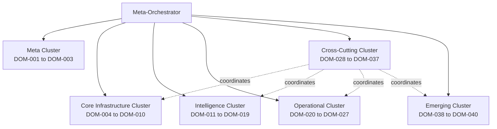
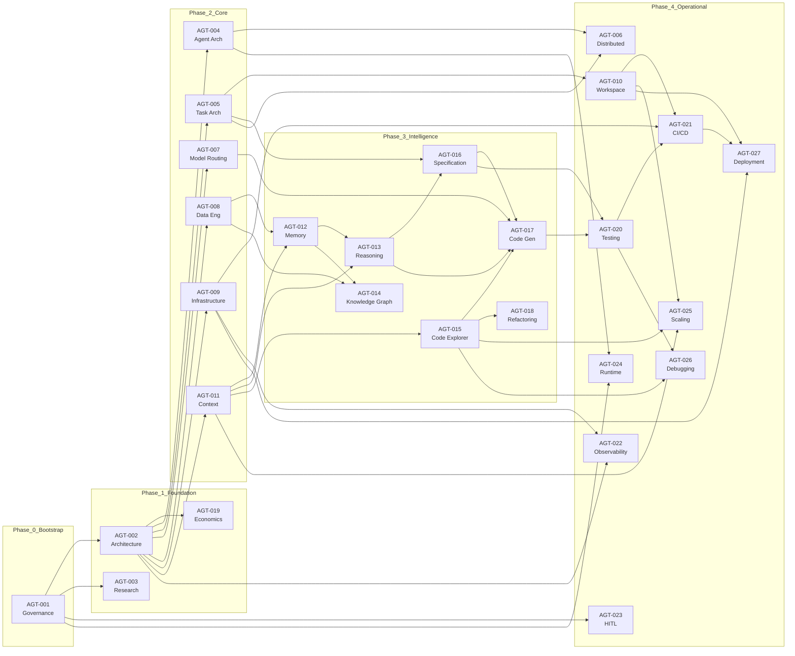
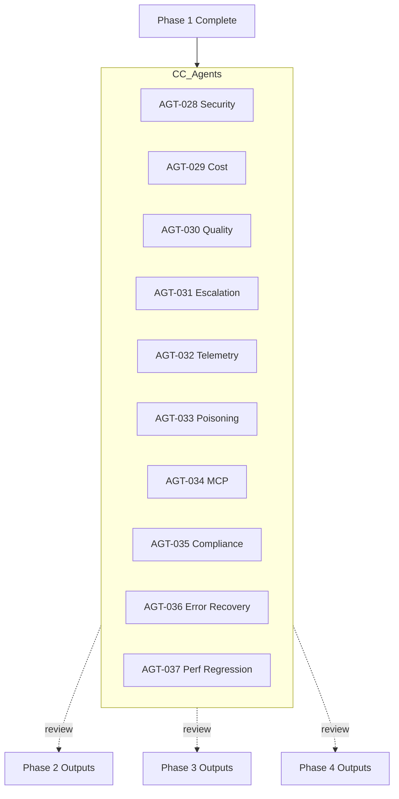

# Autonomous Recursive Meta-Orchestrator: Domain Hierarchy & Agent Architecture

> **Phase 2 Design Document** | Version 1.0  
> **Status**: Design Complete — Pending Phase 3 (Agent Prompt Generation)  
> **Input**: Phase 1 Corpus Analysis (68 atoms, 13 layers, 22 subdomains, 10 PCs, 8 SDLC phases)  
> **Output**: 40 domains, 40 agents, 6-level hierarchy, dependency graph, expansion plan, artifact map

---

## Table of Contents

1. [Design Principles](#1-design-principles)
2. [Complete Domain Taxonomy](#2-complete-domain-taxonomy-40-domains)
3. [Agent Assignments](#3-agent-assignments-40-agents)
4. [Hierarchical System Model](#4-hierarchical-system-model-6-levels)
5. [Dependency Graph](#5-dependency-graph)
6. [Recursive Expansion Plan](#6-recursive-expansion-plan)
7. [Output Artifact Mapping](#7-output-artifact-mapping)
8. [Validation & Completeness](#8-validation--completeness)
9. [Appendices](#9-appendices)

---

## 1. Design Principles

1. **One Agent Per Domain**: Each of the 40 domains has exactly one responsible agent. No domain is unowned.
2. **Non-Overlapping Boundaries**: Domains have clear, non-overlapping scopes. Cross-domain concerns are handled by dedicated coordination agents.
3. **Recursive Decomposition**: Every domain can be recursively expanded into subdomains, each subdomain into categories, each category into atomic definitions.
4. **Category Uniformity**: At Level 5, every domain decomposes into the same category structure: Skills, Workflows, Rules, Interfaces, Dependencies, Failure Modes, Metrics.
5. **Gap-First Design**: Phase 1 gaps (D6 Testing, D9 CI/CD, D12 Self-Improvement, P6 Debugging, P7 Deployment) are addressed by dedicated agents with explicit gap-filling mandates.
6. **Knowledge Atom Coverage**: Every atom type (TECHNIQUE, METRIC, CONSTRAINT, TOOL, COMBINATION, FAILURE_MODE, ANTI_PATTERN, TRADEOFF, RECIPE) is assignable to at least one domain agent.
7. **SDLC Phase Coverage**: Every phase (P1-P8) has at least 2 contributing domain agents.

---

## 2. Complete Domain Taxonomy (40 Domains)

### 2.1 Taxonomy Summary

| Category | Count | Domain IDs | Description |
|---|---|---|---|
| Meta | 3 | DOM-001 to DOM-003 | System-level governance, architecture, and research |
| Core Infrastructure | 7 | DOM-004 to DOM-010 | Foundational agent, task, model, data, and workspace capabilities |
| Intelligence | 9 | DOM-011 to DOM-019 | Reasoning, context, memory, code, and economic intelligence |
| Operational | 8 | DOM-020 to DOM-027 | SDLC execution: testing, CI/CD, debugging, deployment, human interaction |
| Cross-Cutting | 10 | DOM-028 to DOM-037 | Coordination agents ensuring consistency across all domains |
| Emerging | 3 | DOM-038 to DOM-040 | Self-improvement, trust scoring, and ecosystem intelligence |

**Total: 40 domains**

### 2.2 Meta Domains

| Domain ID | Domain Name | Category | Parent | Description |
|---|---|---|---|---|
| DOM-001 | System Governance & Policy | Meta | — | Defines governance frameworks, policy-as-code rules, bootstrap processes, and organizational standards. Absorbs `00_meta` governance and `01_meta_architecture` governance subdomain. |
| DOM-002 | System Architecture & Design Patterns | Meta | — | Defines overarching system design patterns, architectural contracts, and the meta-architecture for the orchestrator itself. Core of `01_meta_architecture`. |
| DOM-003 | Research & Benchmarking Framework | Meta | — | Manages research methodology, benchmarking protocols, evidence grading, and knowledge atom validation. Maps to `09_research_discipline`. |

### 2.3 Core Infrastructure Domains

| Domain ID | Domain Name | Category | Parent | Description |
|---|---|---|---|---|
| DOM-004 | Agent Architecture & Lifecycle | Core Infrastructure | DOM-002 | Defines agent patterns, state machines, lifecycle management (creation, execution, suspension, completion, failure), and delegation protocols. Merges `02_agent_orchestration` agent design with Implicit #13 Agent Lifecycle. |
| DOM-005 | Task Architecture & Dependency Management | Core Infrastructure | DOM-002 | Defines task decomposition hierarchies, dependency graphs, parallel execution strategies, and commit atomicity. Merges `02_agent_orchestration` task architecture with Implicit #2 Dependency Graph Management. |
| DOM-006 | Distributed & Multi-Repository Orchestration | Core Infrastructure | DOM-002 | Manages distributed agent coordination, multi-repository workflows, cross-workspace synchronization, and shared state protocols. Merges `02_agent_orchestration` distributed orchestration with Implicit #9 Multi-Repository Orchestration. |
| DOM-007 | Model Capability Management & Routing | Core Infrastructure | DOM-002 | Manages model capability matrices, cascade routing, confidence-based escalation, temperature optimization, and model selection strategies. Maps to `08_model_management`. |
| DOM-008 | Data Engineering & Storage | Core Infrastructure | — | Database design for agent systems, data pipelines, schema management, and persistence layer architecture. Maps to `06_data_infrastructure` database/data engineering subdomain. |
| DOM-009 | Infrastructure & Platform Engineering | Core Infrastructure | — | Container orchestration, environment provisioning, sandbox management, and platform reliability. Maps to `06_data_infrastructure` infrastructure engineering subdomain. |
| DOM-010 | Workspace & Repository Management | Core Infrastructure | — | Branch management, worktree isolation, workspace cleanup, repository scaffolding, and file system operations. Absorbs workspace aspects of `10_scaling_enterprise`. |

### 2.4 Intelligence Domains

| Domain ID | Domain Name | Category | Parent | Description |
|---|---|---|---|---|
| DOM-011 | Context Management & Prompt Engineering | Intelligence | — | Context window optimization, prompt compression, token budget allocation, and prompt template design. Merges `03_context_memory_intelligence` context management with Implicit #1 Prompt Engineering & Optimization. |
| DOM-012 | Memory Systems & Persistence | Intelligence | — | Short-term and long-term memory architectures, vector database integration, memory consolidation, and retrieval strategies. Maps to `03_context_memory_intelligence` memory systems subdomain. |
| DOM-013 | Reasoning & Decision Intelligence | Intelligence | — | Multi-hop reasoning, self-consistency sampling, chain-of-thought decomposition, and decision-making frameworks. Maps to `03_context_memory_intelligence` reasoning subdomain. |
| DOM-014 | Knowledge Graphs & Semantic Indexing | Intelligence | — | Knowledge graph construction, GraphRAG, vector search, RAG pipelines, and semantic indexing for codebases. Merges `03_context_memory_intelligence` knowledge representation with Implicit #14 Vector Search, RAG & Semantic Indexing. |
| DOM-015 | Code Exploration & Navigation | Intelligence | — | AST/CFG/DFG/CPG analysis, Tree-sitter integration, code search (semantic + syntactic), and codebase mapping. Maps to `04_code_intelligence` code exploration subdomain. |
| DOM-016 | Specification & Design Intelligence | Intelligence | — | Automated spec generation, design document synthesis, requirement extraction, and specification validation. Merges `04_code_intelligence` specification subdomain with Implicit #5 Specification & Design Intelligence. |
| DOM-017 | Code Generation & Synthesis | Intelligence | — | Code synthesis from specifications, template-based generation, context-aware completion, and multi-file generation. Absorbs Implicit #3 Code Generation. |
| DOM-018 | Refactoring & Code Optimization | Intelligence | — | Automated refactoring, dead code elimination, performance optimization, and code quality improvement. Merges `04_code_intelligence` refactoring subdomain with Implicit #4 Refactoring Automation. |
| DOM-019 | Economic Optimization & Cost Modeling | Intelligence | DOM-002 | Token economics, cost modeling, budget decomposition, ROI analysis, and economic decision frameworks. Merges `01_meta_architecture` economics subdomain with Implicit #7 Cost & Economic Management. |

### 2.5 Operational Domains

| Domain ID | Domain Name | Category | Parent | Description |
|---|---|---|---|---|
| DOM-020 | Testing Architecture & Automation | Operational | — | Test generation, mutation testing, test oracle design, coverage analysis, and quality gate definitions. Maps to `05_sdlc_automation` testing architecture. **Gap-filler for D6 (5 testing atoms: KA-024–KA-028).** |
| DOM-021 | CI/CD Pipeline Orchestration | Operational | — | Pipeline design, automated build/test/deploy, canary deployment, rollback strategies, and artifact management. Maps to `05_sdlc_automation` CI/CD DevOps. **Gap-filler for D9 (0 atoms).** |
| DOM-022 | Observability & Feedback Loops | Operational | — | Monitoring infrastructure, logging architecture, alerting systems, and feedback loop design for agent systems. Maps to `05_sdlc_automation` observability subdomain. |
| DOM-023 | Human-in-the-Loop Interaction | Operational | — | Escalation workflows, approval gates, structured clarification, user feedback integration, and notification systems. Merges `07_human_interaction` with Implicit #6 Notification & Communication Systems. |
| DOM-024 | Autonomous Runtime Systems | Operational | — | Self-governing agent behavior, autonomous decision policies, runtime adaptation, and unsupervised execution management. Maps to `11_advanced_runtime`. |
| DOM-025 | Large Codebase & Scaling Strategies | Operational | — | Strategies for handling monorepos, large file counts, incremental analysis, and performance at scale. Maps to `10_scaling_enterprise` large codebase handling. |
| DOM-026 | Debugging & Error Recovery | Operational | — | Root cause analysis, automated debugging, error classification, repair strategies, and recovery workflows. Addresses P6 phase sparsity gap. |
| DOM-027 | Deployment & Release Management | Operational | — | Release orchestration, version management, feature flags, blue-green deployments, and release validation. Addresses P7 phase sparsity gap. |

### 2.6 Cross-Cutting Domains

| Domain ID | Domain Name | Category | Parent | Spans Domains | Description |
|---|---|---|---|---|---|
| DOM-028 | Security Coordination | Cross-Cutting | — | DOM-002, DOM-004, DOM-011, DOM-023, DOM-007, DOM-025 | Coordinates security guardrails, injection defense, sandbox policies, and credential management across all agents. CC #1. |
| DOM-029 | Cost & Token Optimization | Cross-Cutting | — | DOM-002, DOM-011, DOM-007, DOM-038 | Ensures all agents apply cost-awareness: cheap-first routing, token budgets, and economic constraints. CC #2. |
| DOM-030 | Quality Assurance Coordination | Cross-Cutting | — | DOM-004, DOM-020, DOM-005, DOM-021 | Coordinates quality gates, review standards, and validation criteria across all domain agents. CC #3. |
| DOM-031 | Human Escalation Coordination | Cross-Cutting | — | DOM-002, DOM-004, DOM-023, DOM-024 | Defines escalation policies, approval thresholds, and human override protocols system-wide. CC #4. |
| DOM-032 | Observability & Telemetry Coordination | Cross-Cutting | — | DOM-002, DOM-022, DOM-021, DOM-038 | Ensures all agents emit standardized telemetry, metrics, and structured logs. CC #5. |
| DOM-033 | Context Poisoning Defense | Cross-Cutting | — | DOM-011, DOM-023 | Detects and mitigates context poisoning, prompt injection, and adversarial inputs across agents. CC #6. |
| DOM-034 | MCP Integration Coordination | Cross-Cutting | — | DOM-002, DOM-004, DOM-011, DOM-023, DOM-025 | Standardizes MCP server configurations, tool registrations, and protocol compliance. CC #7. |
| DOM-035 | Compliance & Audit Coordination | Cross-Cutting | — | DOM-001, DOM-023, DOM-003 | Ensures audit trail completeness, regulatory compliance, and policy enforcement. Absorbs Implicit #8 Compliance Automation. CC #8. |
| DOM-036 | Error Recovery Coordination | Cross-Cutting | — | DOM-002, DOM-004, DOM-026, DOM-024 | Defines cross-system error recovery patterns, circuit breakers, and graceful degradation policies. CC #9. |
| DOM-037 | Performance Regression Management | Cross-Cutting | — | DOM-007, DOM-003, DOM-038 | Monitors for quality/performance regression across model updates, prompt changes, and system evolution. CC #10. |

### 2.7 Emerging Domains

| Domain ID | Domain Name | Category | Parent | Description |
|---|---|---|---|---|
| DOM-038 | Self-Improvement & Evolution | Emerging | — | Online learning, prompt optimization, gradient-free workflow optimization, self-referential improvement, and system evolution. Merges `12_self_improvement` with Implicit #10 Self-Referential Systems and Implicit #11 Gradient-Free Workflow Optimization. **Gap-filler for D12 (0 atoms).** |
| DOM-039 | Agent Trust & Scoring | Emerging | DOM-004 | Agent reliability scoring, performance-based trust assignment, capability assessment, and trust decay models. Absorbs Implicit #12 Agent Trust & Scoring. |
| DOM-040 | Ecosystem Intelligence | Emerging | DOM-025 | Package ecosystem awareness, supply chain analysis, dependency vulnerability detection, and third-party integration intelligence. Absorbs ecosystem aspects of `10_scaling_enterprise`. |

---

## 3. Agent Assignments (40 Agents)

### 3.1 Agent Registry Overview

Each domain is assigned exactly one agent. Agent IDs mirror domain IDs for traceability.

### 3.2 Meta Agents

#### AGT-001: Governance Policy Agent

| Field | Value |
|---|---|
| **Agent ID** | AGT-001 |
| **Agent Name** | Governance Policy Agent |
| **Assigned Domain** | DOM-001: System Governance & Policy |
| **Agent Category** | Meta |
| **Required Inputs** | Organizational standards, regulatory requirements, existing policy documents, bootstrap configuration |
| **Expected Outputs** | `governance_framework.yaml`, `policy_rules.yaml`, `bootstrap_process.md`, confidence policy definitions |
| **Dependencies** | None (root agent) |
| **SDLC Phases** | P8 (Maintenance & Monitoring) |
| **Knowledge Atoms** | KA-009, KA-020 |

#### AGT-002: System Architect Agent

| Field | Value |
|---|---|
| **Agent ID** | AGT-002 |
| **Agent Name** | System Architect Agent |
| **Assigned Domain** | DOM-002: System Architecture & Design Patterns |
| **Agent Category** | Meta |
| **Required Inputs** | Governance framework from AGT-001, system requirements, architectural constraints |
| **Expected Outputs** | `architecture_contract.md`, `design_patterns.yaml`, system-level `modes.yaml`, architectural decision records |
| **Dependencies** | AGT-001 |
| **SDLC Phases** | P1, P2 |
| **Knowledge Atoms** | KA-006, KA-004, KA-022 |

#### AGT-003: Research & Benchmarking Agent

| Field | Value |
|---|---|
| **Agent ID** | AGT-003 |
| **Agent Name** | Research & Benchmarking Agent |
| **Assigned Domain** | DOM-003: Research & Benchmarking Framework |
| **Agent Category** | Meta |
| **Required Inputs** | Knowledge atom registry, evidence grading criteria, benchmark datasets |
| **Expected Outputs** | `benchmarking_framework.yaml`, validation reports, evidence assessment protocols, research methodology docs |
| **Dependencies** | AGT-001 |
| **SDLC Phases** | P1, P8 |
| **Knowledge Atoms** | KA-003 (validation aspect) |

### 3.3 Core Infrastructure Agents

#### AGT-004: Agent Architecture Agent

| Field | Value |
|---|---|
| **Agent ID** | AGT-004 |
| **Agent Name** | Agent Architecture Agent |
| **Assigned Domain** | DOM-004: Agent Architecture & Lifecycle |
| **Agent Category** | Primary |
| **Required Inputs** | Architecture contract from AGT-002, agent patterns library, lifecycle requirements |
| **Expected Outputs** | `agent_patterns.yaml`, `lifecycle_state_machines.yaml`, delegation protocols, agent templates |
| **Dependencies** | AGT-002 |
| **SDLC Phases** | P2, P3 |
| **Knowledge Atoms** | KA-004, KA-006, KA-009, KA-010, KA-012, KA-015, KA-016, KA-018, KA-019, KA-021, KA-023 |

#### AGT-005: Task Architecture Agent

| Field | Value |
|---|---|
| **Agent ID** | AGT-005 |
| **Agent Name** | Task Architecture Agent |
| **Assigned Domain** | DOM-005: Task Architecture & Dependency Management |
| **Agent Category** | Primary |
| **Required Inputs** | Architecture contract from AGT-002, task decomposition patterns, dependency graph schemas |
| **Expected Outputs** | `task_decomposition_patterns.yaml`, `dependency_graph_schema.yaml`, parallel execution strategies, commit atomicity rules |
| **Dependencies** | AGT-002 |
| **SDLC Phases** | P2 |
| **Knowledge Atoms** | KA-017, KA-029, KA-039, KA-041, KA-042 |

#### AGT-006: Distributed Orchestration Agent

| Field | Value |
|---|---|
| **Agent ID** | AGT-006 |
| **Agent Name** | Distributed Orchestration Agent |
| **Assigned Domain** | DOM-006: Distributed & Multi-Repository Orchestration |
| **Agent Category** | Primary |
| **Required Inputs** | Agent architecture from AGT-004, task architecture from AGT-005, repository topology |
| **Expected Outputs** | `distributed_coordination.yaml`, multi-repo workflow definitions, shared state protocols, synchronization rules |
| **Dependencies** | AGT-004, AGT-005 |
| **SDLC Phases** | P3, P7 |
| **Knowledge Atoms** | KA-041, KA-034 |

#### AGT-007: Model Routing Agent

| Field | Value |
|---|---|
| **Agent ID** | AGT-007 |
| **Agent Name** | Model Routing Agent |
| **Assigned Domain** | DOM-007: Model Capability Management & Routing |
| **Agent Category** | Primary |
| **Required Inputs** | Architecture contract from AGT-002, model capability matrix, cost constraints from AGT-019 |
| **Expected Outputs** | `model_capability_matrix.yaml`, `routing_rules.yaml`, cascade configurations, temperature optimization profiles |
| **Dependencies** | AGT-002, AGT-019 |
| **SDLC Phases** | P1, P3 |
| **Knowledge Atoms** | KA-001, KA-003, KA-011 |

#### AGT-008: Data Engineering Agent

| Field | Value |
|---|---|
| **Agent ID** | AGT-008 |
| **Agent Name** | Data Engineering Agent |
| **Assigned Domain** | DOM-008: Data Engineering & Storage |
| **Agent Category** | Primary |
| **Required Inputs** | Architecture contract from AGT-002, data schemas, persistence requirements |
| **Expected Outputs** | `database_schemas.yaml`, data pipeline definitions, migration strategies, storage architecture docs |
| **Dependencies** | AGT-002 |
| **SDLC Phases** | P3 |
| **Knowledge Atoms** | — (infrastructure domain) |

#### AGT-009: Infrastructure Agent

| Field | Value |
|---|---|
| **Agent ID** | AGT-009 |
| **Agent Name** | Infrastructure Agent |
| **Assigned Domain** | DOM-009: Infrastructure & Platform Engineering |
| **Agent Category** | Primary |
| **Required Inputs** | Architecture contract from AGT-002, platform requirements, sandbox specifications |
| **Expected Outputs** | `infrastructure_patterns.yaml`, container configs, sandbox definitions, environment provisioning templates |
| **Dependencies** | AGT-002 |
| **SDLC Phases** | P3, P7 |
| **Knowledge Atoms** | KA-010 (sandbox/credentials) |

#### AGT-010: Workspace Management Agent

| Field | Value |
|---|---|
| **Agent ID** | AGT-010 |
| **Agent Name** | Workspace Management Agent |
| **Assigned Domain** | DOM-010: Workspace & Repository Management |
| **Agent Category** | Primary |
| **Required Inputs** | Task architecture from AGT-005, repository structure, branch policies |
| **Expected Outputs** | `workspace_management.yaml`, branch strategies, worktree isolation configs, cleanup protocols |
| **Dependencies** | AGT-005 |
| **SDLC Phases** | P1, P7 |
| **Knowledge Atoms** | KA-034 |

### 3.4 Intelligence Agents

#### AGT-011: Context & Prompt Agent

| Field | Value |
|---|---|
| **Agent ID** | AGT-011 |
| **Agent Name** | Context & Prompt Agent |
| **Assigned Domain** | DOM-011: Context Management & Prompt Engineering |
| **Agent Category** | Primary |
| **Required Inputs** | Architecture contract from AGT-002, token budget policies, prompt template library |
| **Expected Outputs** | `context_strategies.yaml`, `prompts.yaml`, compression configs, token budget allocation rules |
| **Dependencies** | AGT-002 |
| **SDLC Phases** | P1, P3 |
| **Knowledge Atoms** | KA-002, KA-036 |

#### AGT-012: Memory Systems Agent

| Field | Value |
|---|---|
| **Agent ID** | AGT-012 |
| **Agent Name** | Memory Systems Agent |
| **Assigned Domain** | DOM-012: Memory Systems & Persistence |
| **Agent Category** | Primary |
| **Required Inputs** | Data engineering specs from AGT-008, context strategies from AGT-011, retrieval requirements |
| **Expected Outputs** | `memory_architecture.yaml`, vector DB configs, retrieval strategy definitions, memory consolidation rules |
| **Dependencies** | AGT-008, AGT-011 |
| **SDLC Phases** | P1, P3 |
| **Knowledge Atoms** | KA-007, KA-013, KA-014 |

#### AGT-013: Reasoning Agent

| Field | Value |
|---|---|
| **Agent ID** | AGT-013 |
| **Agent Name** | Reasoning Agent |
| **Assigned Domain** | DOM-013: Reasoning & Decision Intelligence |
| **Agent Category** | Primary |
| **Required Inputs** | Context strategies from AGT-011, memory systems from AGT-012, task decompositions from AGT-005 |
| **Expected Outputs** | `reasoning_strategies.yaml`, decision frameworks, self-consistency configs, chain-of-thought templates |
| **Dependencies** | AGT-011, AGT-012 |
| **SDLC Phases** | P2, P3 |
| **Knowledge Atoms** | KA-008, KA-031 |

#### AGT-014: Knowledge Graph Agent

| Field | Value |
|---|---|
| **Agent ID** | AGT-014 |
| **Agent Name** | Knowledge Graph Agent |
| **Assigned Domain** | DOM-014: Knowledge Graphs & Semantic Indexing |
| **Agent Category** | Primary |
| **Required Inputs** | Memory architecture from AGT-012, codebase analysis from AGT-015, data schemas from AGT-008 |
| **Expected Outputs** | `knowledge_graph_schema.yaml`, RAG pipeline configs, semantic index definitions, GraphRAG integration specs |
| **Dependencies** | AGT-012, AGT-008 |
| **SDLC Phases** | P1, P3 |
| **Knowledge Atoms** | KA-035 |

#### AGT-015: Code Explorer Agent

| Field | Value |
|---|---|
| **Agent ID** | AGT-015 |
| **Agent Name** | Code Explorer Agent |
| **Assigned Domain** | DOM-015: Code Exploration & Navigation |
| **Agent Category** | Primary |
| **Required Inputs** | Context strategies from AGT-011, codebase file structure, AST/parse requirements |
| **Expected Outputs** | `code_exploration_skills.yaml`, search strategies, AST integration configs, codebase mapping workflows |
| **Dependencies** | AGT-011 |
| **SDLC Phases** | P1 |
| **Knowledge Atoms** | KA-037 |

#### AGT-016: Specification Agent

| Field | Value |
|---|---|
| **Agent ID** | AGT-016 |
| **Agent Name** | Specification Agent |
| **Assigned Domain** | DOM-016: Specification & Design Intelligence |
| **Agent Category** | Primary |
| **Required Inputs** | Reasoning frameworks from AGT-013, code exploration data from AGT-015, task decompositions from AGT-005 |
| **Expected Outputs** | `spec_generation_workflows.yaml`, design document templates, requirement extraction rules, specification validation criteria |
| **Dependencies** | AGT-013, AGT-005 |
| **SDLC Phases** | P2 |
| **Knowledge Atoms** | KA-006, KA-033 |

#### AGT-017: Code Generation Agent

| Field | Value |
|---|---|
| **Agent ID** | AGT-017 |
| **Agent Name** | Code Generation Agent |
| **Assigned Domain** | DOM-017: Code Generation & Synthesis |
| **Agent Category** | Primary |
| **Required Inputs** | Specifications from AGT-016, code exploration data from AGT-015, reasoning frameworks from AGT-013, model routing from AGT-007 |
| **Expected Outputs** | `code_generation_skills.yaml`, generation workflows, multi-file synthesis templates, completion strategies |
| **Dependencies** | AGT-016, AGT-015, AGT-013, AGT-007 |
| **SDLC Phases** | P3 |
| **Knowledge Atoms** | KA-030, KA-031, KA-038 |

#### AGT-018: Refactoring Agent

| Field | Value |
|---|---|
| **Agent ID** | AGT-018 |
| **Agent Name** | Refactoring Agent |
| **Assigned Domain** | DOM-018: Refactoring & Code Optimization |
| **Agent Category** | Primary |
| **Required Inputs** | Code exploration data from AGT-015, quality metrics from AGT-030, performance baselines from AGT-037 |
| **Expected Outputs** | `refactoring_skills.yaml`, optimization workflows, dead code detection rules, performance improvement strategies |
| **Dependencies** | AGT-015, AGT-030 |
| **SDLC Phases** | P3, P8 |
| **Knowledge Atoms** | KA-038 |

#### AGT-019: Economic Optimization Agent

| Field | Value |
|---|---|
| **Agent ID** | AGT-019 |
| **Agent Name** | Economic Optimization Agent |
| **Assigned Domain** | DOM-019: Economic Optimization & Cost Modeling |
| **Agent Category** | Primary |
| **Required Inputs** | Architecture contract from AGT-002, model pricing data, historical cost metrics, token usage patterns |
| **Expected Outputs** | `cost_models.yaml`, budget decomposition templates, ROI analysis frameworks, economic decision rules |
| **Dependencies** | AGT-002 |
| **SDLC Phases** | P1, P8 |
| **Knowledge Atoms** | KA-011, KA-023 |

### 3.5 Operational Agents

#### AGT-020: Testing Architecture Agent

| Field | Value |
|---|---|
| **Agent ID** | AGT-020 |
| **Agent Name** | Testing Architecture Agent |
| **Assigned Domain** | DOM-020: Testing Architecture & Automation |
| **Agent Category** | Gap-Filler |
| **Required Inputs** | Code generation outputs from AGT-017, specifications from AGT-016, quality criteria from AGT-030 |
| **Expected Outputs** | `testing_workflows.yaml`, test generation strategies, mutation testing configs, quality gate definitions, coverage analysis rules |
| **Dependencies** | AGT-017, AGT-016, AGT-030 |
| **SDLC Phases** | P4 |
| **Knowledge Atoms** | KA-024, KA-025, KA-026, KA-027, KA-028, KA-032 (cross-link), KA-038 |
| **Gap Mandate** | **D6 has 5 testing-specific atoms (KA-024–KA-028) plus cross-links.** This agent must expand these into comprehensive testing strategies supplemented by external research. |

#### AGT-021: CI/CD Pipeline Agent

| Field | Value |
|---|---|
| **Agent ID** | AGT-021 |
| **Agent Name** | CI/CD Pipeline Agent |
| **Assigned Domain** | DOM-021: CI/CD Pipeline Orchestration |
| **Agent Category** | Gap-Filler |
| **Required Inputs** | Testing architecture from AGT-020, deployment specs from AGT-027, infrastructure from AGT-009, workspace configs from AGT-010 |
| **Expected Outputs** | `cicd_workflows.yaml`, pipeline definitions, canary deployment configs, rollback strategies, artifact management rules |
| **Dependencies** | AGT-020, AGT-009, AGT-010 |
| **SDLC Phases** | P7 |
| **Knowledge Atoms** | — (no primary atoms) |
| **Gap Mandate** | **D9 has 0 primary atoms.** This agent must define agentic CI/CD patterns from first principles and external research. |

#### AGT-022: Observability Agent

| Field | Value |
|---|---|
| **Agent ID** | AGT-022 |
| **Agent Name** | Observability Agent |
| **Assigned Domain** | DOM-022: Observability & Feedback Loops |
| **Agent Category** | Primary |
| **Required Inputs** | Architecture contract from AGT-002, telemetry coordination from AGT-032, infrastructure from AGT-009 |
| **Expected Outputs** | `observability_workflows.yaml`, logging schemas, alerting rules, feedback loop definitions, dashboard specs |
| **Dependencies** | AGT-002, AGT-009 |
| **SDLC Phases** | P8 |
| **Knowledge Atoms** | KA-004 (journaling), KA-018 |

#### AGT-023: Human-in-the-Loop Agent

| Field | Value |
|---|---|
| **Agent ID** | AGT-023 |
| **Agent Name** | Human-in-the-Loop Agent |
| **Assigned Domain** | DOM-023: Human-in-the-Loop Interaction |
| **Agent Category** | Primary |
| **Required Inputs** | Escalation policies from AGT-031, governance framework from AGT-001, UX requirements |
| **Expected Outputs** | `hitl_workflows.yaml`, escalation templates, approval gate configs, clarification prompt libraries, notification rules |
| **Dependencies** | AGT-001, AGT-031 |
| **SDLC Phases** | P2, P5 |
| **Knowledge Atoms** | KA-033 |

#### AGT-024: Autonomous Runtime Agent

| Field | Value |
|---|---|
| **Agent ID** | AGT-024 |
| **Agent Name** | Autonomous Runtime Agent |
| **Assigned Domain** | DOM-024: Autonomous Runtime Systems |
| **Agent Category** | Primary |
| **Required Inputs** | Agent architecture from AGT-004, governance framework from AGT-001, escalation policies from AGT-031 |
| **Expected Outputs** | `autonomous_runtime_rules.yaml`, self-governing policies, runtime adaptation strategies, unsupervised execution boundaries |
| **Dependencies** | AGT-004, AGT-001, AGT-031 |
| **SDLC Phases** | P3, P8 |
| **Knowledge Atoms** | KA-022 |

#### AGT-025: Scaling Strategies Agent

| Field | Value |
|---|---|
| **Agent ID** | AGT-025 |
| **Agent Name** | Scaling Strategies Agent |
| **Assigned Domain** | DOM-025: Large Codebase & Scaling Strategies |
| **Agent Category** | Primary |
| **Required Inputs** | Code exploration data from AGT-015, context strategies from AGT-011, workspace configs from AGT-010 |
| **Expected Outputs** | `scaling_strategies.yaml`, monorepo handling rules, incremental analysis configs, performance-at-scale techniques |
| **Dependencies** | AGT-015, AGT-011, AGT-010 |
| **SDLC Phases** | P1, P3 |
| **Knowledge Atoms** | KA-034, KA-037 |

#### AGT-026: Debugging Agent

| Field | Value |
|---|---|
| **Agent ID** | AGT-026 |
| **Agent Name** | Debugging Agent |
| **Assigned Domain** | DOM-026: Debugging & Error Recovery |
| **Agent Category** | Gap-Filler |
| **Required Inputs** | Testing output from AGT-020, error recovery coordination from AGT-036, code exploration from AGT-015 |
| **Expected Outputs** | `debugging_workflows.yaml`, root cause analysis strategies, error classification taxonomy, repair workflow templates |
| **Dependencies** | AGT-020, AGT-015, AGT-036 |
| **SDLC Phases** | P6 |
| **Knowledge Atoms** | KA-010, KA-031, KA-038 |
| **Gap Mandate** | **P6 has only 3 sparse atoms.** This agent must expand debugging/recovery patterns. |

#### AGT-027: Deployment Agent

| Field | Value |
|---|---|
| **Agent ID** | AGT-027 |
| **Agent Name** | Deployment Agent |
| **Assigned Domain** | DOM-027: Deployment & Release Management |
| **Agent Category** | Gap-Filler |
| **Required Inputs** | CI/CD pipeline from AGT-021, workspace configs from AGT-010, infrastructure from AGT-009 |
| **Expected Outputs** | `deployment_workflows.yaml`, release orchestration rules, version management strategies, feature flag configs, rollback procedures |
| **Dependencies** | AGT-021, AGT-010, AGT-009 |
| **SDLC Phases** | P7 |
| **Knowledge Atoms** | KA-034, KA-006, KA-032 |
| **Gap Mandate** | **P7 has only 3 sparse atoms.** This agent must define comprehensive deployment patterns. |

### 3.6 Cross-Cutting Agents

#### AGT-028: Security Coordinator Agent

| Field | Value |
|---|---|
| **Agent ID** | AGT-028 |
| **Agent Name** | Security Coordinator Agent |
| **Assigned Domain** | DOM-028: Security Coordination |
| **Agent Category** | Cross-Cutting |
| **Required Inputs** | Governance framework from AGT-001, all domain agent outputs (for security review) |
| **Expected Outputs** | `security_rules.yaml`, guardrail definitions, injection defense patterns, sandbox policies, credential management rules |
| **Dependencies** | AGT-001, AGT-002 |
| **SDLC Phases** | P4, P5 |
| **Knowledge Atoms** | KA-005, KA-010, KA-013, KA-014 |
| **Coordination Scope** | Reviews outputs of DOM-002, DOM-004, DOM-011, DOM-023, DOM-007, DOM-025 |

#### AGT-029: Cost Optimization Coordinator Agent

| Field | Value |
|---|---|
| **Agent ID** | AGT-029 |
| **Agent Name** | Cost Optimization Coordinator Agent |
| **Assigned Domain** | DOM-029: Cost & Token Optimization |
| **Agent Category** | Cross-Cutting |
| **Required Inputs** | Economic models from AGT-019, model routing from AGT-007, all domain agent cost profiles |
| **Expected Outputs** | `cost_optimization_rules.yaml`, token budget enforcement rules, cheap-first routing policies, cost monitoring dashboards |
| **Dependencies** | AGT-019, AGT-007 |
| **SDLC Phases** | P1, P3, P8 |
| **Knowledge Atoms** | KA-001, KA-002, KA-011, KA-023 |
| **Coordination Scope** | Enforces cost awareness in DOM-002, DOM-011, DOM-007, DOM-038 |

#### AGT-030: Quality Assurance Coordinator Agent

| Field | Value |
|---|---|
| **Agent ID** | AGT-030 |
| **Agent Name** | Quality Assurance Coordinator Agent |
| **Assigned Domain** | DOM-030: Quality Assurance Coordination |
| **Agent Category** | Cross-Cutting |
| **Required Inputs** | Testing architecture from AGT-020, governance from AGT-001, all domain agent quality metrics |
| **Expected Outputs** | `quality_rules.yaml`, review standards, validation criteria templates, quality gate enforcement configs |
| **Dependencies** | AGT-001, AGT-020 |
| **SDLC Phases** | P4, P5 |
| **Knowledge Atoms** | KA-032, KA-030 |
| **Coordination Scope** | Coordinates quality across DOM-004, DOM-020, DOM-005, DOM-021 |

#### AGT-031: Human Escalation Coordinator Agent

| Field | Value |
|---|---|
| **Agent ID** | AGT-031 |
| **Agent Name** | Human Escalation Coordinator Agent |
| **Assigned Domain** | DOM-031: Human Escalation Coordination |
| **Agent Category** | Cross-Cutting |
| **Required Inputs** | Governance framework from AGT-001, HITL interaction patterns from AGT-023 |
| **Expected Outputs** | `escalation_policies.yaml`, approval threshold definitions, human override protocols, confidence-based escalation rules |
| **Dependencies** | AGT-001 |
| **SDLC Phases** | P2, P5 |
| **Knowledge Atoms** | KA-033, KA-022 |
| **Coordination Scope** | Defines escalation for DOM-002, DOM-004, DOM-023, DOM-024 |

#### AGT-032: Telemetry Coordinator Agent

| Field | Value |
|---|---|
| **Agent ID** | AGT-032 |
| **Agent Name** | Telemetry Coordinator Agent |
| **Assigned Domain** | DOM-032: Observability & Telemetry Coordination |
| **Agent Category** | Cross-Cutting |
| **Required Inputs** | Observability infrastructure from AGT-022, architecture contract from AGT-002 |
| **Expected Outputs** | `telemetry_standards.yaml`, structured log schemas, metrics emission contracts, trace correlation rules |
| **Dependencies** | AGT-002, AGT-022 |
| **SDLC Phases** | P8 |
| **Knowledge Atoms** | KA-004, KA-018 |
| **Coordination Scope** | Enforces telemetry in DOM-002, DOM-022, DOM-021, DOM-038 |

#### AGT-033: Context Poisoning Defense Agent

| Field | Value |
|---|---|
| **Agent ID** | AGT-033 |
| **Agent Name** | Context Poisoning Defense Agent |
| **Assigned Domain** | DOM-033: Context Poisoning Defense |
| **Agent Category** | Cross-Cutting |
| **Required Inputs** | Security rules from AGT-028, context strategies from AGT-011, HITL patterns from AGT-023 |
| **Expected Outputs** | `context_defense_rules.yaml`, injection detection patterns, adversarial input filters, context validation protocols |
| **Dependencies** | AGT-028, AGT-011 |
| **SDLC Phases** | P1, P3 |
| **Knowledge Atoms** | KA-005, KA-013 |
| **Coordination Scope** | Protects DOM-011, DOM-023 |

#### AGT-034: MCP Integration Coordinator Agent

| Field | Value |
|---|---|
| **Agent ID** | AGT-034 |
| **Agent Name** | MCP Integration Coordinator Agent |
| **Assigned Domain** | DOM-034: MCP Integration Coordination |
| **Agent Category** | Cross-Cutting |
| **Required Inputs** | Architecture contract from AGT-002, tool registry, MCP server specifications |
| **Expected Outputs** | `mcp_configurations.yaml`, tool registration standards, protocol compliance rules, MCP server templates |
| **Dependencies** | AGT-002 |
| **SDLC Phases** | P1, P3 |
| **Knowledge Atoms** | KA-032, KA-038 |
| **Coordination Scope** | Standardizes MCP across DOM-002, DOM-004, DOM-011, DOM-023, DOM-025 |

#### AGT-035: Compliance & Audit Coordinator Agent

| Field | Value |
|---|---|
| **Agent ID** | AGT-035 |
| **Agent Name** | Compliance & Audit Coordinator Agent |
| **Assigned Domain** | DOM-035: Compliance & Audit Coordination |
| **Agent Category** | Cross-Cutting |
| **Required Inputs** | Governance framework from AGT-001, telemetry standards from AGT-032, all domain agent audit logs |
| **Expected Outputs** | `compliance_rules.yaml`, audit trail requirements, regulatory mapping documents, compliance verification workflows |
| **Dependencies** | AGT-001, AGT-032 |
| **SDLC Phases** | P5, P8 |
| **Knowledge Atoms** | KA-004, KA-009, KA-018 |
| **Coordination Scope** | Audits DOM-001, DOM-023, DOM-003 |

#### AGT-036: Error Recovery Coordinator Agent

| Field | Value |
|---|---|
| **Agent ID** | AGT-036 |
| **Agent Name** | Error Recovery Coordinator Agent |
| **Assigned Domain** | DOM-036: Error Recovery Coordination |
| **Agent Category** | Cross-Cutting |
| **Required Inputs** | Architecture contract from AGT-002, debugging patterns from AGT-026, agent architecture from AGT-004 |
| **Expected Outputs** | `error_recovery_rules.yaml`, circuit breaker definitions, graceful degradation policies, retry strategies, fallback routing |
| **Dependencies** | AGT-002, AGT-004 |
| **SDLC Phases** | P6 |
| **Knowledge Atoms** | KA-017, KA-041, KA-040 |
| **Coordination Scope** | Coordinates recovery across DOM-002, DOM-004, DOM-026, DOM-024 |

#### AGT-037: Performance Regression Agent

| Field | Value |
|---|---|
| **Agent ID** | AGT-037 |
| **Agent Name** | Performance Regression Agent |
| **Assigned Domain** | DOM-037: Performance Regression Management |
| **Agent Category** | Cross-Cutting |
| **Required Inputs** | Benchmarking data from AGT-003, model routing from AGT-007, self-improvement metrics from AGT-038 |
| **Expected Outputs** | `regression_detection_rules.yaml`, performance baseline definitions, regression alert configs, quality degradation thresholds |
| **Dependencies** | AGT-003, AGT-007 |
| **SDLC Phases** | P8 |
| **Knowledge Atoms** | KA-042 |
| **Coordination Scope** | Monitors regression in DOM-007, DOM-003, DOM-038 |

### 3.7 Emerging Agents

#### AGT-038: Self-Improvement Agent

| Field | Value |
|---|---|
| **Agent ID** | AGT-038 |
| **Agent Name** | Self-Improvement Agent |
| **Assigned Domain** | DOM-038: Self-Improvement & Evolution |
| **Agent Category** | Gap-Filler |
| **Required Inputs** | Performance metrics from AGT-037, benchmarking data from AGT-003, telemetry from AGT-032, all domain agent performance histories |
| **Expected Outputs** | `self_improvement_workflows.yaml`, prompt optimization strategies, gradient-free optimization configs, self-referential improvement rules, evolution roadmaps |
| **Dependencies** | AGT-003, AGT-037, AGT-032 |
| **SDLC Phases** | P8 |
| **Knowledge Atoms** | — (no primary atoms) |
| **Gap Mandate** | **D12 has 0 primary atoms.** This agent must define self-improvement patterns from meta-learning, online optimization, and self-referential system research. |

#### AGT-039: Agent Trust Agent

| Field | Value |
|---|---|
| **Agent ID** | AGT-039 |
| **Agent Name** | Agent Trust Agent |
| **Assigned Domain** | DOM-039: Agent Trust & Scoring |
| **Agent Category** | Emerging |
| **Required Inputs** | Agent architecture from AGT-004, performance metrics from AGT-037, quality data from AGT-030 |
| **Expected Outputs** | `trust_scoring_rules.yaml`, reliability metrics, capability assessment frameworks, trust decay models, performance-based routing adjustments |
| **Dependencies** | AGT-004, AGT-037, AGT-030 |
| **SDLC Phases** | P8 |
| **Knowledge Atoms** | KA-039 |

#### AGT-040: Ecosystem Intelligence Agent

| Field | Value |
|---|---|
| **Agent ID** | AGT-040 |
| **Agent Name** | Ecosystem Intelligence Agent |
| **Assigned Domain** | DOM-040: Ecosystem Intelligence |
| **Agent Category** | Emerging |
| **Required Inputs** | Code exploration data from AGT-015, security data from AGT-028, scaling strategies from AGT-025 |
| **Expected Outputs** | `ecosystem_intelligence.yaml`, supply chain analysis rules, dependency vulnerability detection configs, package ecosystem maps |
| **Dependencies** | AGT-015, AGT-028, AGT-025 |
| **SDLC Phases** | P1, P4 |
| **Knowledge Atoms** | KA-013 (slopsquatting), KA-014 (vuln rates) |

---

## 4. Hierarchical System Model (6 Levels)

### 4.1 Level Overview

```
Level 1: META-ORCHESTRATOR (single root)
  Level 2: DOMAIN CLUSTERS (6 clusters)
    Level 3: INDIVIDUAL DOMAINS (40 domains)
      Level 4: SUBDOMAINS (variable per domain)
        Level 5: CATEGORIES (7 standard per subdomain)
          Level 6: ATOMIC DEFINITIONS (knowledge atoms, rules, configs)
```

### 4.2 Level 1 — System: Meta-Orchestrator

The Meta-Orchestrator is the root node that:
- Receives the initial task or system-level directive
- Activates the appropriate Level 2 cluster coordinators
- Manages global state and cross-cluster dependencies
- Enforces system-wide governance via AGT-001
- Coordinates recursive expansion and termination

### 4.3 Level 2 — Domain Clusters



| Cluster | Domains | Responsibility | Activation Trigger |
|---|---|---|---|
| Meta | DOM-001 to DOM-003 | Governance, architecture, research | Always active (bootstrap) |
| Core Infrastructure | DOM-004 to DOM-010 | Agent, task, model, data, workspace foundations | After Meta cluster completes |
| Intelligence | DOM-011 to DOM-019 | Context, memory, reasoning, code, economics | After Core Infrastructure provides agent patterns |
| Operational | DOM-020 to DOM-027 | Testing, CI/CD, debugging, deployment, HITL | After Intelligence provides capabilities |
| Cross-Cutting | DOM-028 to DOM-037 | Security, cost, quality, compliance coordination | Runs in parallel after Meta, reviews all outputs |
| Emerging | DOM-038 to DOM-040 | Self-improvement, trust, ecosystem awareness | After Operational produces performance data |

### 4.4 Level 3 — Individual Domains

Each of the 40 domains defined in Section 2. Each domain has:
- A single responsible agent (Section 3)
- A defined set of subdomains (Level 4)
- Standard category decomposition (Level 5)

### 4.5 Level 4 — Subdomains

Each domain decomposes into 2-5 subdomains. The full subdomain map:

| Domain | Subdomains |
|---|---|
| DOM-001 | SD-001a: Policy Framework Design, SD-001b: Bootstrap & Initialization, SD-001c: Standards & Conventions |
| DOM-002 | SD-002a: Architectural Patterns, SD-002b: Contract Definitions, SD-002c: Decision Records |
| DOM-003 | SD-003a: Research Methodology, SD-003b: Benchmarking Protocols, SD-003c: Evidence Grading |
| DOM-004 | SD-004a: Agent Patterns, SD-004b: Lifecycle State Machines, SD-004c: Delegation Protocols, SD-004d: Consensus Mechanisms |
| DOM-005 | SD-005a: Decomposition Strategies, SD-005b: Dependency Graph Mgmt, SD-005c: Parallel Execution, SD-005d: Commit Atomicity |
| DOM-006 | SD-006a: Multi-Agent Coordination, SD-006b: Multi-Repo Workflows, SD-006c: Shared State Protocols |
| DOM-007 | SD-007a: Capability Matrices, SD-007b: Cascade Routing, SD-007c: Temperature Optimization, SD-007d: Model Selection |
| DOM-008 | SD-008a: Schema Design, SD-008b: Data Pipelines, SD-008c: Migration Strategies |
| DOM-009 | SD-009a: Container Orchestration, SD-009b: Sandbox Management, SD-009c: Environment Provisioning |
| DOM-010 | SD-010a: Branch Strategies, SD-010b: Worktree Isolation, SD-010c: Cleanup Protocols |
| DOM-011 | SD-011a: Window Optimization, SD-011b: Prompt Compression, SD-011c: Token Budget Allocation, SD-011d: Template Design |
| DOM-012 | SD-012a: Short-Term Memory, SD-012b: Long-Term Persistence, SD-012c: Vector DB Integration, SD-012d: Retrieval Strategies |
| DOM-013 | SD-013a: Multi-Hop Reasoning, SD-013b: Self-Consistency, SD-013c: Chain-of-Thought, SD-013d: Decision Frameworks |
| DOM-014 | SD-014a: Graph Construction, SD-014b: GraphRAG Integration, SD-014c: Vector Search, SD-014d: Semantic Indexing |
| DOM-015 | SD-015a: AST Analysis, SD-015b: Semantic Search, SD-015c: Codebase Mapping, SD-015d: Navigation Strategies |
| DOM-016 | SD-016a: Spec Generation, SD-016b: Design Synthesis, SD-016c: Requirement Extraction, SD-016d: Spec Validation |
| DOM-017 | SD-017a: Template Generation, SD-017b: Context-Aware Completion, SD-017c: Multi-File Synthesis, SD-017d: Code Quality Gates |
| DOM-018 | SD-018a: Automated Refactoring, SD-018b: Dead Code Elimination, SD-018c: Performance Optimization |
| DOM-019 | SD-019a: Token Economics, SD-019b: Budget Decomposition, SD-019c: ROI Analysis, SD-019d: Cost Decision Rules |
| DOM-020 | SD-020a: Test Generation, SD-020b: Mutation Testing, SD-020c: Coverage Analysis, SD-020d: Quality Gate Design |
| DOM-021 | SD-021a: Pipeline Design, SD-021b: Canary Deployment, SD-021c: Rollback Strategies, SD-021d: Artifact Management |
| DOM-022 | SD-022a: Logging Architecture, SD-022b: Alerting Systems, SD-022c: Feedback Loops, SD-022d: Dashboard Specs |
| DOM-023 | SD-023a: Escalation Workflows, SD-023b: Approval Gates, SD-023c: Clarification Prompts, SD-023d: Notification Systems |
| DOM-024 | SD-024a: Self-Governing Policies, SD-024b: Runtime Adaptation, SD-024c: Unsupervised Boundaries |
| DOM-025 | SD-025a: Monorepo Handling, SD-025b: Incremental Analysis, SD-025c: Performance at Scale |
| DOM-026 | SD-026a: Root Cause Analysis, SD-026b: Error Classification, SD-026c: Repair Strategies, SD-026d: Recovery Workflows |
| DOM-027 | SD-027a: Release Orchestration, SD-027b: Version Management, SD-027c: Feature Flags, SD-027d: Blue-Green Deploy |
| DOM-028 | SD-028a: Guardrail Definitions, SD-028b: Injection Defense, SD-028c: Sandbox Policies, SD-028d: Credential Management |
| DOM-029 | SD-029a: Token Budgets, SD-029b: Cheap-First Routing, SD-029c: Cost Monitoring |
| DOM-030 | SD-030a: Review Standards, SD-030b: Validation Criteria, SD-030c: Gate Enforcement |
| DOM-031 | SD-031a: Escalation Thresholds, SD-031b: Override Protocols, SD-031c: Confidence Routing |
| DOM-032 | SD-032a: Log Schemas, SD-032b: Metrics Contracts, SD-032c: Trace Correlation |
| DOM-033 | SD-033a: Injection Detection, SD-033b: Adversarial Filters, SD-033c: Context Validation |
| DOM-034 | SD-034a: Tool Registration, SD-034b: Protocol Compliance, SD-034c: Server Templates |
| DOM-035 | SD-035a: Audit Trail Requirements, SD-035b: Regulatory Mapping, SD-035c: Verification Workflows |
| DOM-036 | SD-036a: Circuit Breakers, SD-036b: Graceful Degradation, SD-036c: Retry Strategies |
| DOM-037 | SD-037a: Performance Baselines, SD-037b: Regression Alerts, SD-037c: Degradation Thresholds |
| DOM-038 | SD-038a: Prompt Optimization, SD-038b: Gradient-Free Optimization, SD-038c: Self-Referential Improvement, SD-038d: Evolution Planning |
| DOM-039 | SD-039a: Reliability Scoring, SD-039b: Capability Assessment, SD-039c: Trust Decay Models |
| DOM-040 | SD-040a: Supply Chain Analysis, SD-040b: Dependency Vulnerability, SD-040c: Package Ecosystem Maps |

**Total Subdomains: ~138**

### 4.6 Level 5 — Categories (Standardized per Domain)

Every subdomain decomposes into exactly 7 standard categories:

| Category ID | Category Name | Description | Maps to Template Types |
|---|---|---|---|
| CAT-S | Skills | Discrete capabilities the agent can perform | `skills.yaml` |
| CAT-W | Workflows | Multi-step processes combining skills | `workflows.yaml` |
| CAT-R | Rules | Constraints, policies, and enforcement mechanisms | `rules.yaml` |
| CAT-I | Interfaces | Input/output contracts, API definitions, MCP tool specs | `mcp_configurations.yaml` |
| CAT-D | Dependencies | Required inputs from other domains/agents | (manifest) |
| CAT-F | Failure Modes | Known failure patterns and mitigation strategies | `techniques_strategies.yaml` |
| CAT-M | Metrics | Success criteria, KPIs, and measurement definitions | `techniques_strategies.yaml` |

### 4.7 Level 6 — Atomic Definitions

The leaf nodes of the hierarchy. Each atomic definition is one of:

| Atom Type | Example | Assignable Domains |
|---|---|---|
| TECHNIQUE | KA-002 Semantic Caching | Intelligence, Operational |
| METRIC | KA-011 Cost per task $5-8 | Meta, Intelligence (Economic) |
| CONSTRAINT | KA-013 19.7% fabricated packages | Intelligence, Cross-Cutting |
| TOOL | ask_followup_question | Operational (HITL) |
| COMBINATION | KA-023 Cost-first pattern stack | Core Infrastructure, Intelligence |
| FAILURE_MODE | KA-017 Unlimited recursive planning | Core Infrastructure, Cross-Cutting |
| ANTI_PATTERN | KA-019 One-model-for-everything | Cross-Cutting (QA) |
| TRADEOFF | KA-022 Determinism vs stochasticity | Meta, Intelligence |
| RECIPE | KA-023 Cascade + cache + budget | Core Infrastructure, Intelligence |

---

## 5. Dependency Graph

### 5.1 Execution Phases

The dependency graph defines 5 execution phases. Agents within a phase can run in parallel; phases execute sequentially.



### 5.2 Cross-Cutting Agent Activation

Cross-cutting agents (AGT-028 to AGT-037) activate after Phase 1 and run **continuously in parallel** with all subsequent phases, reviewing outputs as they are produced:



Cross-cutting agent dependency details:

| CC Agent | Depends On | Activates After |
|---|---|---|
| AGT-028 | AGT-001, AGT-002 | Phase 1 |
| AGT-029 | AGT-019, AGT-007 | Phase 2 (needs Economic + Model) |
| AGT-030 | AGT-001, AGT-020 | Phase 4 (needs Testing) |
| AGT-031 | AGT-001 | Phase 0 |
| AGT-032 | AGT-002, AGT-022 | Phase 4 (needs Observability) |
| AGT-033 | AGT-028, AGT-011 | Phase 2 (needs Security + Context) |
| AGT-034 | AGT-002 | Phase 1 |
| AGT-035 | AGT-001, AGT-032 | Phase 4 (needs Telemetry) |
| AGT-036 | AGT-002, AGT-004 | Phase 2 (needs Architecture + Agent Arch) |
| AGT-037 | AGT-003, AGT-007 | Phase 2 (needs Research + Model) |

### 5.3 Emerging Agent Activation

| Emerging Agent | Depends On | Activates After |
|---|---|---|
| AGT-038 | AGT-003, AGT-037, AGT-032 | Phase 4 (needs performance data) |
| AGT-039 | AGT-004, AGT-037, AGT-030 | Phase 4 (needs quality + performance data) |
| AGT-040 | AGT-015, AGT-028, AGT-025 | Phase 3 (needs code exploration + security) |

### 5.4 Parallel Execution Groups

Within each phase, agents that share no direct dependencies can execute in parallel:

| Phase | Parallel Groups |
|---|---|
| Phase 0 | `{AGT-001}` (single agent) |
| Phase 1 | `{AGT-002, AGT-003}` then `{AGT-019}` after AGT-002 |
| Phase 2 | Group A: `{AGT-004, AGT-005, AGT-008, AGT-009, AGT-011}` — Group B: `{AGT-007}` (after AGT-019) |
| Phase 3 | Group A: `{AGT-012, AGT-015}` — Group B: `{AGT-013, AGT-014}` (after Group A) — Group C: `{AGT-016, AGT-017, AGT-018}` (after Group B) |
| Phase 4 | Group A: `{AGT-010, AGT-022, AGT-023, AGT-024, AGT-025}` — Group B: `{AGT-006, AGT-020, AGT-026}` — Group C: `{AGT-021, AGT-027}` (after Group B) |

### 5.5 Information Flow Summary

| From Agent | To Agent | Data Exchanged |
|---|---|---|
| AGT-001 | AGT-002, AGT-003, AGT-023, AGT-024 | Governance framework, policy rules |
| AGT-002 | AGT-004 to AGT-009, AGT-011, AGT-019, AGT-022 | Architecture contracts, design patterns |
| AGT-005 | AGT-006, AGT-010, AGT-016 | Task decomposition patterns, dependency schemas |
| AGT-011 | AGT-012, AGT-013, AGT-015, AGT-025 | Context strategies, prompt templates, token budgets |
| AGT-012 | AGT-013, AGT-014 | Memory architecture, retrieval configs |
| AGT-013 | AGT-016, AGT-017 | Reasoning frameworks, decision strategies |
| AGT-015 | AGT-017, AGT-018, AGT-025, AGT-026, AGT-040 | Code exploration data, AST analysis |
| AGT-016 | AGT-017, AGT-020 | Specifications, design documents |
| AGT-017 | AGT-020 | Generated code artifacts |
| AGT-019 | AGT-007, AGT-029 | Economic models, cost constraints |
| AGT-020 | AGT-021, AGT-026, AGT-030 | Test architecture, quality gates |
| AGT-021 | AGT-027 | Pipeline definitions |
| AGT-028 | AGT-033, all agents | Security rules, guardrail definitions |
| AGT-037 | AGT-038, AGT-039 | Performance baselines, regression data |

---

## 6. Recursive Expansion Plan

### 6.1 Expansion Strategy

Each domain agent follows a recursive expansion protocol:

1. **Analyze** the domain scope and identify subdomains
2. **Decompose** each subdomain into the 7 standard categories (Level 5)
3. **Populate** each category with atomic definitions from the knowledge atom registry
4. **Identify gaps** where atoms are missing or weak
5. **Generate** gap-filling content or flag for research
6. **Validate** completeness against termination criteria
7. **Report** expansion results to the Meta-Orchestrator

### 6.2 Per-Domain Expansion Specifications

| Domain ID | Expected Subdomains | Max Recursion Depth | Termination Criteria | Gap-Filling Strategy |
|---|---|---|---|---|
| DOM-001 | 3 | 3 | All policies have enforcement mechanisms | Derive from existing 00_meta corpus |
| DOM-002 | 3 | 3 | All patterns have implementation guides | Cross-reference 01_meta_architecture research |
| DOM-003 | 3 | 3 | All benchmarks have evaluation criteria | Extend from 09_research corpus |
| DOM-004 | 4 | 4 | All agent patterns have lifecycle definitions and failure modes | Synthesize from KA-004, KA-006, KA-009; fill consensus/delegation gaps |
| DOM-005 | 4 | 4 | All decomposition strategies have dependency graphs | Extend KA-017, KA-029; fill parallel execution gaps |
| DOM-006 | 3 | 3 | All distributed patterns have coordination protocols | Derive from KA-041, KA-034; fill multi-repo gaps |
| DOM-007 | 4 | 4 | All models have capability profiles and routing rules | Extend KA-001, KA-003; fill temperature optimization gaps |
| DOM-008 | 3 | 3 | All schemas have migration strategies | Generate from infrastructure requirements |
| DOM-009 | 3 | 3 | All environments have provisioning templates | Generate from platform requirements |
| DOM-010 | 3 | 3 | All workspace operations have cleanup protocols | Extend KA-034; fill multi-worktree gaps |
| DOM-011 | 4 | 4 | All prompts have compression and budget strategies | Extend KA-002, KA-036; fill dynamic budget gaps |
| DOM-012 | 4 | 4 | All memory types have persistence and retrieval strategies | Extend KA-007; fill long-term memory gaps |
| DOM-013 | 4 | 4 | All reasoning chains have validation mechanisms | Extend KA-008, KA-031; fill multi-hop gaps |
| DOM-014 | 4 | 4 | All knowledge graphs have update and query protocols | Extend KA-035; fill graph construction gaps |
| DOM-015 | 4 | 4 | All code representations have navigation strategies | Extend KA-037; fill AST/CFG/DFG gaps |
| DOM-016 | 4 | 4 | All spec types have generation and validation workflows | Extend KA-006, KA-033; fill design synthesis gaps |
| DOM-017 | 4 | 4 | All generation strategies have quality gates | Synthesize from KA-030, KA-031; fill multi-file gaps |
| DOM-018 | 3 | 3 | All refactoring operations have safety checks | Extend KA-038; fill performance optimization gaps |
| DOM-019 | 4 | 4 | All cost models have enforcement mechanisms | Extend KA-011, KA-023; fill ROI analysis gaps |
| DOM-020 | 4 | 5 | All test types have generation strategies and mutation configs | **Critical gap**: Generate test architecture from external research and cross-domain KA-032 |
| DOM-021 | 4 | 5 | All pipelines have canary and rollback configs | **Critical gap**: Generate CI/CD patterns from external research |
| DOM-022 | 4 | 4 | All monitoring has alerting and feedback loops | Extend KA-004, KA-018 |
| DOM-023 | 4 | 4 | All escalation paths have resolution protocols | Extend KA-033; fill notification system gaps |
| DOM-024 | 3 | 3 | All runtime policies have safety boundaries | Extend KA-022; fill self-governing policy gaps |
| DOM-025 | 3 | 3 | All scaling strategies have performance benchmarks | Extend KA-034, KA-037 |
| DOM-026 | 4 | 4 | All error types have diagnosis and repair strategies | **Sparse phase**: Extend KA-010, KA-031, KA-038 |
| DOM-027 | 4 | 4 | All deployment types have validation and rollback | **Sparse phase**: Extend KA-034, KA-006 |
| DOM-028 | 4 | 4 | All security threats have detection and mitigation | Extend KA-005, KA-010; fill injection defense gaps |
| DOM-029 | 3 | 3 | All agents have cost budgets and enforcement | Extend KA-001, KA-023 |
| DOM-030 | 3 | 3 | All quality gates have enforcement mechanisms | Extend KA-032 |
| DOM-031 | 3 | 3 | All escalation thresholds have resolution paths | Extend KA-033 |
| DOM-032 | 3 | 3 | All domains emit standardized telemetry | Extend KA-004 |
| DOM-033 | 3 | 3 | All context inputs have validation layers | Extend KA-005, KA-013 |
| DOM-034 | 3 | 3 | All MCP tools have registration and compliance checks | Generate from MCP protocol specs |
| DOM-035 | 3 | 3 | All compliance requirements have audit trails | Extend KA-009, KA-018 |
| DOM-036 | 3 | 3 | All error patterns have recovery strategies | Extend KA-017, KA-041 |
| DOM-037 | 3 | 3 | All performance metrics have regression thresholds | Extend KA-042 |
| DOM-038 | 4 | 5 | All improvement strategies have validation loops | **Critical gap**: Generate from self-improvement research |
| DOM-039 | 3 | 3 | All trust metrics have scoring formulas | Generate from agent trust research |
| DOM-040 | 3 | 3 | All ecosystems have vulnerability databases | Extend KA-013, KA-014 |

### 6.3 Global Expansion Metrics

| Metric | Target |
|---|---|
| Total Domains | 40 |
| Total Subdomains | ~138 |
| Total Categories (L5) | ~966 (138 subdomains x 7 categories) |
| Estimated Atomic Definitions | ~2,000-3,000 |
| Maximum Recursion Depth | 5 (for gap-filling domains) |
| Average Recursion Depth | 3.4 |

### 6.4 Termination Criteria (Global)

Recursive expansion terminates when ALL of the following are satisfied:

1. **Coverage**: Every subdomain has at least 1 skill, 1 workflow, and 1 rule defined
2. **Atom Assignment**: Every knowledge atom from the registry is assigned to at least one atomic definition
3. **Gap Resolution**: Every gap identified in Phase 1 gap report has either a populated definition or an explicit research flag
4. **Cross-Reference**: Every cross-cutting concern has enforcement rules in every domain it spans
5. **SDLC Coverage**: Every SDLC phase (P1-P8) has artifacts from at least 2 domains
6. **Self-Consistency**: No circular dependencies in the dependency graph, no orphaned domains

---

## 7. Output Artifact Mapping

### 7.1 Agent-to-Product Category Mapping

This matrix shows which agents contribute to which Product Categories (PC1-PC10):

| Agent | PC1 Modes | PC2 Skills | PC3 Workflows | PC4 Prompts | PC5 MCP | PC6 Rules | PC7 Context | PC8 Task Decomp | PC9 Workspace | PC10 Techniques |
|---|---|---|---|---|---|---|---|---|---|---|
| AGT-001 | | | | | | **P** | | | | |
| AGT-002 | **P** | | | | | **P** | | | | **S** |
| AGT-003 | | | | | | | | | | **P** |
| AGT-004 | **P** | **P** | **P** | | | **S** | | | | **P** |
| AGT-005 | | | **P** | | | **S** | | **P** | | **P** |
| AGT-006 | | | **P** | | | **S** | | **S** | | |
| AGT-007 | **P** | **P** | | | | **S** | | | | **P** |
| AGT-008 | | | | | | | | | | |
| AGT-009 | | | | | **S** | | | | **S** | |
| AGT-010 | | | **S** | | | | | | **P** | |
| AGT-011 | **P** | | | **P** | | | **P** | | | **P** |
| AGT-012 | | **S** | | | | | **P** | | | **P** |
| AGT-013 | | **P** | | **P** | | | **S** | | | **P** |
| AGT-014 | | **P** | | | **S** | | **P** | | | |
| AGT-015 | | **P** | **S** | | | | | | | **P** |
| AGT-016 | | | **P** | **P** | | | | **P** | | |
| AGT-017 | | **P** | **P** | **S** | | | | | | **P** |
| AGT-018 | | **P** | **P** | | | | | | | **P** |
| AGT-019 | | | | | | **P** | | | | **P** |
| AGT-020 | | | **P** | | | **P** | | | | **P** |
| AGT-021 | | | **P** | | **S** | **S** | | | | |
| AGT-022 | | | **P** | | | **S** | | | | **S** |
| AGT-023 | **S** | | **P** | **P** | | | | | | |
| AGT-024 | **P** | | | | | **P** | | | | |
| AGT-025 | | | | | | | **P** | | **P** | **P** |
| AGT-026 | | **P** | **P** | | | | | | | **P** |
| AGT-027 | | | **P** | | | **S** | | | | |
| AGT-028 | | | | | | **P** | | | | **P** |
| AGT-029 | | | | | | **P** | | | | |
| AGT-030 | | | | | | **P** | | | | |
| AGT-031 | | | | | | **P** | | | | |
| AGT-032 | | | | | | **P** | | | | |
| AGT-033 | | | | | | **P** | | | | **P** |
| AGT-034 | | | | | **P** | **S** | | | | |
| AGT-035 | | | **S** | | | **P** | | | | |
| AGT-036 | | | | | | **P** | | | | **P** |
| AGT-037 | | | | | | **P** | | | | **S** |
| AGT-038 | | | **P** | | | | | | | **P** |
| AGT-039 | | | | | | **P** | | | | **P** |
| AGT-040 | | **S** | | | | **S** | | | | **P** |

**Legend**: **P** = Primary contributor, **S** = Secondary contributor

### 7.2 Agent-to-Template Type Mapping

| Agent | modes.yaml | skills.yaml | workflows.yaml | rules.yaml | prompts.yaml | mcp_configurations.yaml | context_strategies.yaml | task_decomposition_patterns.yaml | techniques_strategies.yaml | workspace_management.yaml |
|---|---|---|---|---|---|---|---|---|---|---|
| AGT-001 | | | | X | | | | | | |
| AGT-002 | X | | | X | | | | | X | |
| AGT-003 | | | | | | | | | X | |
| AGT-004 | X | X | X | X | | | | | X | |
| AGT-005 | | | X | X | | | | X | X | |
| AGT-006 | | | X | X | | | | X | | |
| AGT-007 | X | X | | X | | | | | X | |
| AGT-008 | | | | | | | | | | |
| AGT-009 | | | | | | X | | | | X |
| AGT-010 | | | X | | | | | | | X |
| AGT-011 | X | | | | X | | X | | X | |
| AGT-012 | | X | | | | | X | | X | |
| AGT-013 | | X | | | X | | X | | X | |
| AGT-014 | | X | | | | X | X | | | |
| AGT-015 | | X | X | | | | | | X | |
| AGT-016 | | | X | | X | | | X | | |
| AGT-017 | | X | X | | X | | | | X | |
| AGT-018 | | X | X | | | | | | X | |
| AGT-019 | | | | X | | | | | X | |
| AGT-020 | | | X | X | | | | | X | |
| AGT-021 | | | X | X | | X | | | | |
| AGT-022 | | | X | X | | | | | X | |
| AGT-023 | X | | X | | X | | | | | |
| AGT-024 | X | | | X | | | | | | |
| AGT-025 | | | | | | | X | | X | X |
| AGT-026 | | X | X | | | | | | X | |
| AGT-027 | | | X | X | | | | | | |
| AGT-028 | | | | X | | | | | X | |
| AGT-029 | | | | X | | | | | | |
| AGT-030 | | | | X | | | | | | |
| AGT-031 | | | | X | | | | | | |
| AGT-032 | | | | X | | | | | | |
| AGT-033 | | | | X | | | | | X | |
| AGT-034 | | | | X | | X | | | | |
| AGT-035 | | | X | X | | | | | | |
| AGT-036 | | | | X | | | | | X | |
| AGT-037 | | | | X | | | | | X | |
| AGT-038 | | | X | | | | | | X | |
| AGT-039 | | | | X | | | | | X | |
| AGT-040 | | X | | X | | | | | X | |

### 7.3 Product Category Coverage Verification

| Product Category | Primary Contributors | Secondary Contributors | Total | Status |
|---|---|---|---|---|
| PC1: Modes | AGT-002, 004, 007, 011, 024 | AGT-023 | 6 | ✅ Covered |
| PC2: Skills | AGT-004, 007, 013, 014, 015, 017, 018, 026 | AGT-012, 040 | 10 | ✅ Covered |
| PC3: Workflows | AGT-004, 005, 006, 016, 017, 018, 020, 021, 022, 023, 026, 027, 038 | AGT-010, 015, 035 | 16 | ✅ Covered |
| PC4: Prompts | AGT-011, 013, 016, 023 | AGT-017 | 5 | ✅ Covered |
| PC5: MCP Configs | AGT-034 | AGT-009, 014, 021 | 4 | ✅ Covered |
| PC6: Rules | AGT-001, 002, 019, 020, 024, 028-037, 039 | AGT-004-006, 007, 021, 022, 027, 034, 040 | 24 | ✅ Covered |
| PC7: Context Strategies | AGT-011, 012, 014, 025 | AGT-013 | 5 | ✅ Covered |
| PC8: Task Decomposition | AGT-005, 016 | AGT-006 | 3 | ✅ Covered |
| PC9: Workspace Mgmt | AGT-010, 025 | AGT-009 | 3 | ✅ Covered |
| PC10: Techniques | AGT-003, 004, 005, 007, 011-013, 015, 017-020, 025, 026, 028, 033, 036, 038-040 | AGT-002, 022, 037 | 22 | ✅ Covered |

---

## 8. Validation & Completeness

### 8.1 Constraint Verification

#### Constraint 1: Knowledge Atom Type Coverage

> Every knowledge atom type must be assignable to at least one domain agent.

| Atom Type | Assignable Agents | Status |
|---|---|---|
| TECHNIQUE | AGT-004, 005, 007, 011, 012, 013, 015, 017, 018, 020, 026 | ✅ |
| METRIC | AGT-003, 019, 032, 037 | ✅ |
| CONSTRAINT | AGT-001, 028, 035, 012 | ✅ |
| TOOL | AGT-034, 015, 009 | ✅ |
| COMBINATION | AGT-005, 004, 029 | ✅ |
| FAILURE_MODE | AGT-036, 026, 037, 005 | ✅ |
| ANTI_PATTERN | AGT-030, 039, 029 | ✅ |
| TRADEOFF | AGT-019, 002, 007 | ✅ |
| RECIPE | AGT-017, 004, 011, 029 | ✅ |

#### Constraint 2: SDLC Phase Coverage

> Every SDLC phase must have at least 2 domain agents contributing to it.

| Phase | Contributing Agents | Count | Status |
|---|---|---|---|
| P1: Discovery | AGT-002, 003, 007, 010, 011, 015, 019, 025, 029, 033, 034, 040 | 12 | ✅ |
| P2: Planning | AGT-002, 005, 013, 016, 023, 031 | 6 | ✅ |
| P3: Implementation | AGT-004, 006, 007, 009, 011, 012, 013, 014, 017, 024, 025, 029, 033, 034 | 14 | ✅ |
| P4: Testing | AGT-020, 028, 030, 040 | 4 | ✅ |
| P5: Review | AGT-023, 028, 030, 031, 035 | 5 | ✅ |
| P6: Debugging | AGT-026, 036 | 2 | ✅ |
| P7: Deployment | AGT-006, 009, 010, 021, 027 | 5 | ✅ |
| P8: Maintenance | AGT-003, 018, 019, 022, 024, 032, 035, 037, 038, 039 | 10 | ✅ |

#### Constraint 3: Gap Coverage

> Every gap identified in Phase 1 must have a dedicated gap-filling agent.

| Gap | Responsible Agent | Strategy | Status |
|---|---|---|---|
| D6: Testing (5 atoms: KA-024–KA-028) | AGT-020 (Gap-Filler) | Expand KA-024–KA-028 + KA-032 cross-link + external research | ✅ |
| D9: CI/CD (0 atoms) | AGT-021 (Gap-Filler) | Generate from first principles + external research | ✅ |
| D12: Self-Improvement (0 atoms) | AGT-038 (Gap-Filler) | Generate from meta-learning research | ✅ |
| D7: Security (weak, 2 atoms) | AGT-028 (Cross-Cutting) | Extend KA-005; fill injection/sandbox gaps | ✅ |
| D8: Model Mgmt (weak, 2 atoms) | AGT-007 (Primary) | Extend KA-001, KA-003; fill capability matrix gaps | ✅ |
| D10: Workspace (1 atom) | AGT-010 (Primary) | Extend KA-034; fill cleanup/multi-worktree gaps | ✅ |
| D11: Human Interaction (1 atom) | AGT-023 (Primary) | Extend KA-033; fill escalation/notification gaps | ✅ |
| P6: Debugging (sparse) | AGT-026 (Gap-Filler) | Expand from 3 atoms to full debugging taxonomy | ✅ |
| P7: Deployment (sparse) | AGT-027 (Gap-Filler) | Expand from 3 atoms to full deployment patterns | ✅ |
| PC6: Rules (weak) | AGT-001 + all CC agents | Governance + cross-cutting rules | ✅ |
| PC7: Context Strats (limited) | AGT-011, 012, 014, 025 | 4 dedicated intelligence agents | ✅ |
| PC8: Task Decomp (narrow) | AGT-005, 016 | Dedicated task + spec agents | ✅ |
| PC9: Workspace (focused) | AGT-010, 025, 009 | Dedicated workspace + scaling + infra agents | ✅ |
| PC10: Techniques (weak) | 20+ agents contributing | Broadest contributor base | ✅ |

#### Constraint 4: Cross-Cutting Concern Coverage

> Cross-cutting concerns must each have a dedicated coordination agent.

| Cross-Cutting Concern | Dedicated Agent | Status |
|---|---|---|
| CC1: Security | AGT-028 | ✅ |
| CC2: Cost/Token | AGT-029 | ✅ |
| CC3: Quality Assurance | AGT-030 | ✅ |
| CC4: Human Escalation | AGT-031 | ✅ |
| CC5: Observability/Telemetry | AGT-032 | ✅ |
| CC6: Context Poisoning | AGT-033 | ✅ |
| CC7: MCP Integration | AGT-034 | ✅ |
| CC8: Compliance & Audit | AGT-035 | ✅ |
| CC9: Error Recovery | AGT-036 | ✅ |
| CC10: Performance Regression | AGT-037 | ✅ |

#### Constraint 5: Self-Consistency

- **No orphaned domains**: All 40 domains have assigned agents ✅
- **No circular dependencies**: Dependency graph is a DAG (verified by phase structure) ✅
- **Complete coverage**: All 13 explicit + 14 implicit + 10 cross-cutting sources are mapped ✅
- **Template type coverage**: All 10 template types have contributing agents ✅
- **Product category coverage**: All 10 PCs have primary contributors ✅

### 8.2 Traceability Matrix: Original Taxonomy to New Domains

| Original Source | Original ID | New Domain(s) | Mapping Type |
|---|---|---|---|
| 00_meta | Governance/Policy | DOM-001 | Direct |
| 01_meta_architecture | System Design | DOM-002 | Direct |
| 01_meta_architecture | Economics | DOM-019 | Direct |
| 01_meta_architecture | Governance | DOM-001 | Merged |
| 01_meta_architecture | Security Architecture | DOM-028 | Merged into CC |
| 02_agent_orchestration | Agent System Design | DOM-004 | Direct |
| 02_agent_orchestration | Task Architecture | DOM-005 | Direct |
| 02_agent_orchestration | Distributed Orchestration | DOM-006 | Direct |
| 03_context_memory | Context Management | DOM-011 | Direct |
| 03_context_memory | Memory Systems | DOM-012 | Direct |
| 03_context_memory | Reasoning | DOM-013 | Direct |
| 03_context_memory | Knowledge Representation | DOM-014 | Direct |
| 04_code_intelligence | Code Exploration | DOM-015 | Direct |
| 04_code_intelligence | Specification/Design | DOM-016 | Direct |
| 04_code_intelligence | Refactoring/Optimization | DOM-018 | Direct |
| 05_sdlc_automation | Testing Architecture | DOM-020 | Direct |
| 05_sdlc_automation | CI/CD DevOps | DOM-021 | Direct |
| 05_sdlc_automation | Observability | DOM-022 | Direct |
| 06_data_infrastructure | Database/Data Eng | DOM-008 | Direct |
| 06_data_infrastructure | Infrastructure Eng | DOM-009 | Direct |
| 07_human_interaction | HITL Systems | DOM-023 | Direct |
| 08_model_management | Model Capability | DOM-007 | Direct |
| 09_research_discipline | Research/Benchmarking | DOM-003 | Direct |
| 10_scaling_enterprise | Large Codebase | DOM-025 | Direct |
| 10_scaling_enterprise | Ecosystem Intelligence | DOM-040 | Direct |
| 11_advanced_runtime | Autonomous Runtime | DOM-024 | Direct |
| 12_self_improvement | Self-Improvement | DOM-038 | Direct |
| Implicit #1 | Prompt Engineering | DOM-011 | Merged |
| Implicit #2 | Dependency Graph | DOM-005 | Merged |
| Implicit #3 | Code Generation | DOM-017 | Promoted |
| Implicit #4 | Refactoring Automation | DOM-018 | Merged |
| Implicit #5 | Spec & Design Intelligence | DOM-016 | Merged |
| Implicit #6 | Notification & Communication | DOM-023 | Merged |
| Implicit #7 | Cost & Economic Mgmt | DOM-019 | Merged |
| Implicit #8 | Compliance Automation | DOM-035 | Merged into CC |
| Implicit #9 | Multi-Repo Orchestration | DOM-006 | Merged |
| Implicit #10 | Self-Referential Systems | DOM-038 | Merged |
| Implicit #11 | Gradient-Free Optimization | DOM-038 | Merged |
| Implicit #12 | Agent Trust & Scoring | DOM-039 | Promoted |
| Implicit #13 | Agent Lifecycle & State Machines | DOM-004 | Merged |
| Implicit #14 | Vector Search, RAG | DOM-014 | Merged |
| CC #1 | Security | DOM-028 | Direct |
| CC #2 | Cost/Token Optimization | DOM-029 | Direct |
| CC #3 | Quality Assurance | DOM-030 | Direct |
| CC #4 | Human Escalation | DOM-031 | Direct |
| CC #5 | Observability/Telemetry | DOM-032 | Direct |
| CC #6 | Context Poisoning | DOM-033 | Direct |
| CC #7 | MCP Integration | DOM-034 | Direct |
| CC #8 | Compliance & Audit | DOM-035 | Merged |
| CC #9 | Error Recovery | DOM-036 | Direct |
| CC #10 | Performance Regression | DOM-037 | Direct |

**Additional domains created from operational needs:**
- DOM-017: Code Generation & Synthesis (promoted from implicit)
- DOM-026: Debugging & Error Recovery (P6 gap-filler)
- DOM-027: Deployment & Release Management (P7 gap-filler)

---

## 9. Appendices

### Appendix A: Knowledge Atom Assignment Index

| Atom ID | Primary Agent | Secondary Agents | Atom Type |
|---|---|---|---|
| KA-001 | AGT-007 | AGT-029 | TECHNIQUE |
| KA-002 | AGT-011 | AGT-029 | TECHNIQUE |
| KA-003 | AGT-007 | AGT-003 | TECHNIQUE |
| KA-004 | AGT-004 | AGT-022, AGT-032, AGT-035 | TECHNIQUE |
| KA-005 | AGT-028 | AGT-033 | TECHNIQUE |
| KA-006 | AGT-004 | AGT-016, AGT-027 | TECHNIQUE |
| KA-007 | AGT-012 | — | TECHNIQUE |
| KA-008 | AGT-013 | — | TECHNIQUE |
| KA-009 | AGT-001 | AGT-035 | TECHNIQUE |
| KA-010 | AGT-009 | AGT-028, AGT-026 | TECHNIQUE |
| KA-011 | AGT-019 | AGT-029 | METRIC |
| KA-012 | AGT-004 | AGT-019 | METRIC |
| KA-013 | AGT-012 | AGT-028, AGT-040 | CONSTRAINT |
| KA-014 | AGT-028 | AGT-040 | CONSTRAINT |
| KA-015 | AGT-004 | AGT-019 | METRIC |
| KA-016 | AGT-004 | — | METRIC |
| KA-017 | AGT-005 | AGT-036 | FAILURE_MODE |
| KA-018 | AGT-022 | AGT-032, AGT-035 | FAILURE_MODE |
| KA-019 | AGT-029 | AGT-007 | ANTI_PATTERN |
| KA-020 | AGT-001 | AGT-028 | ANTI_PATTERN |
| KA-021 | AGT-004 | — | METRIC |
| KA-022 | AGT-002 | AGT-024, AGT-031 | TRADEOFF |
| KA-023 | AGT-019 | AGT-029 | RECIPE |
| KA-024 | AGT-020 | AGT-030 | TECHNIQUE |
| KA-025 | AGT-020 | AGT-030 | TECHNIQUE |
| KA-026 | AGT-020 | AGT-030 | TECHNIQUE |
| KA-027 | AGT-020 | AGT-030 | TECHNIQUE |
| KA-028 | AGT-020 | AGT-027 | TECHNIQUE |
| KA-029 | AGT-005 | AGT-004 | TECHNIQUE |
| KA-030 | AGT-017 | AGT-030 | TECHNIQUE |
| KA-031 | AGT-013 | AGT-026 | TECHNIQUE |
| KA-032 | AGT-030 | AGT-020, AGT-027, AGT-034 | TECHNIQUE |
| KA-033 | AGT-023 | AGT-016, AGT-031 | TECHNIQUE |
| KA-034 | AGT-010 | AGT-006, AGT-025, AGT-027 | TECHNIQUE |
| KA-035 | AGT-014 | — | TECHNIQUE |
| KA-036 | AGT-011 | — | TECHNIQUE |
| KA-037 | AGT-015 | AGT-025 | TECHNIQUE |
| KA-038 | AGT-018 | AGT-020, AGT-026 | TECHNIQUE |
| KA-039 | AGT-005 | AGT-039 | TECHNIQUE |
| KA-040 | AGT-036 | AGT-026 | FAILURE_MODE |
| KA-041 | AGT-006 | AGT-036 | FAILURE_MODE |
| KA-042 | AGT-007 | AGT-037 | TRADEOFF |

### Appendix B: Glossary

| Term | Definition |
|---|---|
| Domain | A bounded area of knowledge and responsibility within the orchestrator system |
| Agent | An autonomous unit assigned to one domain, responsible for producing all artifacts for that domain |
| Subdomain | A subdivision of a domain, representing a focused topic area |
| Category | One of 7 standard artifact types: Skills, Workflows, Rules, Interfaces, Dependencies, Failure Modes, Metrics |
| Atomic Definition | The leaf-level artifact: a single skill, rule, workflow step, etc. |
| Cross-Cutting Agent | An agent whose scope spans multiple domains, enforcing consistency |
| Gap-Filler Agent | An agent explicitly assigned to address Phase 1 coverage gaps |
| Knowledge Atom | A validated, evidence-graded unit of knowledge from the corpus |
| Product Category | One of PC1-PC10 artifact types the system produces |
| Template Type | One of 10 YAML template formats for artifact output |

### Appendix C: Phase 3 Handoff Specification

Phase 3 (Agent Prompt Generation) will consume this document as follows:

1. **For each agent (AGT-001 through AGT-040)**:
   - Generate a complete system prompt using the agent's specification from Section 3
   - Include domain scope, required inputs, expected outputs, and dependencies
   - Embed relevant knowledge atoms from Appendix A
   - Include gap-filling mandates where applicable

2. **For each template type**:
   - Use the Agent-to-Template mapping (Section 7.2) to determine which agents contribute
   - Generate template instances pre-populated with domain-specific content

3. **For the Meta-Orchestrator**:
   - Generate the orchestration prompt that coordinates all 40 agents
   - Include the dependency graph (Section 5) for execution ordering
   - Include termination criteria (Section 6.4) for recursive expansion

---

*Document generated as Phase 2 of the Autonomous Recursive Meta-Orchestrator build.*  
*Next: Phase 3 — Agent Prompt Generation*
