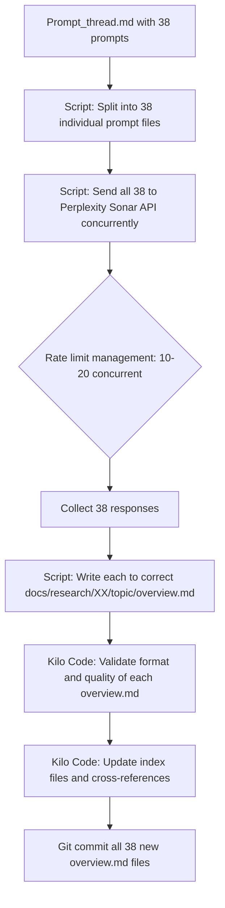

# Parallel Research Execution Strategy — 38 Prompts

> **Goal**: Execute all 38 research prompts from [`Prompt_thread.md`](Prompt_thread.md) simultaneously to generate `overview.md` artifacts as fast as possible.
> **Date**: 2026-02-24

---

## Executive Summary

After analyzing the 38 prompts, the Kilo Code configuration, existing research infrastructure, and available execution mechanisms, the **recommended approach is a hybrid: API-based batch script (primary) + Kilo Code worktree-based Agent Manager (secondary)**. The prompts are fully self-contained, each writes to a unique subfolder, and there are zero inter-prompt dependencies — making this an embarrassingly parallel problem.

---

## Current State Analysis

### What We Have
- **38 self-contained prompts** in [`Prompt_thread.md`](Prompt_thread.md:67-4460) — each ~120 lines, delimited by `## N. Topic Name` + code fences
- **Existing output structure** under `docs/research/` with 12 category folders, each containing topic subfolders with `overview.md`, `comparisons.md`, `patterns.md`, `references.md`
- **Kilo Code modes**: `research` mode in [`.kilocodemodes`](.kilocodemodes:1) and `research-engine` mode in [`.roomodes`](.roomodes:1) — both configured for markdown-only output
- **Kilo Auto Launch** config capability via `.kilocode/launchConfig.json`
- **Kilo Agent Manager** with git worktree isolation and parallel mode
- **Orchestrator mode** with `new_task` tool for spawning subtasks

### Key Constraint: No Inter-Prompt Dependencies
Each prompt:
- Is completely self-contained with its own role definition, scope, and output template
- Targets a unique topic and writes to a unique subfolder
- Has zero dependency on any other prompt's output
- Produces a single `overview.md` file

This makes parallelization trivially safe — no file conflicts, no ordering requirements.

---

## Options Evaluated

### Option A: Kilo Code Orchestrator Subtasks

**How it works**: Use orchestrator mode to call `new_task` 38 times, each spawning a research-mode subtask with one prompt.

| Aspect | Assessment |
|--------|------------|
| **Parallelism** | ❌ **Sequential, not parallel** — `new_task` spawns subtasks one at a time; each must complete before the next begins |
| **Automation** | ✅ Fully automated within Kilo Code |
| **Quality** | ✅ Uses the research mode with full tool access |
| **Speed** | ❌ Extremely slow — 38 sequential deep-research tasks |
| **Cost** | ✅ Uses existing Kilo Code API keys |

**Verdict**: ❌ **Not recommended** — Kilo Code subtasks are sequential within a single VS Code instance. There is no native parallel subtask execution.

---

### Option B: Multiple Kilo CLI Instances + Git Worktrees

**How it works**: Create 38 git worktrees, each with its own `.kilocode/launchConfig.json` pointing to one prompt. Open each worktree in a separate VS Code window or use the Kilo CLI directly.

| Aspect | Assessment |
|--------|------------|
| **Parallelism** | ⚠️ **Limited parallel** — each VS Code instance runs one task; limited by local machine resources |
| **Automation** | ⚠️ Semi-automated — requires scripting worktree creation and launch config injection |
| **Quality** | ✅ Full Kilo Code research mode with all tools |
| **Speed** | ⚠️ Moderate — maybe 5-10 concurrent instances before machine struggles |
| **Cost** | ✅ Uses existing Kilo Code API keys |
| **Complexity** | ⚠️ High — 38 worktrees, 38 VS Code instances, merge coordination |

**Practical Limit**: A typical dev machine can handle 5-8 VS Code instances running Kilo Code agents simultaneously. Running all 38 at once would require extraordinary resources.

**Verdict**: ⚠️ **Viable but impractical at 38x scale** — good for batches of 5-8, not full parallelism.

---

### Option C: Perplexity Deep Research (Manual)

**How it works**: Open 38 browser tabs to Perplexity, paste each prompt into a new thread.

| Aspect | Assessment |
|--------|------------|
| **Parallelism** | ✅ Perplexity handles concurrent threads |
| **Automation** | ❌ Fully manual — paste, wait, copy output |
| **Quality** | ✅ Perplexity Pro produces high-quality research with citations |
| **Speed** | ⚠️ Each deep research query takes 3-10 minutes; all 38 run concurrently |
| **Cost** | ⚠️ Perplexity Pro subscription; may hit rate limits |
| **Output Collection** | ❌ Manual copy-paste of 38 outputs into correct file paths |

**Verdict**: ⚠️ **Works but tedious** — the original approach, but collecting 38 outputs manually is error-prone.

---

### Option D: API-Based Batch Script (Recommended Primary)

**How it works**: Write a script that:
1. Splits `Prompt_thread.md` into 38 individual prompt files
2. Sends all 38 prompts to an LLM API concurrently
3. Collects responses and writes each to the correct `docs/research/XX_category/topic/overview.md` path

#### Sub-Option D1: Perplexity Sonar API
| Aspect | Assessment |
|--------|------------|
| **Parallelism** | ✅ True parallel — async HTTP requests |
| **Automation** | ✅ Fully scripted end-to-end |
| **Quality** | ✅ Sonar Pro model with web grounding and citations |
| **Speed** | ✅ All 38 in ~5-15 minutes with rate limit management |
| **Cost** | ⚠️ ~$5/query for deep research × 38 = ~$190 (Sonar Pro pricing) |
| **Rate Limits** | ⚠️ Check tier — may need to throttle to 10-20 concurrent |

#### Sub-Option D2: Anthropic Claude API
| Aspect | Assessment |
|--------|------------|
| **Parallelism** | ✅ True parallel with async requests |
| **Automation** | ✅ Fully scripted |
| **Quality** | ✅ Claude Opus/Sonnet excels at research synthesis |
| **Speed** | ✅ All 38 in ~10-20 minutes |
| **Cost** | ⚠️ Claude Opus: ~$15/1M input + $75/1M output; each prompt ~5K tokens in, ~15K out ≈ $1.20/prompt × 38 = ~$46 |
| **Rate Limits** | ⚠️ Tier-dependent; 1000 RPM on most tiers |
| **Limitation** | ❌ No web search — Claude cannot browse for citations; prompts expect web research |

#### Sub-Option D3: OpenAI GPT-4o / o3
| Aspect | Assessment |
|--------|------------|
| **Parallelism** | ✅ True parallel |
| **Quality** | ✅ Good for research synthesis |
| **Cost** | ⚠️ GPT-4o: ~$2.50/$10 per 1M tokens; ~$0.70/prompt × 38 = ~$27 |
| **Limitation** | ❌ No native web search in completions API |

#### Sub-Option D4: OpenAI Responses API with Web Search
| Aspect | Assessment |
|--------|------------|
| **Parallelism** | ✅ True parallel |
| **Quality** | ✅ Web-grounded research with citations |
| **Speed** | ✅ ~10-20 minutes for all 38 |
| **Cost** | ⚠️ Web search tool adds ~$0.025-0.050/call + model costs |

**Verdict**: ✅ **Recommended primary approach** — D1 (Perplexity Sonar) is ideal because the prompts were designed for Perplexity and expect web research with citations. D4 (OpenAI Responses with web search) is a strong alternative. D2 (Claude) works if web-grounded citations are not critical.

---

### Option E: Perplexity Batch API

**How it works**: Perplexity does not currently offer a dedicated "batch" API endpoint. However, their standard Sonar API supports concurrent requests.

| Aspect | Assessment |
|--------|------------|
| **Exists?** | ⚠️ No dedicated batch endpoint; use concurrent standard API calls |
| **Effective?** | ✅ Same as Option D1 in practice |

**Verdict**: Merged with Option D1.

---

### Option F: Hybrid — API + Kilo Code Validation

**How it works**: 
1. **Phase 1 — Generation**: Use API batch script (Option D) to generate all 38 `overview.md` files in parallel
2. **Phase 2 — Validation**: Use Kilo Code research mode to review/validate the outputs, checking for quality, citation accuracy, and format compliance
3. **Phase 3 — Integration**: Use Kilo Code to place files in correct paths and update index files

| Aspect | Assessment |
|--------|------------|
| **Parallelism** | ✅ Phase 1 is fully parallel |
| **Quality** | ✅ Two-pass: generation + validation |
| **Speed** | ✅ Phase 1: ~15 min; Phase 2: sequential but fast (review only) |
| **Automation** | ✅ Scripted generation + Kilo Code validation |

**Verdict**: ✅ **Best overall approach** — combines speed of API parallelism with quality assurance of Kilo Code review.

---

## Recommended Strategy: Option F (Hybrid)



### Phase 1: Prompt Extraction and Mapping

Create a mapping table from prompt number to output path. The 38 prompts map to these `docs/research/` locations:

| # | Topic | Output Path |
|---|-------|-------------|
| 1 | Agent Orchestration and Multi-Agent Patterns | `02_agent_orchestration/agent_system_design/overview.md` |
| 2 | Context Management for LLM/Agent Systems | `03_context_memory_intelligence/context_management/overview.md` |
| 3 | Memory Systems | `03_context_memory_intelligence/memory_systems/overview.md` |
| 4 | MCP Servers and MCP Security | `02_agent_orchestration/agent_system_design/mcp_overview.md` |
| 5 | Task Decomposition and Agent Coordination | `02_agent_orchestration/task_architecture/overview.md` |
| 6 | Testing Architecture and Automatic Validation | `05_sdlc_automation/testing_architecture/overview.md` |
| 7 | Model Routing, Switching and Fallback | `08_model_management/model_capability_management/overview.md` |
| 8 | Security Architecture | `01_meta_architecture/security_architecture/overview.md` |
| 9 | Anti-Hallucination Strategies and Guardrails | `01_meta_architecture/security_architecture/anti_hallucination_overview.md` |
| 10 | Self-Healing CI/CD | `05_sdlc_automation/cicd_devops/self_healing_overview.md` |
| 11 | Human-in-the-Loop Interaction | `07_human_interaction/human_in_the_loop_systems/overview.md` |
| 12 | Reasoning Architecture | `03_context_memory_intelligence/reasoning_architecture/overview.md` |
| 13 | Knowledge Representation | `03_context_memory_intelligence/knowledge_representation/overview.md` |
| 14 | Governance and Compliance | `01_meta_architecture/governance_compliance/overview.md` |
| 15 | Large Codebase Handling | `10_scaling_enterprise/large_codebase_handling/overview.md` |
| 16 | Ecosystem Intelligence | `10_scaling_enterprise/ecosystem_intelligence/overview.md` |
| 17 | Observability and Feedback Loops | `05_sdlc_automation/observability_feedback_loops/overview.md` |
| 18 | Human Interaction and UX | `07_human_interaction/human_in_the_loop_systems/ux_overview.md` |
| 19 | Org-Wide Knowledge Base Patterns | `03_context_memory_intelligence/knowledge_representation/org_kb_overview.md` |
| 20 | System Design and Philosophy | `01_meta_architecture/system_design_philosophy/overview.md` |
| 21 | Economic and Optimization Modeling | `01_meta_architecture/economic_optimization_modeling/overview.md` |
| 22 | Database and Data Engineering | `06_data_infrastructure/database_data_engineering/overview.md` |
| 23 | Infrastructure Engineering | `06_data_infrastructure/infrastructure_engineering/overview.md` |
| 24 | Model Serving and GPU/Accelerator Management | `08_model_management/model_serving/overview.md` |
| 25 | Vector Search, RAG and Semantic Indexing | `03_context_memory_intelligence/vector_search_rag/overview.md` |
| 26 | Agent Modes, Skills and Role-Based Design | `02_agent_orchestration/agent_system_design/modes_skills_overview.md` |
| 27 | Orchestration Graphs, Workflows and Task Graphs | `02_agent_orchestration/distributed_orchestration/overview.md` |
| 28 | Agent Lifecycle, State Machines and Failure Handling | `11_advanced_runtime/autonomous_runtime_systems/lifecycle_overview.md` |
| 29 | Agent Trust, Scoring and Multi-Agent Consensus | `02_agent_orchestration/agent_system_design/trust_scoring_overview.md` |
| 30 | SDLC Automation Overview | `05_sdlc_automation/sdlc_automation_overview.md` |
| 31 | Code Repair, Refactoring and Optimization | `04_code_intelligence/refactoring_optimization/overview.md` |
| 32 | CI/CD and DevOps Automation | `05_sdlc_automation/cicd_devops/overview.md` |
| 33 | Research and Benchmarking Framework | `09_research_discipline/research_benchmarking_framework/overview.md` |
| 34 | System Self-Improvement | `12_self_improvement/system_self_improvement/overview.md` |
| 35 | Feedback, Telemetry and AI Feedback Loops | `05_sdlc_automation/observability_feedback_loops/telemetry_overview.md` |
| 36 | Meta-Prompting and Prompt Evolution | `12_self_improvement/meta_prompting/overview.md` |
| 37 | Gradient-Free Workflow Optimization | `12_self_improvement/gradient_free_optimization/overview.md` |
| 38 | Godel-like Self-Referential Agents | `12_self_improvement/self_referential_agents/overview.md` |

> **Note**: Some paths may need new subdirectories created. Some existing `overview.md` files may be overwritten — back up first.

### Phase 2: Script Implementation

A Python or Node.js script that:

```
1. Reads Prompt_thread.md
2. Splits on "## N." pattern boundaries (lines 67-4460)
3. Extracts the code-fenced prompt text for each
4. Builds the mapping table above
5. Sends all 38 requests concurrently using asyncio/aiohttp (Python) or Promise.all (Node.js)
6. Manages rate limits with a semaphore (e.g., max 10-15 concurrent)
7. Writes each response to the correct output path
8. Generates a completion report
```

#### API Choice Decision Matrix

| Criterion | Perplexity Sonar Pro | Claude Opus | GPT-4o + Web | OpenRouter |
|-----------|---------------------|-------------|--------------|------------|
| Web research | ✅ Native | ❌ No | ✅ Via tool | ⚠️ Depends on model |
| Citation quality | ✅ Excellent | ⚠️ From training only | ✅ Good | ⚠️ Varies |
| Prompt compatibility | ✅ Designed for Perplexity | ⚠️ Needs minor adaptation | ⚠️ Needs adaptation | ⚠️ Varies |
| Cost for 38 prompts | ~$190 (deep) / ~$38 (standard) | ~$46 | ~$35 | ~$30-50 |
| Rate limits | ⚠️ Check tier | ✅ Generous | ✅ Generous | ✅ Generous |
| Output length | ✅ Long-form supported | ✅ 8K+ output | ✅ 16K output | ⚠️ Varies |

**Primary recommendation**: **Perplexity Sonar Pro API** — the prompts were designed for Perplexity, include web research expectations, and Sonar provides grounded citations.

**Budget alternative**: **Claude Sonnet** via Anthropic API — cheaper, excellent synthesis quality, but no live web research (citations will come from training data only).

### Phase 3: Quality Validation

After all 38 files are generated:

1. **Automated checks** (script):
   - File exists at expected path
   - File size > 5KB (minimum viable research)
   - Contains required sections: Executive Summary, Definition and Scope, Research Corpus, etc.
   - Contains citation markers like `[1]`, `[2]`, etc.
   - No truncation indicators like `...` at end of file

2. **Kilo Code review** (semi-automated):
   - Use research mode to spot-check 5-10 outputs for depth and accuracy
   - Verify citation URLs are real (for Perplexity outputs)
   - Check cross-references between related topics

3. **Index update**:
   - Update `docs/research/index.md`
   - Update individual `_indices/*.md` files
   - Commit all 38 files in a single commit

---

## Execution Plan — Step by Step

### Step 1: Prepare the Prompt Splitter Script
- Parse `Prompt_thread.md` and extract 38 prompts
- Create `prompts/` directory with `01_agent_orchestration.md` through `38_self_referential_agents.md`
- Create the topic-to-output-path mapping as a JSON config file

### Step 2: Back Up Existing overview.md Files
- Several of the 38 target paths already have `overview.md` files from prior research
- Create a backup branch or copy existing files to `docs/research/_backups/`

### Step 3: Choose API and Configure
- Set up API key for chosen provider (Perplexity Sonar, Claude, or OpenAI)
- Test with 1 prompt to verify output quality and format
- Adjust prompt if needed for the chosen API (e.g., remove Perplexity-specific instructions if using Claude)

### Step 4: Run Batch Script
- Execute all 38 prompts with rate limiting
- Monitor progress and handle any failures/retries
- Expected runtime: 10-20 minutes for all 38

### Step 5: Validate Outputs
- Run automated validation checks
- Spot-check 5-10 outputs manually
- Fix any truncated or low-quality outputs

### Step 6: Integrate into Repository
- Place files in correct paths
- Create any missing subdirectories
- Update index files
- Commit with descriptive message

---

## Cost Estimates

| Provider | Model | Estimated Cost | Notes |
|----------|-------|---------------|-------|
| Perplexity | Sonar Pro (deep research) | ~$150-200 | Best quality for web-grounded research |
| Perplexity | Sonar Pro (standard) | ~$30-50 | Good quality, less depth |
| Anthropic | Claude Sonnet 4 | ~$20-30 | No web search; training data citations only |
| Anthropic | Claude Opus 4 | ~$40-60 | Higher quality, no web search |
| OpenAI | GPT-4o + web search | ~$30-50 | Web-grounded but less research-focused |
| OpenRouter | Various | ~$25-50 | Flexible model choice |

---

## Risk Mitigation

| Risk | Mitigation |
|------|-----------|
| API rate limiting | Implement semaphore with max 10-15 concurrent requests; exponential backoff on 429 |
| Truncated outputs | Set max_tokens high (8192+); detect truncation in validation |
| Low quality output | Test 1 prompt first; switch provider if quality insufficient |
| Overwriting good existing files | Back up to branch before running |
| Citation URLs that are dead | Accept for non-Perplexity providers; Perplexity Sonar grounds citations |
| Cost overrun | Start with cheapest viable option; scale up if quality insufficient |
| Prompt too long for API | Each prompt is ~5K tokens — well within all providers context windows |

---

## Alternative: Kilo Code Agent Manager x5 Approach

If you prefer to stay within Kilo Code entirely and avoid writing a script:

1. Create 5-8 git worktrees: `git worktree add ../SDLC-research-01 main`
2. In each worktree, create `.kilocode/launchConfig.json` with a different prompt
3. Open each worktree in a separate VS Code window
4. Kilo Auto Launch executes the research prompt automatically
5. Repeat 5-8 batches until all 38 are done

**Pros**: No API key management, uses Kilo Code natively
**Cons**: 5-8 parallel max, requires 5-8 VS Code windows, 5-8 batches to complete all 38

---

## Final Recommendation

**For maximum speed**: Use **Option D1 (Perplexity Sonar API script)** — all 38 prompts complete in ~15 minutes, fully automated, web-grounded citations match the original prompt design.

**For budget-conscious**: Use **Option D2 (Claude Sonnet API script)** — ~$25, all 38 in ~15 minutes, excellent synthesis but no live web citations.

**For staying in Kilo Code**: Use **Option B (Agent Manager worktrees)** in 5-8 batches — slower but zero additional setup, uses existing Kilo Code configuration.

**Best overall**: Use **Option F (Hybrid)** — API script for generation, Kilo Code for validation and integration.
