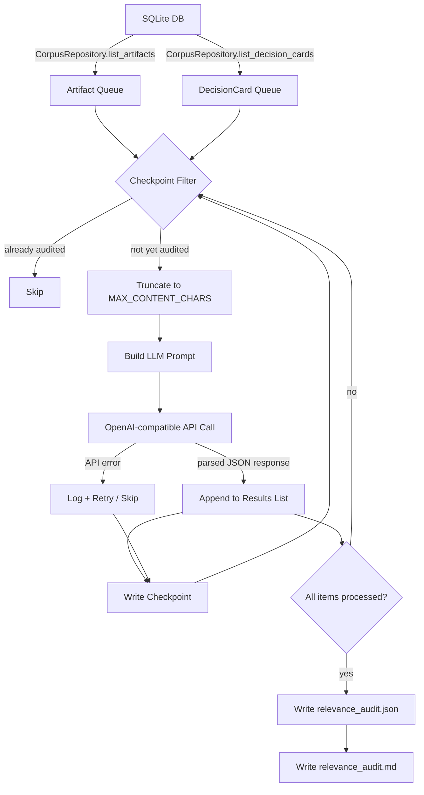

# Design: `scripts/audit_corpus_relevance.py`

> LLM-powered relevance audit for the SDLC corpus — identify content that is NOT about autonomous AI agent design, planning, building, testing, deployment, or operation.

## 1. Objective

Iterate over every `ResearchArtifact` and `DecisionCard` in the SQLite database, send each item to an LLM for a relevance judgment, and produce a structured report of anything flagged as off-topic. The goal is corpus hygiene: ensuring every piece of ingested content actually serves the project's mission.

---

## 2. Data Flow



---

## 3. LLM Prompt Template

### System Prompt

```text
You are a corpus relevance auditor for an engineering knowledge base.
The knowledge base exists to support the design, planning, building,
testing, deployment, and operation of AUTONOMOUS AI AGENTS — software
systems that perceive their environment, make decisions, and take
actions with minimal human intervention.

Relevant topics include, but are not limited to:
- Agent architectures, orchestration, and multi-agent coordination
- LLM integration, prompt engineering, context management
- Code generation, analysis, and self-modification
- SDLC automation, CI/CD for AI systems
- Memory systems, RAG, knowledge graphs
- Tool use, function calling, MCP servers
- Model evaluation, benchmarking, fine-tuning
- Safety, alignment, guardrails, human-in-the-loop
- Deployment infrastructure, scaling, monitoring
- Self-improvement, meta-learning, recursive optimization

Your job: determine whether a given piece of content is RELEVANT to
this mission. Respond ONLY with a JSON object — no markdown fences,
no extra text.
```

### User Prompt — Artifacts

```text
Evaluate this research artifact for relevance.

TITLE: {title}
DOMAIN TAGS: {domain_tags}
CAPABILITY TAGS: {capability_tags}
SOURCE PATH: {source_path}

CONTENT (first {max_chars} characters):
---
{content_truncated}
---

Respond with JSON:
{
  "relevant": true | false,
  "confidence": 0.0 to 1.0,
  "reason": "1-2 sentence explanation"
}
```

### User Prompt — Decision Cards

```text
Evaluate this decision card for relevance.

QUESTION: {question}
CAPABILITY: {capability}
RECOMMENDATION: {recommendation}
ALTERNATIVES: {alternatives}

Respond with JSON:
{
  "relevant": true | false,
  "confidence": 0.0 to 1.0,
  "reason": "1-2 sentence explanation"
}
```

---

## 4. JSON Output Schema

The output file `data/relevance_audit.json` uses this schema:

```json
{
  "$schema": "http://json-schema.org/draft-07/schema#",
  "type": "object",
  "properties": {
    "audit_metadata": {
      "type": "object",
      "properties": {
        "started_at": { "type": "string", "format": "date-time" },
        "completed_at": { "type": "string", "format": "date-time" },
        "model_used": { "type": "string" },
        "base_url": { "type": "string" },
        "max_content_chars": { "type": "integer" },
        "total_artifacts": { "type": "integer" },
        "total_decision_cards": { "type": "integer" },
        "artifacts_flagged": { "type": "integer" },
        "decision_cards_flagged": { "type": "integer" },
        "errors": { "type": "integer" }
      },
      "required": [
        "started_at", "completed_at", "model_used",
        "total_artifacts", "total_decision_cards",
        "artifacts_flagged", "decision_cards_flagged", "errors"
      ]
    },
    "artifact_results": {
      "type": "array",
      "items": {
        "type": "object",
        "properties": {
          "artifact_id": { "type": "string" },
          "title": { "type": "string" },
          "domain_tags": { "type": "string" },
          "source_path": { "type": "string" },
          "status": { "type": "string" },
          "relevant": { "type": "boolean" },
          "confidence": { "type": "number", "minimum": 0, "maximum": 1 },
          "reason": { "type": "string" },
          "error": { "type": ["string", "null"] }
        },
        "required": ["artifact_id", "title", "relevant"]
      }
    },
    "decision_card_results": {
      "type": "array",
      "items": {
        "type": "object",
        "properties": {
          "decision_id": { "type": "string" },
          "question": { "type": "string" },
          "capability": { "type": "string" },
          "relevant": { "type": "boolean" },
          "confidence": { "type": "number", "minimum": 0, "maximum": 1 },
          "reason": { "type": "string" },
          "error": { "type": ["string", "null"] }
        },
        "required": ["decision_id", "question", "relevant"]
      }
    }
  },
  "required": ["audit_metadata", "artifact_results", "decision_card_results"]
}
```

---

## 5. Markdown Report Schema

`data/relevance_audit.md` contains only **flagged items** for quick human review:

```markdown
# Corpus Relevance Audit Report

**Date:** 2026-03-04T03:00:00Z
**Model:** google/gemini-2.5-flash
**Total artifacts:** 150 | **Flagged:** 7 (4.7%)
**Total decision cards:** 42 | **Flagged:** 1 (2.4%)
**Errors:** 2

---

## Flagged Artifacts

| # | Artifact ID | Title | Domain Tags | Confidence | Reason |
|---|-------------|-------|-------------|------------|--------|
| 1 | abc-123... | ... | ... | 0.92 | ... |

## Flagged Decision Cards

| # | Decision ID | Question | Capability | Confidence | Reason |
|---|-------------|----------|------------|------------|--------|
| 1 | dc_xyz... | ... | ... | 0.88 | ... |

## Errors

| # | Item ID | Type | Error |
|---|---------|------|-------|
| 1 | abc-456... | artifact | Timeout after 30s |
```

---

## 6. CLI Arguments

The script uses `argparse` for consistency with standalone scripts in this repo:

| Argument | Type | Default | Description |
|---|---|---|---|
| `--db-url` | `str` | from `CorpusSettings.db_url` | SQLAlchemy database URL |
| `--base-url` | `str` | from `CorpusSettings.llm_base_url` | OpenAI-compatible API base URL |
| `--api-key` | `str` | from `CorpusSettings.kilo_api_key` | API key; also reads `CORPUS_KILO_API_KEY` env var |
| `--model` | `str` | from `CorpusSettings.llm_model` | LLM model identifier |
| `--max-content-chars` | `int` | `4000` | Max characters of content sent per artifact |
| `--delay` | `float` | `0.5` | Seconds to wait between API calls |
| `--max-calls` | `int` | `0` (unlimited) | Cap on total LLM calls; 0 = no limit |
| `--output-dir` | `str` | `data` | Directory for output files |
| `--checkpoint` | `str` | `data/relevance_audit_checkpoint.json` | Path to the checkpoint file for resume |
| `--skip-artifacts` | flag | `False` | Skip artifact auditing |
| `--skip-decisions` | flag | `False` | Skip decision card auditing |
| `--only-flagged` | flag | `False` | Only write flagged items to JSON output |
| `--dry-run` | flag | `False` | List items to audit without calling the LLM |
| `--verbose` | flag | `False` | Enable DEBUG-level logging |

---

## 7. Error Handling and Resume Strategy

### 7.1 Checkpoint File

The checkpoint file `data/relevance_audit_checkpoint.json` tracks progress:

```json
{
  "phase": "artifacts",
  "completed_ids": ["artifact-id-1", "artifact-id-2", "dc-card-1"],
  "results": [ ... ],
  "last_updated": "2026-03-04T03:00:00Z"
}
```

**Resume logic:**
1. On startup, if `--checkpoint` file exists, load it.
2. Build a `set` of `completed_ids` from the checkpoint.
3. When iterating artifacts/decisions, skip any whose ID is already in the completed set.
4. After each successful LLM call, append the result and write the checkpoint file atomically — write to a `.tmp` file, then rename. This prevents corruption from mid-write crashes.
5. On normal completion, the final outputs are written and the checkpoint file is deleted.

### 7.2 API Error Handling

Following the established pattern from [`arbitrate()`](src/corpus/dedup/arbitrator.py:69):

- **Individual call failures**: Log the error, record `"error"` field in the result, mark item as `relevant: true` (safe default — do not flag on error). Continue to next item.
- **Consecutive failure threshold**: After 10 consecutive API failures, abort the run early with a warning. The checkpoint is preserved so the user can resume later.
- **Rate limit errors (HTTP 429)**: Detect via `openai.RateLimitError` exception. Apply exponential backoff — wait `delay * 2^attempt` seconds, up to 3 retries per item.
- **Timeout**: The `OpenAI` client is configured with `timeout=30.0`. Timeouts count toward the consecutive failure counter.

### 7.3 Response Parsing

The LLM response is parsed with the same defensive approach used in [`arbitrator.py`](src/corpus/dedup/arbitrator.py:156):

1. Strip markdown code fences if present.
2. Find the first `{` and last `}` to extract JSON.
3. Parse with `json.loads()`.
4. Validate that `relevant` is a boolean, `confidence` is a float in 0-1, `reason` is a string.
5. If parsing fails, default to `relevant: true, confidence: 0.0, reason: "parse error"` and record in the `error` field.

---

## 8. Architecture — Module Decomposition

The script should be structured as a single file for script simplicity, but with clear internal sections:

```python
# scripts/audit_corpus_relevance.py

# --- Section 1: Imports and constants ---
# sys.path hack, argparse, openai, json, logging, pathlib, time

# --- Section 2: Prompt templates ---
SYSTEM_PROMPT = "..."
ARTIFACT_USER_TEMPLATE = "..."
DECISION_CARD_USER_TEMPLATE = "..."

# --- Section 3: LLM client abstraction ---
class RelevanceAuditor:
    def __init__(self, base_url, api_key, model, max_content_chars, delay)
    def audit_artifact(self, artifact: ResearchArtifact) -> dict
    def audit_decision_card(self, card: DecisionCard) -> dict
    def _call_llm(self, user_prompt: str) -> dict
    def _parse_response(self, raw: str) -> dict

# --- Section 4: Checkpoint management ---
class CheckpointManager:
    def __init__(self, checkpoint_path: Path)
    def load(self) -> set of completed IDs, list of partial results
    def save(self, completed_ids: set, results: list, phase: str)
    def delete(self)

# --- Section 5: Report generation ---
def write_json_report(results: dict, output_path: Path)
def write_markdown_report(results: dict, output_path: Path)

# --- Section 6: Main orchestration ---
def main():
    # parse args, load settings, open DB session
    # build auditor + checkpoint manager
    # iterate artifacts (with checkpoint skip)
    # iterate decision cards (with checkpoint skip)
    # write final outputs
    # clean up checkpoint
```

### Provider Swappability

The `RelevanceAuditor` class uses the `openai.OpenAI` client, which already supports any OpenAI-compatible endpoint via `base_url`. This covers:

- **OpenAI** directly
- **Kilo AI gateway** — the project default at `https://api.kilo.ai/api/gateway`
- **Azure OpenAI** — via base_url override
- **Ollama / vLLM / LiteLLM** — any local OpenAI-compatible server

To swap providers, the user changes `--base-url` and `--model`. No code changes needed. For future non-OpenAI-compatible providers, the `_call_llm()` method is the single integration point to override.

---

## 9. Token Usage Considerations

### Per-Item Estimates

| Component | Tokens (approx) |
|---|---|
| System prompt | ~200 |
| User prompt template + metadata fields | ~80 |
| Content — artifact at 4000 chars | ~1000 |
| Content — decision card, all fields | ~300 |
| LLM response | ~60 |
| **Total per artifact** | **~1,340** |
| **Total per decision card** | **~640** |

### Corpus-Wide Projections

| Scenario | Artifacts | Decision Cards | Total Tokens | Cost at $0.15/1M input, $0.60/1M output |
|---|---|---|---|---|
| Small corpus — 50 artifacts, 20 cards | 50 | 20 | ~80K | <$0.02 |
| Medium corpus — 200 artifacts, 50 cards | 200 | 50 | ~300K | ~$0.05 |
| Large corpus — 1000 artifacts, 200 cards | 1000 | 200 | ~1.5M | ~$0.25 |

These estimates assume `google/gemini-2.5-flash` pricing via the Kilo gateway. Costs scale linearly; the `--max-calls` flag provides a hard budget cap.

### Mitigation Strategies

- **`--max-content-chars 4000`** — the default truncation limit. Lowering to 2000 approximately halves per-artifact token cost with minimal relevance-judgment degradation.
- **`--max-calls N`** — hard cap on total API calls.
- **Skip already-audited items** — the checkpoint ensures no double-billing on resume.
- **`--skip-artifacts` / `--skip-decisions`** — audit just one item type at a time.
- **Batch by status** — only audit `active` artifacts. Archived or superseded items can be skipped since they are already out of the active corpus. This could be added as a `--status-filter` argument in a future iteration.

---

## 10. Dependencies

All dependencies are already in [`pyproject.toml`](pyproject.toml):

- `openai` — LLM API client
- `sqlalchemy` — database access
- `pydantic-settings` — config via `CorpusSettings`

No new packages are required.

---

## 11. Example Usage

```bash
# Full audit with defaults (uses CorpusSettings from env)
python scripts/audit_corpus_relevance.py

# Dry run — see what would be audited
python scripts/audit_corpus_relevance.py --dry-run

# Audit only artifacts, with a lower token budget
python scripts/audit_corpus_relevance.py --skip-decisions --max-content-chars 2000

# Resume from a previous interrupted run
python scripts/audit_corpus_relevance.py --checkpoint data/relevance_audit_checkpoint.json

# Use a different model
python scripts/audit_corpus_relevance.py --model openai/gpt-4o-mini --base-url https://api.openai.com/v1 --api-key sk-...

# Limit to 100 API calls for cost control
python scripts/audit_corpus_relevance.py --max-calls 100
```

---

## 12. Implementation Checklist

When implementing this design, the following steps should be followed:

1. Create `scripts/audit_corpus_relevance.py` with the `sys.path` hack matching existing scripts
2. Define prompt constants — `SYSTEM_PROMPT`, `ARTIFACT_USER_TEMPLATE`, `DECISION_CARD_USER_TEMPLATE`
3. Implement `CheckpointManager` class — `load()`, `save()`, `delete()` with atomic writes
4. Implement `RelevanceAuditor` class — `__init__()`, `audit_artifact()`, `audit_decision_card()`, `_call_llm()`, `_parse_response()`
5. Implement `write_json_report()` and `write_markdown_report()` functions
6. Implement `main()` — argparse setup, DB session management, iteration loop with checkpoint integration
7. Add consecutive-failure abort logic matching the arbitrator pattern
8. Test with `--dry-run` to verify DB access and item enumeration
9. Test with a small `--max-calls 5` run to verify LLM integration
10. Verify checkpoint resume by interrupting and restarting
